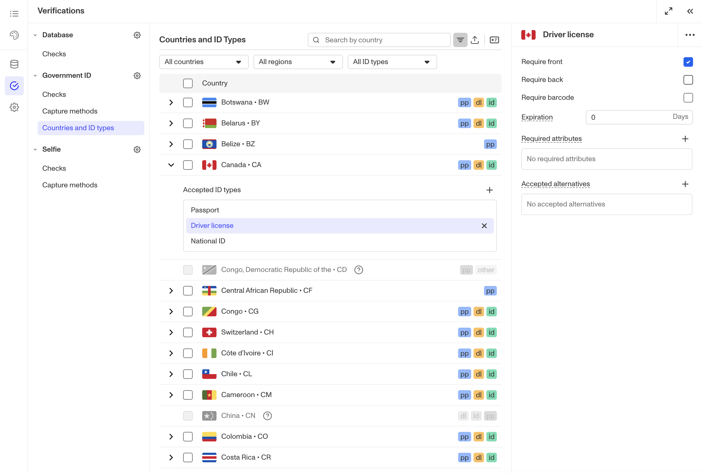
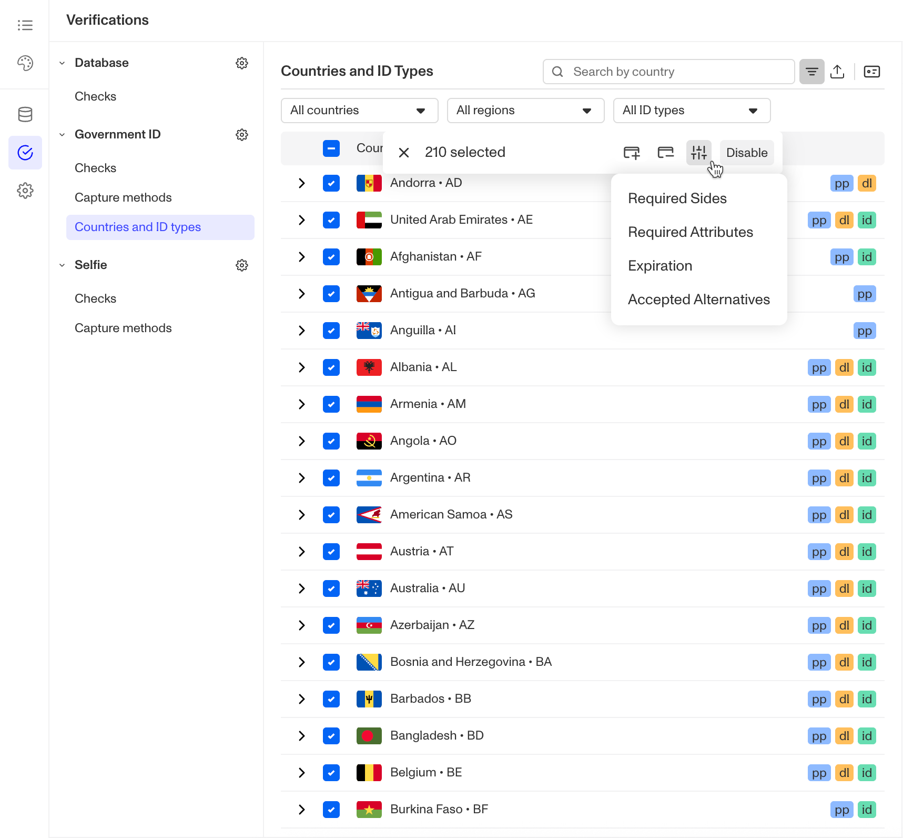
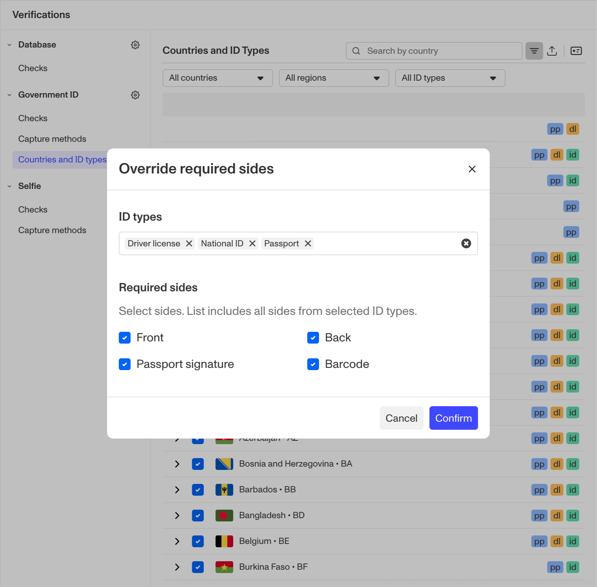
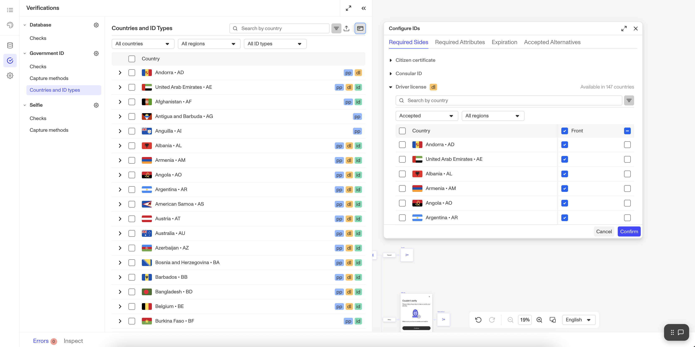

# Government ID Verification: Requiring front and/or back of IDs

# Overview

You can configure a Government ID Verification to require only the front, the back, or both sides of an ID. You can set different requirements for different types of IDs.

For example, you can require your end users to submit both the front and back side of a Driver's License, but only require them to submit the front side of a passport.

Note that some IDs have additional options. For example, for a driver's license, you can require a barcode scan.

This guide describes one step in a larger process. For more information on configuring Government ID Verification, see [Configuring Verification checks for Government ID Verification](./3WnqX7N26sshPLKPQbuW4O.md).

### Prerequisites

-   The ability to configure accepted ID types is available on paid plans. If you're on the free plan and want to upgrade, please contact us [here](https://app.withpersona.com/dashboard/contact-us).
-   If your Verification check configurations are fully managed by your Persona team, you will not be able to edit this configuration yourself. Please reach out to your customer success manager if you'd like to make changes.

## Step 1: Navigate to the Government ID Verification Template configurations

### For Government ID Verification Templates within an Inquiry Template

1.  In the Persona Dashboard, navigate to Inquiries > Templates. Select a template that uses Government ID Verification.
2.  Once you are in the Flow Editor, use the Left Panel to head to Verifications.
3.  Select the Government ID Verification template.
4.  Navigate to Countries and ID types.

### For Government ID Verification Templates used alongside a Transaction, Workflow, or via API

1.  In the Persona Dashboard, navigate to Verifications > Templates.
2.  Select the desired Government ID Verification Template that you'd like to change.

## Step 2: Configure Required Sides

You can configure required sides using three different methods depending on your needs:

### Method 1: Configure for an individual country

1.  Locate the country you want to configure in the Countries and ID types table.
2.  Click the chevron next to the country's name to view its accepted ID types.
3.  Select the ID type you want to configure required sides for.
4.  In the ID configuration pane, select the checkboxes for the sides you want to require from end users. Some ID types offer options beyond just front and back. For example, Driver's License includes checkboxes for front, back, and barcode. Note that at least one side must be required.

### Method 2: Bulk configure for multiple countries/ID Types

1.  Select multiple countries using the checkboxes to the left of the table.
2.  From the floating action bar that appears, select the ID configuration icon.
3.  From the dropdown, select **Required sides.**

4.  In the Required Sides Overrides modal:
    -   Select the ID types you want to set required sides for.
    -   Use the checkboxes to select the required sides.
    -   Note that any sides not selected will be removed from the selected ID types, as changes in this modal are applied as an override.
5.  Click **Confirm** to apply your changes.

### Method 3: View and edit alternatives across countries

1.  Click the **ID** button in the table actions to open the Bulk ID Configuration Panel.
2.  Navigate to the **Required sides** tab.
3.  This tab displays all required sides for each ID type across all countries, organized by ID type.
4.  Use the checkboxes to make your changes as needed.
5.  Click **Confirm** to save your configurations.

## Step 3: Save your changes

In the upper corner of the Flow Editor, click **Save**.

As usual, you will need to publish your changes for them to go live.
