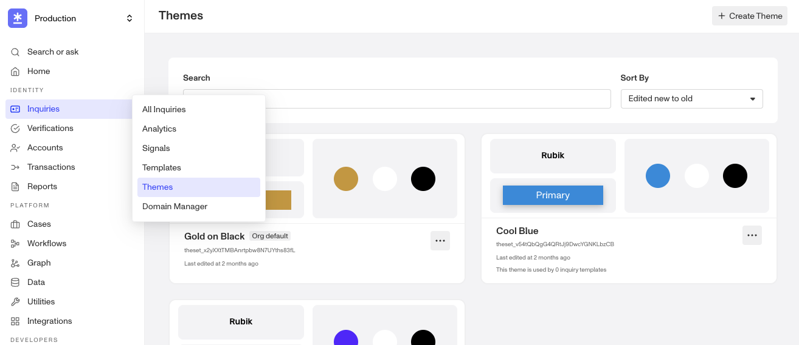
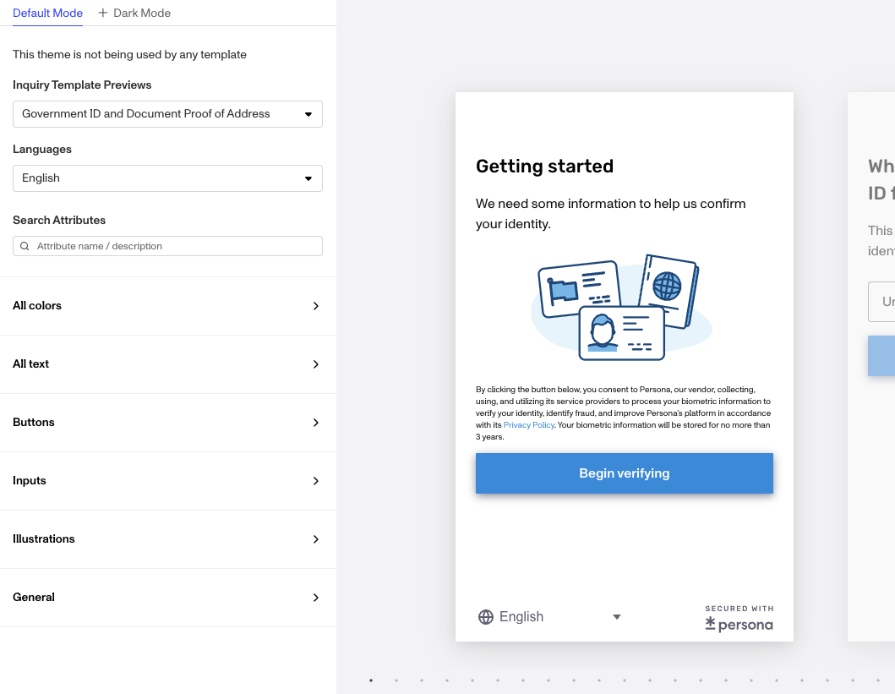
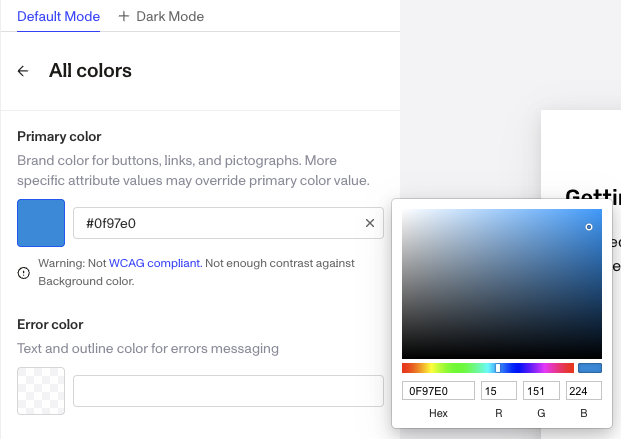
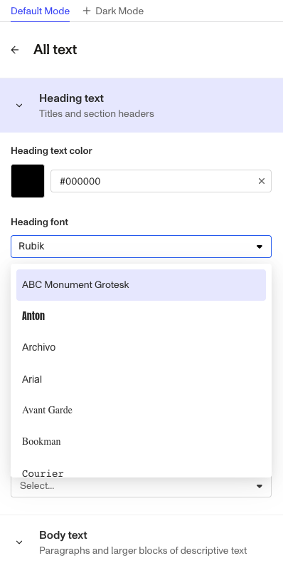
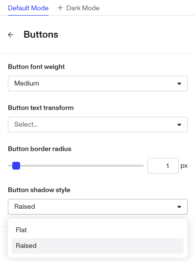
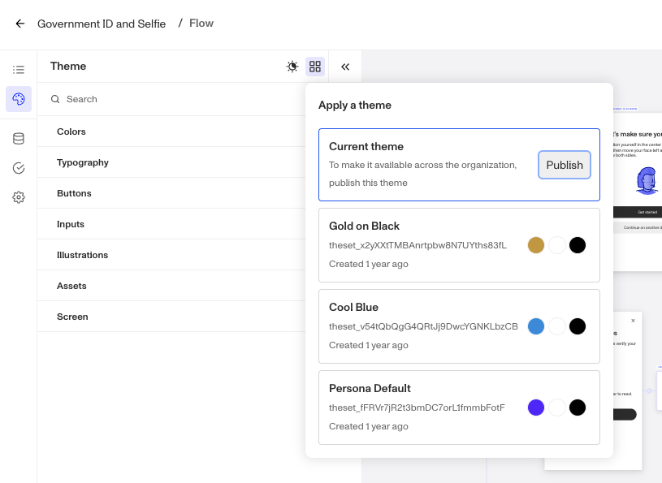

# Configuring a Theme with Theme Editor

# Overview

A theme defines the overall look-and-feel of the UI of an Inquiry. A theme includes settings for colors, fonts, borders, and more. Use the Flow Editor to easily edit a theme.

In this tutorial, you'll learn how to:

-   **Customize colors**: Choose an overall primary color, and primary and secondary colors for buttons.
-   **Style text**: Set the font, font size, and font weight of text.
-   **Style buttons**: Choose from preset style configurations for buttons.

## 1\. Set up

### Open Theme Editor

1.1. Navigate to `Inquiries` → `Themes` to manage theme sets.

1.2. Click the `+ Create Theme` button at the top-right corner of the window to open the Theme editor. Alternatively, you can click `...` to duplicate and modify an existing theme set.

### Select customizations

1.3. To edit a theme set, click into a card. Here, you can rename the Theme to a more descriptive name than the default.

1.4. In the Language dropdown, select the language you want to view the flow in, while you edit.

**Note:** Any edit you make to your theme will be applied to your flow in _all_ languages. The language you pick in this dropdown does not narrow the scope of your edits to just that language.

1.5. Modify your theme color, font, and buttons, as well as advanced visual settings.

1.5. (Optional) You can also set an organization wide default theme set. When this option is set and an Inquiry Template does not have a specifically assigned theme set, the Inquiry Template will default to the organization default.

## 2\. Customize colors

In this tutorial, we'll choose an overall primary color, and primary and secondary colors for buttons. Many more color options are available.

2.1. Select **Color** from the left-hand sidebar.

2.2. Under **Primary color**, click the square box to open a color picker. Pick the color you want. See the hex code of your chosen color appear in the input box.

2.3. Under **Primary button fill color**, copy/paste the hex code from the Primary color to the input box here. This sets primary buttons to be the same color as the Primary color.

2.4. Under **Secondary button fill color**, click the square box to open a color picker. Pick the color you want. (If you don't want to choose, copy/paste this hex code for a dark gray: #585656)

2.5. Click **Save**.

## 3\. Style text

In this tutorial, we'll set the font, font size, and font weight of headings. You can apply analogous settings to body text and small text. Additional settings exist for line height, and text alignment.

3.1. Select All **text** from the left-hand sidebar.

3.2. Under **Heading font**, select a font for your heading text.

3.3. Under **Heading font size**, use the slider or input box to set a font size.

3.4. Click **Save**.

## 4\. Style buttons

Choose from preset style configurations for buttons.

4.1. Select **Buttons** from the left-hand sidebar.

4.2. Under **Button font weight**, use the drop down to select your preferred font weight.

4.3 Under **Button border radius**, use the slider or input box to select a radius.

4.4. Under **Button style**, select the Raised style.

4.5. Click **Save**. 

## 5\. Apply theme set to a template

5.1. To change the theme set for a given Inquiry Template, go to `Inquiries` → `Templates` to select a specific template. Then in the left nav, click the theme icon.

5.2. Click on one of the available themes to apply it to the template.

5.3. Click save.
