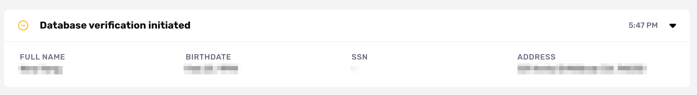

# Why is a Database Verification stuck in "initiated" status?

## Problem

You see a Database Verification is “initiated,” but it doesn't progress:

## Common causes

This problem commonly happens when a Database Verification is completed via the Persona API, and not all required fields were sent to the API. Since there are missing fields, the Verification can’t run.

## Suggested steps

-   Check your API integration is sending all fields required to the complete this Database Verification.
-   Reach out to us for help. You can contact your customer success manager or [contact the Persona support team](https://app.withpersona.com/dashboard/contact-us).

## Learn more

To learn what "initiated" and other statuses mean, see [Reference: Database Verification statuses](./382VuPIqELyr8osOxwkY3S.md).

## Related articles

[What do the various Database Verification statuses mean?](./382VuPIqELyr8osOxwkY3S.md)

[Database Verification](./7dcdaIsMttmPUZ2ZelRbZD.md)
