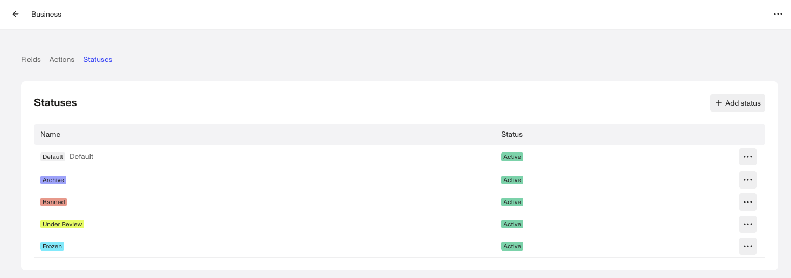
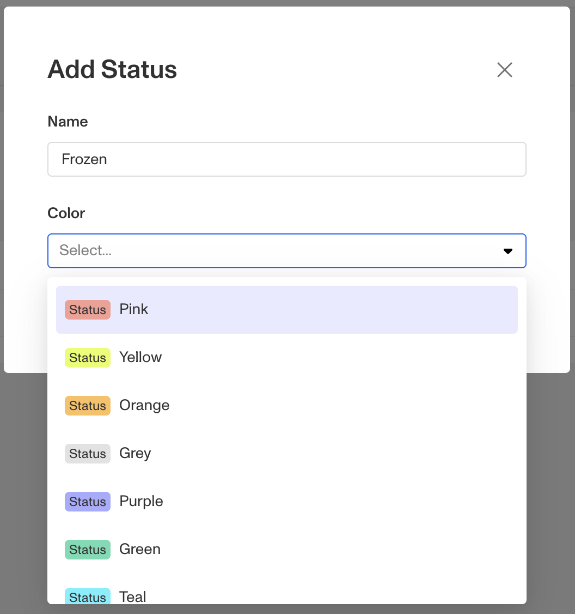
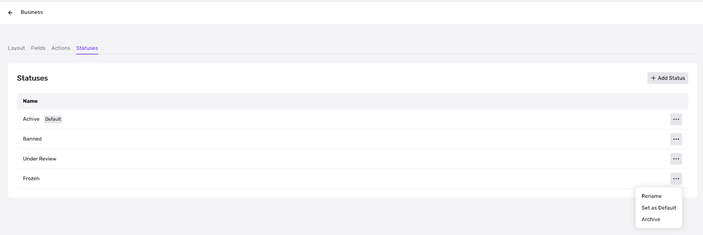

# Creating and setting custom Account Statuses

# **Overview**

You can define and assign account statuses to represent the lifecycle stages of an account.

> For example, your organization might assign the following statuses to the Business Account Type: Active, Pending review, Deactivated, and Frozen.

📍 Account statuses are scoped to each Account type, \*\*not\*\* global. This means that each Account type has its own set of statuses to allow for the most flexibility.

# **When to use account statuses**

Businesses can use Account Statuses to:

-   Automatically create cases for review based on account status (e.g. `High-risk` or `Needs review`) to speed up the review process
-   Exclude Accounts marked as `Inactive` when pulling recurring reports in order to ensure accurate metrics
-   Track stages within their operational process to provide improved visibility to team leads (e.g. volume of Accounts that are `Pending review`)

# **Create an account status**

Each Account type has its own set of statuses, so if you create a status under one Account type, it only applies to that Account type.

To apply the same status to multiple Account types, recreate it for each Account type.

## Add a new status to an Account type

1.  In the Dashboard’s left-side navigation bar, navigate to **Accounts** > **Type**.
2.  Click on the Account type to which you want to add a new status, then click on the **Statuses** tab.

 3. Click the **\+ Add Status** button, give it a name, choose a color, and click **Save**. 

## Edit an account status

You can rename an account status or make it the default status for all new accounts of this account type.

1.  Click the ••• button to the right of each status. You will be able to **Edit** or **Deactivate** a status, as well as **Set as Default** status for new accounts of this type.

## Deactivate or Delete an account status

🚨 Persona cannot delete a status that is currently associated with any accounts.

Deleting is an irreversible action that effectively deletes a status. Deleted statuses are erased from Persona’s system and cannot be retrieved.

-   Before you delete a status, update all accounts with this status to have a different status, either manually or by using a Workflow.
-   Find the status you wish to delete and click the **•••** button.
-   Click Delete.

However, if you want to simply remove a status going forward (while keeping the status on existing accounts), you can **deactivate**, which makes the active status to be inactive.

## How to access status in Workflows

In Workflows, you may want to access and condition off of a status for a given account. You can access using `account.account_status`.
