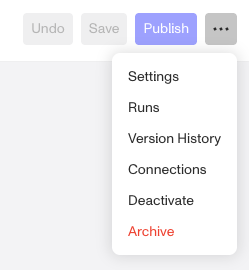

# Workflow Versions and Change Management

# Overview

Workflows in Persona support version management, allowing you to draft, publish, and maintain multiple versions over time. This enables safe iteration, controlled rollouts of changes, and the ability to audit or revert prior configurations as needed.

| **Persona Object** | **Object ID syntax** | **Object ID versioning syntax** |
| --- | --- | --- |
| Workflows | Begins with `wfl_` | Begins with `wflv_` |

## Drafting and Publishing

When you update a Workflow, Persona creates a **draft** version. Drafts allow you to make incremental changes and save progress before committing those changes live. You can edit a draft multiple times. Once you are satisfied with your changes, publishing the draft will create a new version of the Workflow.

After publishing, the new version becomes available for rollout. Published versions are locked from further editing. To make additional changes, you must create a new draft based on any existing version.

In this way a Workflow can have many Workflow versions associated to it. For a given Workflow, only one version is currently live and in a `published` state, and there may be one that you are actively editing and is in a `draft` state.

## Rollouts and live version behavior

Unlike Persona templates, Workflows support **Rollouts** to control how new versions are gradually applied. When a new Workflow version is published, you can choose what percentage of new Workflow runs should use the new version, while the remainder continue using the previous version.

-   A rollout set to **100%** means that all Workflow runs will use the newly published version.
-   A rollout set to any value below 100% will split traffic between the latest version and the previous version.
-   This staged rollout approach allows you to validate changes with a small subset of Workflow runs before fully committing.

If issues arise during rollout, you can stop the rollout or revert to a previous version entirely.

Each individual Workflow run is permanently linked to the version that was active at the time it was executed. Subsequent version changes do not affect past Workflow runs.

## Version History

All published versions of a Workflow are recorded in **Version History**, providing a complete audit trail of changes over time.

### How do you view Version History?

1.  Navigate to the Dashboard, and click on **Workflows.**
2.  Select the **Workflow** you want to review.
3.  On the upper right corner click the “**…**” button and click “**Version History**” from the dropdown.

4.  The **Versions History** will show in the overflow menu on the right.

### Reverting to a previous version

If you need to undo changes or roll back to a stable configuration, you can revert to any prior version in Version History. Reverting publishes the selected version, and you can control the rollout percentage as needed when making that version live again. Existing Workflow runs remain linked to the version they originally executed with.
