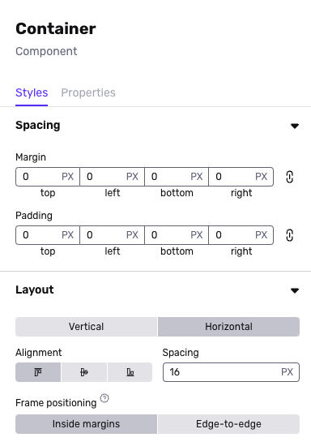
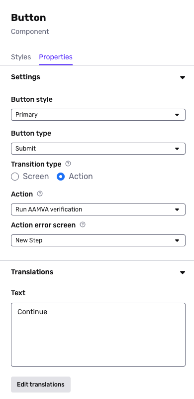
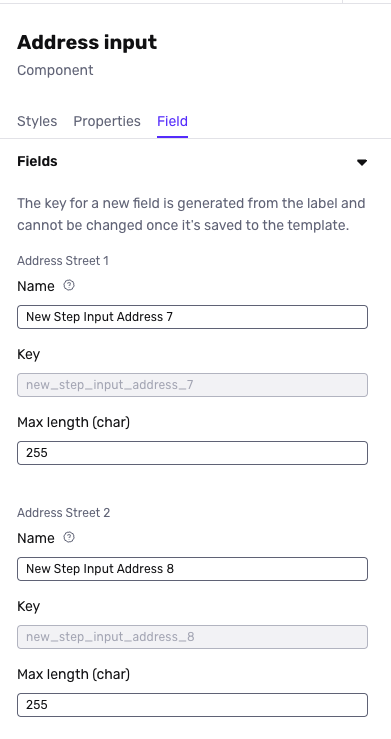

# Screen Step components in Inquiries

# Overview

Components are the building blocks of designing your flow inside the Flow Editor. You can drag and drop components from the Component Library to arrange them on screens inside the Screen Editing View.

This capability is currently only available to customers on the beta version of Flow Editor. If you're interested in joining the beta, please reach out to your Customer Success Manager or [contact the Persona support team](https://app.withpersona.com/dashboard/contact-us).

## Using Component Styles, Properties, and Fields

For each component, you will see Styles, Properties, and Fields if applicable.

Styles lets you set sizing, spacing, and other attributes for each component.

Properties lets you set behaviors for your components or translations.

Fields are used for Form components to designate how to structure information collected from your end-users. Note that once you save a template, you can not edit a key name for a field.

## Component Options

There are many types of components. Note that we continue to add components, and this may be an incomplete list.

### Basic

| **Component** | **Description** |
| --- | --- |
| Button | Clickable button that can be used to transition screens |
| Clickable container | Clickable way to create grouping of components in your desired layouts |
| Container | Way to create grouping of components in your desired layout |
| Image | Add an image asset |
| Spacer | Add custom spacing between components |
| Text | Add body text |
| Title | Add header text |
| Footer | Add a section block to the bottom of the screen |

### Forms

| **Component** | **Description** |
| --- | --- |
| Address input | Input for end-user to enter an address |
| Checkbox | Way for end-user to select or deselect a checkbox |
| Checkbox group | A group of checkboxes that allow the end-user to toggle options on or off |
| Country selection | Way for end-user to select a country from a pre-determined list |
| Date | Input for end-user to select or enter a date in a structured format |
| File Upload | Input for selecting a file to upload |
| Government ID type select | Way for end-user to select an identification type from a predefined list |
| International Database | A multi-input block with required inputs for international database verification |
| Masked text | Input for end-user to enter text that can be hidden |
| Multi select | Way for end-user to select multiple options from a pre-determined list |
| Number | Input for end-user to enter numerical value |
| Phone number | Input for end-user to enter phone number |
| Radio group | Way for end-user to select a single option from multiple choices displayed as a radio group |
| Select | Way for end-user to select a single option from multiple options displayed as a drop-down |
| Text area | Input for end-user to input longform text |
| Text input | Input for end-user to input text |
| URL input | Input for end-user to enter or edit web addresses |
