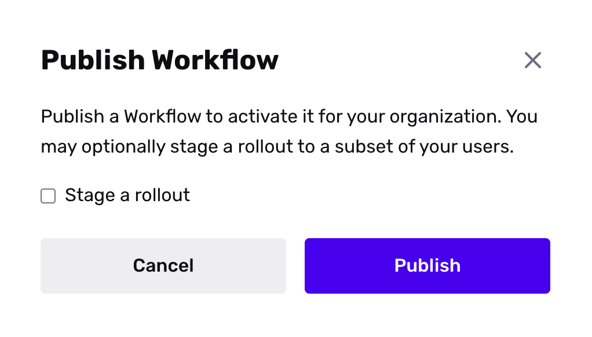
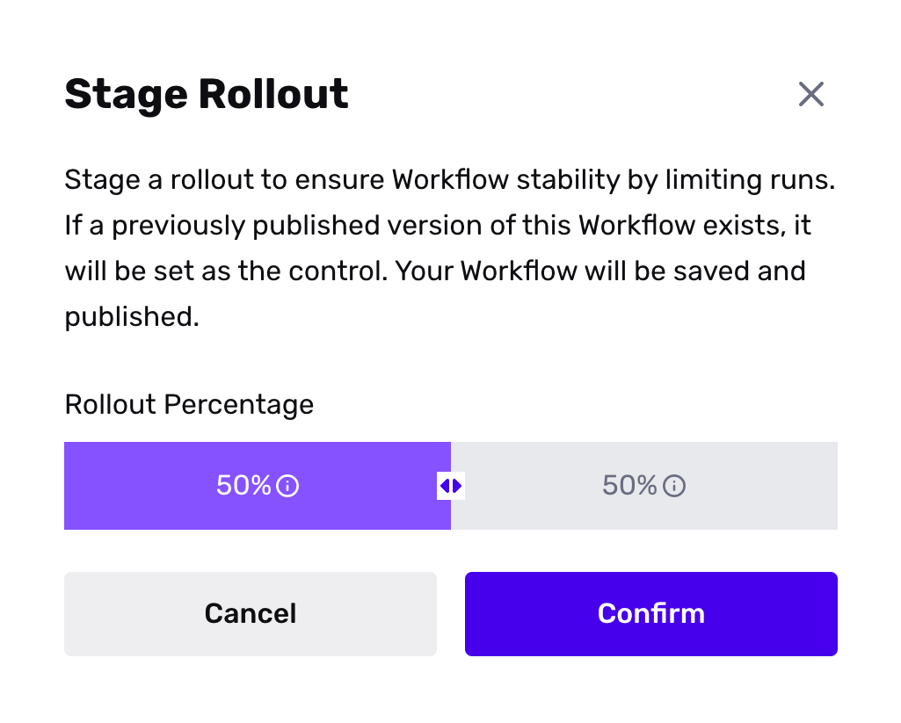
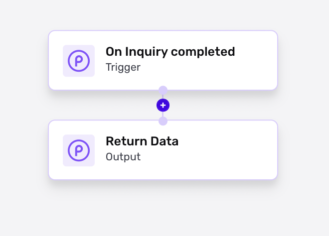
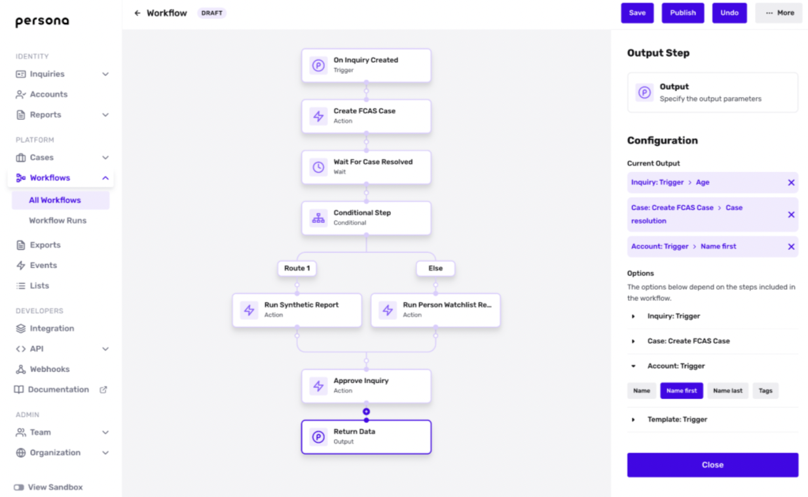
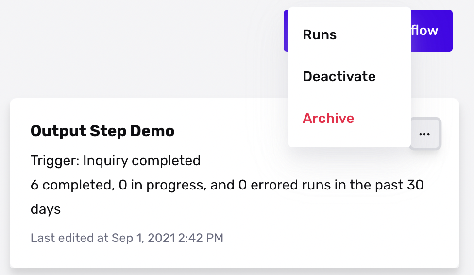
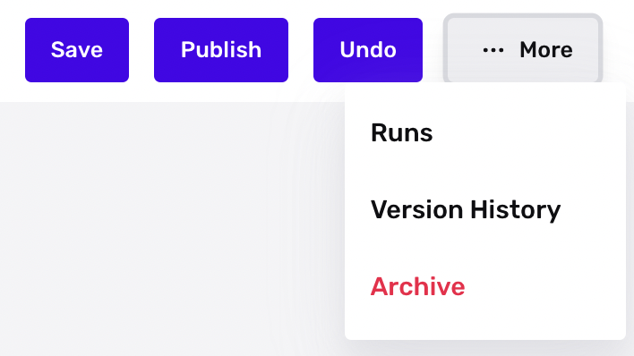
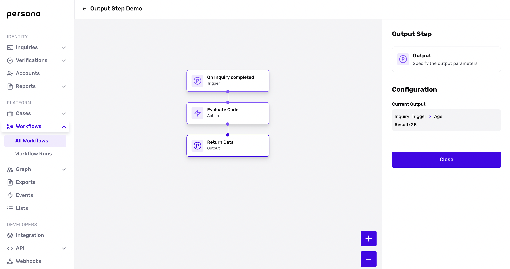

# Testing and auditing your Workflows

## Testing and auditing your Workflows

In order to make sure your Workflows operate as expected, users can leverage Rollouts, Output Step, and Runs to administer their testing and auditing efforts. Users can also view Workflow Version History to inspect and revert past changes as needed.

## Rollouts

Rollouts allow users to specify a percentage rollout when updating a Workflow to a new version. Customers primarily use rollouts to slowly test new versions and to make sure they work as expected before activating a Workflow to 100% of their end users.

### Staging a Rollout

When a user publishes a new Workflow version, they're given the option to stage a rollout.

If you opt to stage a rollout, you can specify a rollout percentage, which will then create a treatment and control group for your Workflows. The Workflow Runs section will tell you which Workflow (treatment or control) operated on a given run.

Staging a rollout to 100% will publish your changes to all users. Staging a rollout to 0% will revert any changes for all users.

## Output Steps and Workflow Versions

With Output Step, you can configure your workflow to return any object or field data referenced within a single workflow run and surface that information on the respective Workflow Runs table view. By default, we display outputs across versions in the Workflow Runs table view. However, it’s important to note that Output Step configurations are version-specific. You can filter by version to see the output data associated with a given version for a more granular view.

### How can I leverage Output Step today?

You can leverage Output Step for lightweight QA (e.g. outputting age and then inspecting the Workflow Runs table view to make sure no users > age 21 are passing, etc), lightweight analytics (e.g. making sure Workflow Runs table view displays all associated tags, or whatever data you select), and even lightweight A/B testing (e.g. printing fields of interest and then using rollouts to see how those variables changes when you make changes to a workflow).

### Configure the Output Step

When you create a workflow, two nodes will appear: the trigger node and the output step node.

To configure the Output Step, click the output node and select the fields you want the Output Step to return.

The data associated with an Output Step lives in the Workflow Runs table view and the Workflow Runs tree view. You can access it in one of three ways:

1.  Via the Workflows dashboard, click the hamburger next to a workflow to access the Runs view
    
    
2.  Via a given workflow, select the **More** CTA to access Runs  
    
    
3.  Via the Workflow Runs tree view, click the Output Step node to see the associated data  
    
    

### Viewing past versions

Workflows also offers the ability to view past versions of published, activated, and draft workflows. In order to view a version, click the More menu in the top right:

A version history sidebar will appear as a right side panel. With Version History, you can view past iterations of Workflow, update the description of past iterations to guarantee context and knowledge around past changes, and importantly, revert to old versions of your Workflow if necessary.

## Example Use Case

An example of using the above features to test changes would include:

1.  Upon finishing a Workflow draft, configure the Output Step to return the data you would like to investigate (i.e. Watchlist matches, tags generated, user age, Custom Code Actions output)
2.  Stage a gradual rollout to 10% of the population
3.  Use Workflow Runs and Output Step to audit your Workflows and ensure that your automation works as intended by examining the decision tree and Runs table
4.  If the workflow does not work as intended, you can use Rollouts to roll back the changes. You can also leverage Workflows Version History to access past versions as well
5.  If the workflow operates as intended, use Rollouts to publish the workflow to a larger population
