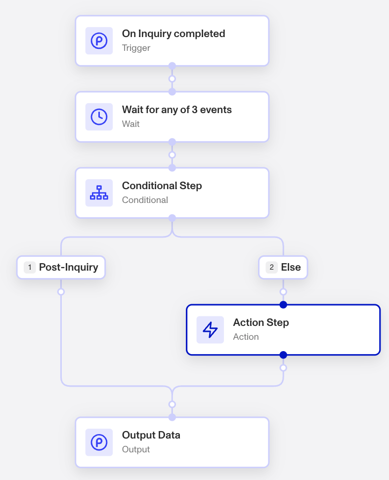

# Workflows overview

## About Workflows

### Automate your identity processes

Workflows are a flexible, intuitive, and powerful way to streamline your identity processes. You can use Workflows to automate repetitive manual decisions and decrease manual review time.

Workflows lets you sequence a set of conditional actions that are started, or “triggered” by:

-   an event, like an Inquiry reaching the “Completed” status
-   an API call
-   another Workflow
-   a recurring cadence or schedule
-   you manually

### Build flexible logic, with or without code

 Workflows supports if / else conditions, and parallel execution of multiple steps.

You can build a Workflow with no code, using a drag-and-drop editor. You can also use code if you want. A Workflow can run custom JavaScript code and make custom web requests.

### Integrate with Persona products and other apps

Workflows lets you easily take action on any part of Persona. For example, mark an Inquiry for review, create a Case, or run a Report.

Workflows also integrates with many apps, ranging from risk vendors to productivity tools. You can pass information into your internal systems with custom integrations.

## Example use cases

### Example 1

You can set up a Workflow that is triggered when an Inquiry is completed—an event. The Workflow can automatically decline the Inquiry if the Inquiry's IP address matches an IP address on a specified [List](./7IqWZFDaPjn8RTJtbgUjfV.md).

### Example 2

Let's say you want to manually review any Inquiry in which the end user is under 18.

You can set up a Workflow that is triggered when an Inquiry is completed. The Workflow automatically marks an Inquiry for review if the end user of the Inquiry submitted an ID with a birth date indicating they are under 18 years old.

The Workflow can integrate with Slack to notify your team that an Inquiry has been marked for review.

### Example 3

Let's say you want to run Reports to help you conduct a Know Your Business (KYB) process, and you want to trigger these Reports to run via API.

You can set up a Workflow can that is triggered via API, that runs four Know Your Business (KYB) Reports: Business Watchlist, Business Adverse Media, Business Lookup Report, and TIN Check Report. You can trigger this Workflow via API and pass in parameters to that Workflow, such as business name, business address, and EIN.

You can set up the Workflow to take additional actions based on the results of these Reports.

## Get started

Next, learn about [Creating Workflows](./20Zvcq50493eMUdt7aDhRY.md).
