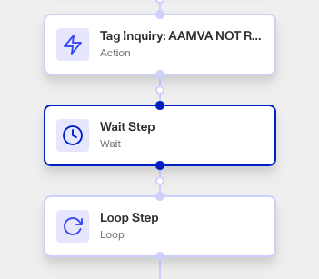
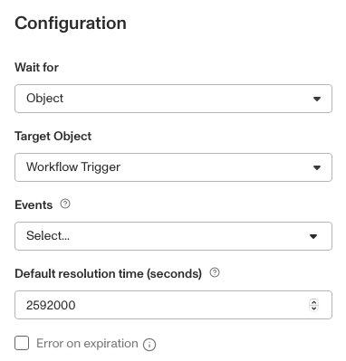
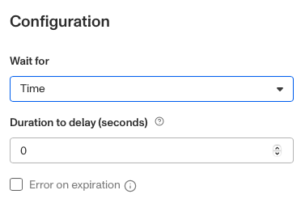

# Workflows: Wait step

# What is the Wait step?

**Wait** is a Workflow step that pauses a workflow process until a certain condition is met. That condition can either be an Object-based trigger (where a change to an Object triggers the process to continue), or when specified time is elapsed.

# How does the object-based trigger work?

An Object is a Persona product such as Inquiries, Cases, and Verifications. You can choose a trigger based either on an Object change resulting from a previous step, or from an overarching Workflow event (such as an Inquiry being approved).

An Object-based trigger therefore may include:

-   An Object (such as an Inquiry) is created.
-   An Object is assigned.
-   An Object’s status updates.

The Wait step's object-based trigger option always includes a **Default resolution time** to ensure your process doesn’t stall out indefinitely in cases where the Object trigger will not happen. Once either the trigger or Default resolution time is met, the Workflow continues.

This step is useful when further steps in the Workflow depend on an Object’s current state, or to trigger actions based on the Workflow’s state.

# How does the elapsed time trigger work?

You may alternatively set the Wait step to expire after a certain amount of time has passed, in seconds. This delays the workflow from progressing during that time period.

# How do you add a Wait step?

1.  Navigate to the Dashboard, and click on **Workflows** > **All Workflows**.
2.  Find and click on the workflow you want to edit, or **Create** a new workflow.
3.  Click on **+** when hovering over a circle to add a **Wait** step.

4.  Under **Wait for**, select either **Object** or **Time**.
    1.  If **Object**, choose which Object the step should wait for, what it should wait for to happen to that Object, and the default resolution time (in seconds).
    2.  If **Time**, choose the duration to wait for (in seconds).

5.  (Optional) Click the Error on expiration box if you want the entire Workflow to time out if the wait step reaches time out without resolving.
    
6.  Close the Step Type. You’ll have to **Save** and **Publish** the workflow to begin using it.
    

# Plans Explained

## Wait step by plan

|  | Startup Program | Essential Plan | Growth Plan | Enterprise Plan |
| --- | --- | --- | --- | --- |
| Wait Step | Not Available | Available | Available | Available |

[Learn more about pricing and plans.](./6oZbzp7jb7AWGClF5vpY3K.md)
