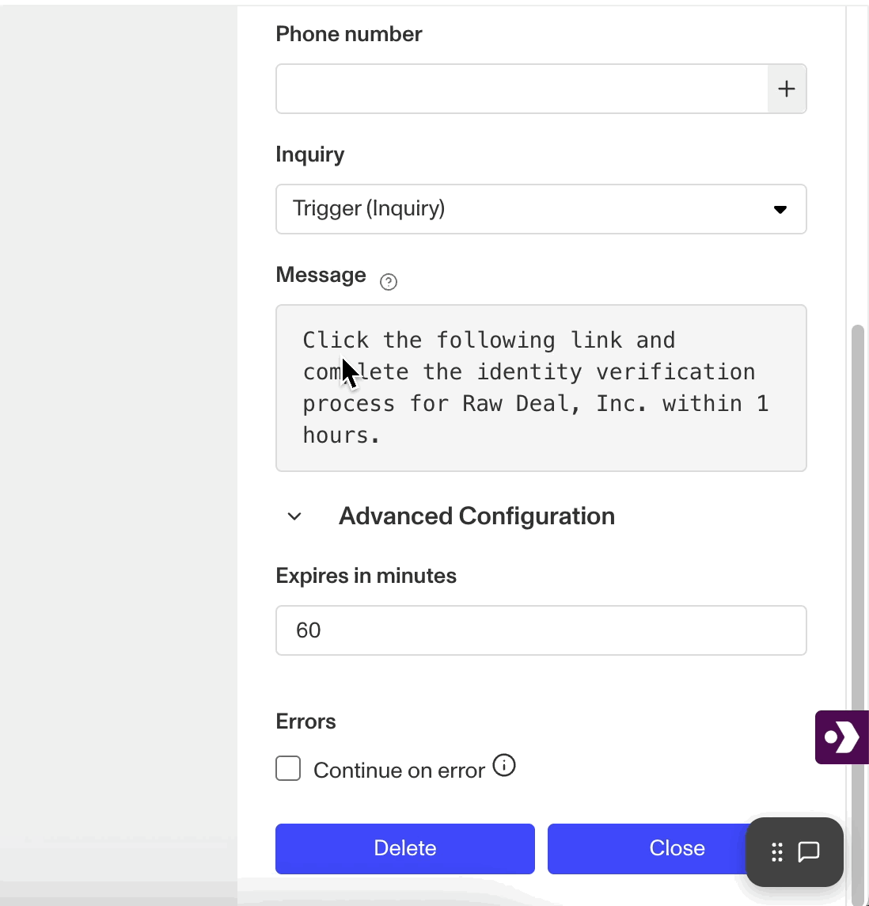

# Workflows: Send Inquiry Link SMS step

# What is the Send Inquiry Link SMS step?

**Send Inquiry Link SMS** is a Workflow Action step that sends a user a link for an Inquiry in an SMS message.

When an Inquiry is created, a user must be sent a link to the Inquiry to fill out their information and undergo verification. Rather than manually sending links to a user, the Send Inquiry Link SMS step lets you automate and standardize this process within a workflow.

The Send Inquiry Link SMS step requires:

-   The destination phone number. Phone numbers can be added automatically to Send Inquiry Link SMS from another Persona object (such as an Account), or entered manually.
-   The Inquiry template it should link to. Inquiries can be pulled from elsewhere in the Workflow, or a prior step can be added to Create Inquiry.
-   The message content. The default language includes direction for the end user and the amount time they have before the link expires. This content cannot be modified.
-   The expiration time. Under Advanced Configuration, the default expiration time is 60 seconds but can be adjusted. Any change beyond the default automatically adjusts the message content.

Inquiry verification links can also be sent via email using the Inquiry Link Email action step.

# How do you add an Inquiry Link Email step?

1.  Navigate to the Dashboard, and click on **Workflows** > **All Workflows**.
2.  Find and click on the workflow you want to edit, or **Create** a new workflow.
3.  Click on **+** when hovering over a circle to add an **Action** step.

4.  Use the **Find Action** select box to click on **Inquiry** > **Send Inquiry Link SMS**.
5.  Add a phone number destination, either manually or from another **Object** by clicking **+**.
6.  Add an Inquiry the action should link to.
7.  Add or edit the message to be sent along with the link.
8.  (Optional) Edit the expiry time under **Advanced Configurations**.
9.  (Optional) Click the **Continue on error** box if you want the Workflow to continue running even if this Action raises an error.
10.  **Close** the Action. You’ll have to **Save** and **Publish** the workflow to begin using it.

# Plans Explained

## Send Inquiry Link SMS step by plan

|  | Startup Program | Essential Plan | Growth Plan | Enterprise Plan |
| --- | --- | --- | --- | --- |
| Send Inquiry Link SMS Step | Not Available | Not Available | Available | Available |

[Learn more about pricing and plans.](./6oZbzp7jb7AWGClF5vpY3K.md)

# Learn more

[Learn more about Inquiries.](../../docs/docs/inquiries.md)
