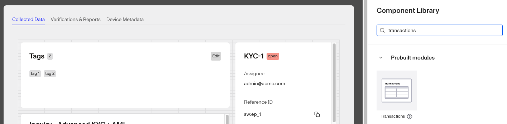
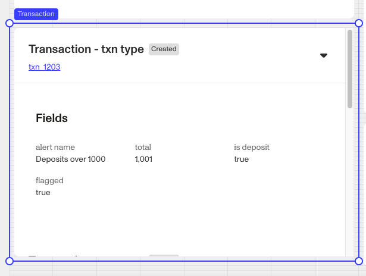
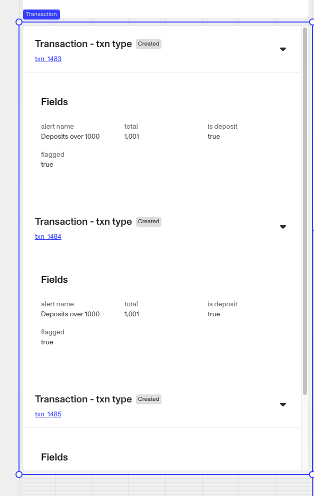
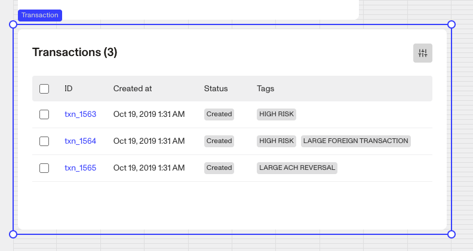

# Cases: Transactions prebuilt module

# What is the Case Transaction module?

The **Case Transaction module** is a prebuilt component that can be added to a Case Template. It displays Transactions that have been attached to the Case, in a list or table format. You can attach a Transaction to a Case in a Workflow using the [Attach Objects to Case](./68OO1Ovqk7xRcYUDVMbWYa.md) step. You can also define logic that governs when it appears.

# How do you add a Case Transaction Module?

1.  Navigate to the Dashboard, and click on **Cases** > **Templates**.
2.  Find and click on the Case template you want to edit, or **Create** a new template.
3.  Navigate to the **Tab** you want to add a Case component to. Click an empty space to view the Component Library.
4.  In the right toolbar, search for ‘**Transaction**.’
5.  Drag and drop the **Transaction module** into your Case UI and reposition it by dragging it around.

6.  Click on the **Transaction module** on the right toolbar you can customize the module.
    1.  Under **Settings,** you can change how the **Transactions** are displayed. The module offers two display options: list and table. See the **Transaction display options** section below for screenshots.
    2.  Under **Module Layout**, you can change:
        1.  Dynamic height: Module will grow or shrink to fit its contents.
        2.  Visibility: Dynamically control whether the module is hidden. This is a toggle button that lets you set conditions for when the button should be displayed or hidden from view based on your case requirements. You can read more about **Visibility configuration** below.
    3.  Under **Advanced Options > Module Enablement**, you can define custom control conditions that determine when the **Transaction module** is enabled or disabled. Advanced options are typically configured for specific customers by a Persona team member.
7.  Click the **“Delete”** button if you want to remove the component from the Case UI.

## Transaction display options

1.  List: This is the default display configuration.

2.  Table: The table format gives you the option to further customize the module. You can click the button on the top right to show or hide attributes.

## Visibility configuration

If you toggle this on you will have two options to customize visibility.

1.  **Basic** visibility allows you to set rules on the **Transaction module** to determine when it will be visible. You can read more about **Basic visibility configuration** below.
2.  **Advanced** visibility allows you to set logic to control when the **Transaction module** is enabled or disabled based on custom conditions. Advanced visibility configurations are typically configured for specific customers by a Persona team member.

## Basic visibility configuration

Visibility configuration consist of three main components:

1.  **Field**: The object that will have a condition linked to it.
2.  **Condition**: How the field is compared to the value (e.g., equals, does not equal).
3.  **Value**: The value to test against.

### Creating Visibility Configuration

-   **AND Statements**: Combine multiple conditions that must all be true for the rule to pass. Add these using the **"Add"** button.
-   **OR Groups**: Combine conditions where only one needs to be true for the rule to pass. Create these by clicking **"Add OR Group"**.

## How to Use Visibility Configuration

1.  Click on the **Transaction module**, and go to **Module Layout** and toggle the button next to **Visibility** in the right toolbar.
    1.  Click on “**Empty rule**” to see **Visibility configuration**.
    2.  Create a logical rule by filling in the three boxes following **Show if**, which correspond to an object, its condition, and its value being assessed, respectively. When that logical rule passes, the **Checklist module** is shown.
    3.  (Optional) Add additional logical rules by clicking either ”**Add”** (if you want to add 'AND' rules, where all must be passed to continue) or ”**Or group”** (if you can also nest a group of OR statements within an AND statement).

# Plans Explained

## Case Transaction module component by plan

|  | Startup Program | Essential Plan | Growth Plan | Enterprise Plan |
| --- | --- | --- | --- | --- |
| Case Transaction module component | Limited | Limited | Available | Available |
| Advanced options - Module enablement | Not Available | Not Available | Limited | Available |
| Visibility - Advanced configurations | Limited | Limited | Limited | Available |

[Learn more about pricing and plans](./6oZbzp7jb7AWGClF5vpY3K.md).
