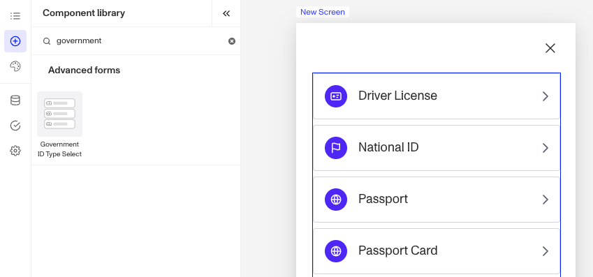

# Inquiries: Government ID Type Select component

# What is the Inquiry Government ID Type Select component?

**Government ID Type Select** is an Inquiry screen component that allows a user to choose an identification type form a predefined list.

A **Government ID Type Select** component is ideal for scenarios where users need to provide an official identification type, such as a passport, driver’s license, or national ID. This component is often used in conjunction with a Government ID Verification within an Inquiry and the component comes pre-built alongside the verification when using the Government ID module.

# How do you add an Inquiry Government ID Type Select component?

1.  Navigate to the Dashboard, and click on **Inquiries > Templates**.
2.  Find and click on the Inquiry template you want to edit, or **Create** a new template.
3.  Hover over a screen and click the **Pencil** icon, or double-click the screen to open it in the Screen Editing View.

4.  In the Left Panel, click **Component Library** and search for ‘**Government ID Type Select**’.
5.  Drag and drop the Government ID Type Select component into your screen, and reposition it by dragging it around.
6.  Click on the Government ID Type Select component, and go to **Properties** in the Right Panel.
    1.  Under **Settings**, you must set a **Transition Type**. This sets the screen to transition to a different screen, or to use an action sequence that determines the next screen. You can choose between two types: **Screen** and **Action Sequence**.
        1.  **Screen** transition allows the screen to change to a different screen when the component is clicked.
            1.  Click the **Screen** dropdown menu to select the **transition screen**. You will see a list of available screens from your Inquiry.
            2.  Click the **Government Id Step** dropdown menu to add a predefined list of Government IDs. Assets and localizations will be taken from this step.
            3.  Click the **Country Code Field Override** if you need to override the **Government Id Step.** If this is not populated, the country code will be taken from the configured country code field key in the government id step.
        2.  **Action Sequence** transition uses an action sequence to determine the next screen.
            1.  **Action Sequences** run logic within an Inquiry to determine which screen to show users based on specific conditions. Click the **Action Sequence** dropdown menu to select the sequence. You will see a list of available actions from your inquiry.
            2.  **Action Sequence Error Screen**: If your **Action Sequence** fails for any reason, users will be routed to this screen. Click the **Action Sequence Error Screen** dropdown menu to select the error screen. You will see a list of screens from your Inquiry.
            3.  Click the **Government Id Step** dropdown menu to add a predefined list of Government IDs. Assets and localizations will be taken from this step.
            4.  Click the **Country Code Field Override** if you need to override the **Government Id Step.** If this is not populated, the country code will be taken from the configured country code field key in the government id step.
7.  In the **[Fields](./5rT2Llik2kUvJTXKapZb8c.md)** tab, you can set up and customize the behavior of the Government ID Type Select component.
    1.  **Required**: This field will be set to **Conditional**. You will need to set a Logic rule, you can read more about **Logic** below.
    2.  In the **Logic** tab, you can add rules that govern when the component appears, and when it does not. You can read more about **Logic** below.
8.  **Close** the step. You’ll have to **Save** and **Publish** the template to begin using it.

# Translations

Persona can automatically translate new text into other languages in the component’s **Properties** tab. You can also customize the translation for any particular language.

To configure available languages for your template, click the **Gear** icon in the Left Panel to access **Settings**, then select languages under the **General** tab.

# Logic

Persona provides you with the ability to add logic to a Multi Select component. For example, a component may only become visible to a user if certain conditions are met. On the **Logic** tab, there are two options for logic rules:

-   **On screen load**: Logic rules are evaluated only when the screen loads. They can reference any field configured on the template.
-   **On screen update**: Logic rules are evaluated in real time. They can only reference inputs on the current screen.

For form components a field can be labeled as required under specific conditions.

-   **Require field**: Logic rules are evaluated in real time referencing inputs on the current screen. They can only reference inputs on the current screen.

## Logic Rules

Logic rules consist of three main components:

1.  **Field**: The object that will have a condition linked to it.
2.  **Condition**: How the field is compared to the value (e.g., equals, does not equal).
3.  **Value**: The value to test against.

### Creating Logic Rules

-   **AND Statements**: Combine multiple conditions that must all be true for the rule to pass. Add these using the **"Add"** button.
-   **OR Groups**: Combine conditions where only one needs to be true for the rule to pass. Create these by clicking **"Add OR Group"**.

## How to use Logic Rules

1.  Click on the Government ID Type Select component, and go to **Logic** in the Right Panel.
    1.  Choose either “**On screen load**” or “**On screen update**” and click **Add.**
    2.  Choose what **Component Update to apply**. This determines what happens to the component when the logical rules are met.
    3.  Create a logical rule by filling in the three boxes following **When**, which correspond to an object, its condition, and its value being assessed, respectively. When that logical rule passes, the component update is applied.
    4.  (Optional) Add additional logical rules by clicking either **\+ Add** (if you want to add 'AND' rules, where all must be passed to continue) or **\+ Or** (if you want to add 'OR' rules, where one must be passed to continue). You can also nest a group of OR statements within an AND statement by clicking **\+ Add Group**.
    5.  (Optional) To edit the logic directly, you can open the **code editor**.

# Plans Explained

## Government ID Type Select component by plan

|  | Startup Program | Essential Plan | Growth Plan | Enterprise Plan |
| --- | --- | --- | --- | --- |
| Government ID Type Select component | Available | Available | Available | Available |
| Translations for Government ID Type Select component | Available | Available | Available | Available |
| Logic for Government ID Type Select component | Not Available | Not Available | Available as part of Inquiries Enhanced | Available as part of Inquiries Enhanced |

[Learn more about pricing and plans](./6oZbzp7jb7AWGClF5vpY3K.md).

# Learn more

[Learn more about Inquiries.](../../docs/docs/inquiries.md)
