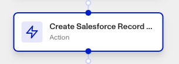

# Workflows: Pattern of Salesforce steps

# What is the pattern of Salesforce action steps?

Salesforce can be integrated into your workflow, offering several Salesforce Workflow Action steps that allow you to **Create**, **Search**, and **Update** Salesforce records automatically within your workflow.

Salesforce is a CRM platform that helps unify marketing, sales, service, commerce, and IT in personalizing every experience along the customer journey. Salesforce is available as a [Marketplace integration](./6YaRAGHHcXb6MQ0c6CGvbJ.md).

Persona’s Salesforce integration can be useful for streamlining and simplifying customer onboarding, improving customer data management, and more.

Once the integration is set up, you can trigger the following Salesforce actions inside your Workflows. _Note: If there are multiple options for these actions, choose the one with "OAuth" in the name._

-   Create Salesforce Record
-   Update Salesforce Record
-   Find Salesforce Record

Records map to the specific fields that exist within your Salesforce instance.

# How do you add a Salesforce action step?

## Navigating to your Workflow

1.  Navigate to the Dashboard, and click on **Workflows** > **All Workflows**.
2.  Find and click on the workflow you want to edit, or **Create** a new workflow.
3.  Click on **+** when hovering over a circle to add an **Action**.

4.  Use the **Find Action** select box to click on **Marketplace** > **Salesforce**. Choose which Salesforce action step to add: **Create**, **Search**, or **Update**.

## Adding a Create Salesforce Record step

1.  In **Find Action**, click on **Marketplace** > **Salesforce** > **Create Salesforce Record OAuth**.
2.  Choose the **Salesforce Instance** the step should interact with.
3.  Choose the **Record Type** to be created.
4.  Choose the **Record Properties** that record should contain.
5.  (Optional) In ‘Advanced Configuration’, click the **Continue on error** box if you want the workflow to continue running even if this step raises an error.
6.  **Close** the step. You’ll have to **Save** and **Publish** the workflow to begin using it.

## Adding a Search Salesforce Record step

1.  In **Find Action**, click on **Marketplace** > **Salesforce** > **Search Salesforce Record OAuth**.
2.  Choose the **Salesforce Instance** the step should interact with.
3.  Choose the **Record Type** to be searched for.
4.  Choose the **Record Properties** that record should contain.
5.  (Optional) In ‘Advanced Configuration’, click the **Continue on error** box if you want the workflow to continue running even if this step raises an error.
6.  **Close** the step. You’ll have to **Save** and **Publish** the workflow to begin using it.

## Adding an Update Salesforce Record step

1.  In **Find Action**, click on **Marketplace** > **Salesforce** > **Update Salesforce Record OAuth**.
2.  Choose the **Salesforce Instance** the step should interact with.
3.  Choose the **Record Type** and **Record ID** to be updated.
4.  Choose the **Record Properties** that record should contain.
5.  (Optional) In ‘Advanced Configuration’, click the **Continue on error** box if you want the workflow to continue running even if this step raises an error.
6.  **Close** the step. You’ll have to **Save** and **Publish** the workflow to begin using it.

# Plans Explained

## Salesforce action steps by plan

|  | Startup Program | Essential Plan | Growth Plan | Enterprise Plan |
| --- | --- | --- | --- | --- |
| Salesforce action steps | Not Available | Not Available | Available | Available |

[Learn more about pricing and plans](./6oZbzp7jb7AWGClF5vpY3K.md).

# Learn more

[Learn more about Salesforce integration here.](./5utuLitvY7L4V4GU34NyS9.md)
