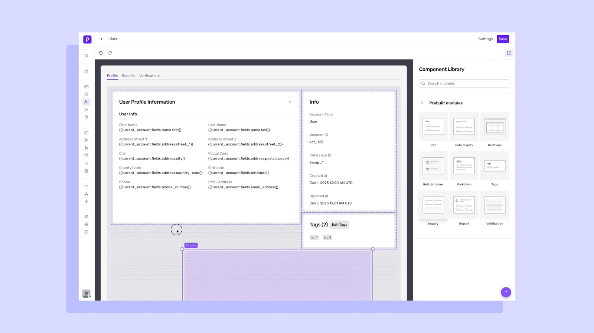
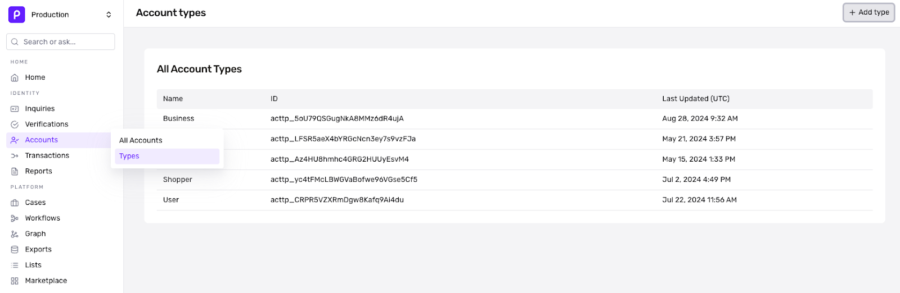
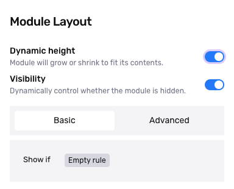

# Configuring Account views with Layout Editor

_(Account Layout Editor is currently in Open Beta and may not be available for all users. Please contact support for additional questions.)_

# Overview

Within each Account Type, organizations have the ability to modify how information is arranged or displayed. Since accounts are meant to be a source of truth for an entity’s identity data, Persona equips organizations with a flexible drag-and-drop tool to build identity records that reflect their business needs. This may be helpful in the following scenarios:

-   Customize how accounts are modeled and visualized per account type (e.g. surfacing the most frequently referenced information at the top of the template)
-   Consolidate data from multiple sources in one place and organize data by its source
-   Set and visualize relationships between different accounts

# Configure your Account Layout

To modify your Account view, use the layout editor to drag-and-drop modules into the desired location. Modules are prebuilt components (e.g. Inquiries, Reports, Verifications) containing specific kinds of information that may be useful when performing business or user lookups.

1.  From the left navigation menu, select **Accounts** > **Types** to view your existing list of Account Types. To create new [account types](./NrM9W6KETzMbzQXgdU3cV/%20%22Create%20new%20Account%20Types%22.md), click `+ Add Type`. You can also modify the view for an existing Account Type by selecting the desired Account Type from the index view.

2.  Clicking on an Account Type will open the Layout Editor. On this page, you’ll see the Account layout template, along with a right panel showing the Component Library. The Component Library features a variety of prebuilt Modules that serve as building blocks for your template (see below for all available prebuilt Modules).
    
3.  Drag and drop your preferred Module into the template to create your optimal layout. For advanced configurations, we also provide settings for Dynamic Height and Visibility.
    

-   **Dynamic Height** automatically grows or shrinks modules to fit its contents.
-   **Visibility** enables you to dynamically control whether the module is hidden, using conditional criteria.

## Modules

Modules available in the Account Layout Editor include the following.

### General Modules

| Module Name | Description | Configurations |
| --- | --- | --- |
| Data display | Displays any string, number, or boolean fields on the Account. Includes file support. |  |
| Info | Displays an overview about the Account. | (Optional) Rearrange the order of fields, and show or hide fields. |
| Markdown | Display custom text using Markdown syntax. |  |
| Tags | Displays tags applied to the Account.  
  
_We recommend you always include this module._ |  |
| Relations | Displays related Accounts, such as businesses linked to an individual, or transactions linked to an individual. |  |
| Related cases | Displays cases that are linked to the account entity. For example, all cases associated with a given user or business. |  |

### Product Modules

| Module Name | Description | Configurations |
| --- | --- | --- |
| Report | Displays all Reports related to the Account, for one Report Type. | Select the Report Type. |
| Verification | Displays all Verification attempts related to the Account, for one Verification type. | Select the Verification Type |
| Inquiry | Displays all Inquiries related to the Account. | (Optional) Select an Inquiry template. Only Inquiries for this template will be displayed.  
  
(Optional) Rearrange the order of fields, and show or hide fields. |

## Related articles

[Creating custom Account Types and Fields](./NrM9W6KETzMbzQXgdU3cV.md)
