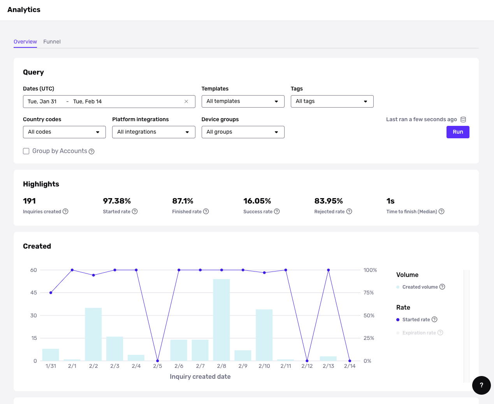
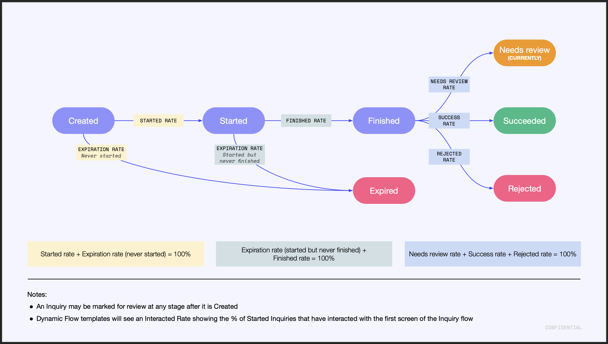
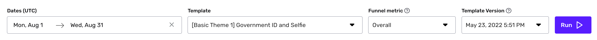
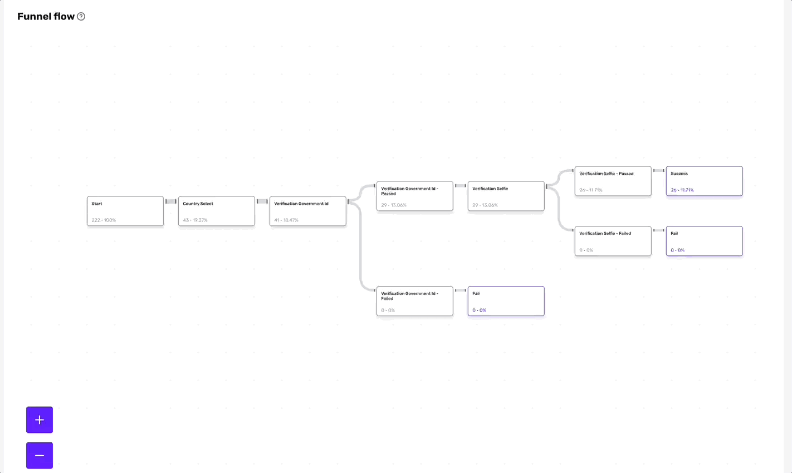
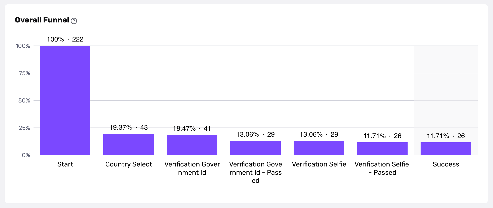
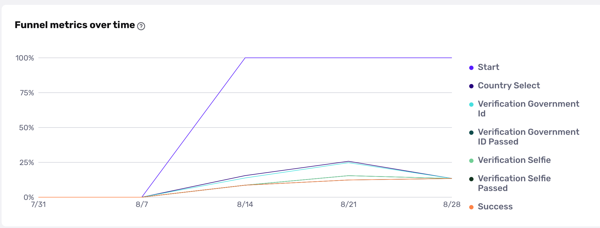

# Utilizing Inquiry Analytics

## Overview

This guide explains which analytics are available for Inquiries, and how to view them in the Persona Dashboard.

## About Inquiry Analytics

Inquiry Analytics shows key metrics for each Inquiry template. Use Inquiry Analytics to uncover insights and optimize your Inquiry flows.

Answer questions like:

-   How many Inquiries have been finished by the end user?
-   How many Inquiries have been completed and approved?
-   What percentage of Inquiries are getting marked for manual review?
-   Between which screens are users dropping off in an Inquiry?
-   What percentage of Inquiries are routed down a particular path within an Inquiry?

## Inquiry Analytics page

Find the [Inquiry Analytics](https://app.withpersona.com/dashboard/inquiry-analytics/volume) page within **Inquiries** > **Analytics** in the navigation bar.

On the Inquiry Analytics page, there are two tabs:

-   **Overview**: See key high-level metrics.
-   **Funnel**: Drill into how your end users are progressing through each screen in an Inquiry Template. This data is available for Dynamic Flow Inquiry Templates only.

## Overview tab

### Query

The Query editor lets you filter the Inquiries you want to see data for. Select the Date range, and optionally specific Inquiry Templates, Tags, Country codes, Platform integrations, and Device groups.

Click **Run** to update the metrics on the page.

### Highlights

The Highlights section displays metrics that give insight into how your end users are progressing through the Inquiry flow. These metrics include:

-   **Inquiries created**: the number of Inquiries created.
-   **Started rate**: the % of created Inquiries in which a user viewed the first screen of the Inquiry flow.
-   **Interacted rate**: the % of started Inquiries in which a user progressed beyond the first screen of the Inquiry flow.
    -   Note: this metric is only available for Dynamic Flow Inquiry Templates. If your Query includes data from a mix of Dynamic Flow and pre-Dynamic Flow Templates, this metric will not be shown. 
-   **Finished rate**: the % of started Inquired in which a user made it to the end of the Inquiry flow.
-   **Success rate**: the % of finished Inquiries that reached an Inquiry status of "completed" or "approved."
-   **Rejected rate**: the % of finished Inquiries that reached an Inquiry status of "failed" or "declined."
-   **Time to finish (median)**: the median amount of time the user has interacted with the inquiry flow from start to finish.

### Charts

Below the Highlights section, there are four charts:

-   Created
-   Started
-   Finished
-   Marked for Review

Each chart shows the total volume of Inquiries in that category.

Additional metrics are overlayed on the chart. Toggle each metric on or off by clicking on the metric in the legend.

Metrics are presented by hour, day, week or month depending on the chart granularity and the time range you have selected.

### Chart: Created

This chart shows metrics about Inquiries that are ever marked for review.

In addition to total volume, metrics include:

-   **Started rate**: the % of Inquiries in which a user viewed the first screen of the Inquiry flow.
    -   Started rate is primarily a useful metric if you manually create Inquiries through the Dashboard. If you integrated Persona using an [Embedded integration](./Jx6UeQzh5tVSkoynev7bt.md), you should expect the started rate to be close to 100%.
-   **Expiration rate**: the % of Inquiries that expired (based on the expiration policy you defined on your Inquiry Template).

### Chart: Started

This chart shows metrics about Inquiries started during the selected time period. An Inquiry is considered started if a user viewed the first screen of the Inquiry flow.

In addition to total volume, metrics include:

-   **Finished rate**: the % of started Inquiries in which a user made it to the end of the Inquiry flow.
-   **Expiration rate**: the % of started Inquiries that expired (based on the expiration policy you defined on your Inquiry Template).

At any given moment, the finished rate and expiration rate will add up to 100%, because after an Inquiry is started, it must be finished or will expire.

### Chart: Finished

This chart shows metrics about Inquiries finished during the selected time period. An Inquiry is considered finished if a user made it to the end of the Inquiry flow.

In addition to total volume, metrics include:

-   **Success rate**: the % of finished Inquiries that reached an Inquiry status of "completed" or "approved."
-   **Rejected rate**: the % of finished Inquiries that reached an Inquiry status of "failed" or "declined."
-   **Needs review rate**: the % of finished Inquiries that are currently marked for review.
-   **Ever-marked-for-review rate**: the % of finished Inquiries that were ever marked for review.
-   **Auto-decisioned rate**: % of finished inquiries that were decisioned (approved or declined) automatically, without any manual intervention.
-   **Manual-decisioned rate**: % of finished inquiries that were decisioned (approved or declined) via a manual reviewer.

### Chart: Marked for Review

This chart shows metrics about Inquiries marked for review during the selected time period. 

In addition to total volume, metrics include:

-   **Decisioned rate**: the % of Inquiries marked for review that have been decisioned. This is a productivity metric.
-   **Approved rate**: the % of decisioned Inquiries that were approved.

If your team uses [Cases](./1EJCOF8bL5KRx4pQESw7VB.md) to review flagged Inquiries, you can use [Cases Analytics](https://app.withpersona.com/dashboard/case-analytics/productivity) to get a more detailed look at your team's productivity and your case resolution trends.

## Funnel tab

The Funnel tab lets you drill into how your end users are progressing through each screen in an Inquiry Template. _**Note: This data is available for Dynamic Flow Inquiry Templates only.**_

### Filters

Use the filters at the top of the page to select:

-   **Dates**: the time period you want to see data for.
-   **Template**: the Inquiry Template you want to analyze.
-   **Funnel metric**: the reference point for the percentages in each node within the Funnel flow diagram.
    -   **Overall**: Use the starting point as the reference point. Each percentage shown will reflect the % of started Inquiries that progressed to each step.
        -   Overall percentages help you understand the overall drop-off from start to finish in the flow.
    -   **Per Step**: Use the previous step as the reference point. Each percentages shown will reflect the % of Inquiries from the previous step that progressed to this step.
        -   Per Step percentages help you identify which steps have a lot of drop-off and may require attention.
-   **Template version:** the version of the selected Inquiry Template to use.
    -   When changes get published through the Inquiry Template Editor, a new template version is generated. By default, the latest published template version is selected.
    -   You can use this dropdown to compare versions for a single template and see how the funnel might look different between any published changes.

### Run

Click **Run** to update the metrics on the page.

### Funnel flow

The Funnel flow section shows a screen-by-screen breakdown of how end users progressed through the selected Inquiry Template flow.

#### Understand the Funnel flow

In the diagram:

-   Each node represents a screen in the flow.
-   Each node contains two metrics:
    -   The number of Inquiries in which a user viewed that screen.
    -   The funnel metric (either Overall or Per step, based on your choice).
-   The thickness of the line that connects each node is proportional to the volume of users that progressed from one screen to the next.

As you examine your data, keep in mind that any conditional logic configured in the selected Inquiry Template can impact user behavior.

#### Interact with the Funnel flow

In the diagram:

-   Hover on any final step node to view the funnel metrics as a bar chart.
-   Click on a final step node to visit the **Funnel details page** for this specific path in the flow.

### Funnel details page

#### Funnel metrics per screen

A bar chart shows the funnel metrics for screens on the selected path, across the entire selected time period.

#### Funnel metrics per screen over time

A line chart shows the funnel metrics per screen broken down by days or weeks.

This chart can surface metric fluctuations that warrant investigation.

For example, if you notice that 75% of users who view the “Start” screen progressed to the next screen, you can use the line chart to examine if this percentage is consistent over time. If you find there are specific days or weeks where this metric is higher or lower, you can use that information to dig into possible reasons why.

Your analytics is a source of truth for the performance of your specifics solutions, but should not be treated as such for your billing. Your contract will determine how your bill is calculated and your invoice should be treated as the source of truth.

For example, verification analytics will count unique inquiries containing a verification, but not the number of individual verifications in the inquiry, whereas billing counts the total number of verifications. If you have an inquiry with 2 Gov ID verifications, this can cause a disparity in the count between the analytics numbers and billing.
