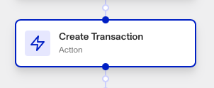

# Workflows: Create Transaction step

# What is the Create Transaction step?

**Create Transaction** is a Workflow Action step that creates a new Transaction when triggered.

Transactions represent significant interactions or events (e.g. user onboarding, loan application journey, etc). While an Account in Persona represents a user or entity, a Transaction captures some event associated with that user/entity. Its fields are used to capture the necessary information for processing the transaction.

You define what types of transactions are possible based on what counts as significant events or user journeys in your product. Similarly, the fields that can be included in a transaction are flexible and can be tailored to your requirements.

Transactions are integrated via Workflows and tie automations across Persona objects and constructs. Transactions and Workflows connect all parts of the platform together and back to your own systems over time.

The Create Transaction step lets you automate transaction creation within your workflow, which helps automate your user journey and experience.

# How do you add a Create Transaction step?

1.  Navigate to the Dashboard, and click on **Workflows** > **All Workflows**.
2.  Find and click on the workflow you want to edit, or **Create** a new workflow.
3.  Click on **+** when hovering over a circle to add an **Action**.

4.  Use the **Find Action** select box to click on **Transaction** > **Create Transaction**.
5.  Choose the **Transaction Type** and **Transaction Fields** for the newly created transaction. (You can edit what Transaction types and fields are available in **Dashboard** > **Transactions** > **All Transactions** > **\+ Create Transaction**)**.**
6.  (Optional) In ‘Advanced Configuration’, click the **Continue on error** box if you want the workflow to continue running even if this step raises an error.
7.  **Close** the step. You’ll have to **Save** and **Publish** the workflow to begin using it.

# Plans Explained

## Create Transaction step by plan

|  | Startup Program | Essential Plan | Growth Plan | Enterprise Plan |
| --- | --- | --- | --- | --- |
| Create Transaction step | Not Available | Limited | Available | Available |

[Learn more about pricing and plans](./6oZbzp7jb7AWGClF5vpY3K.md).

# Learn more

Learn more about Transactions [here](../../docs/docs/transactions.md).
