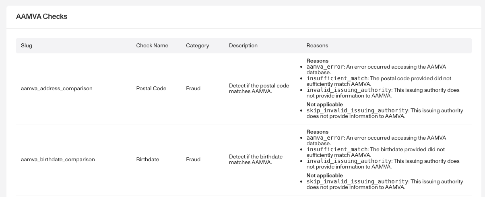
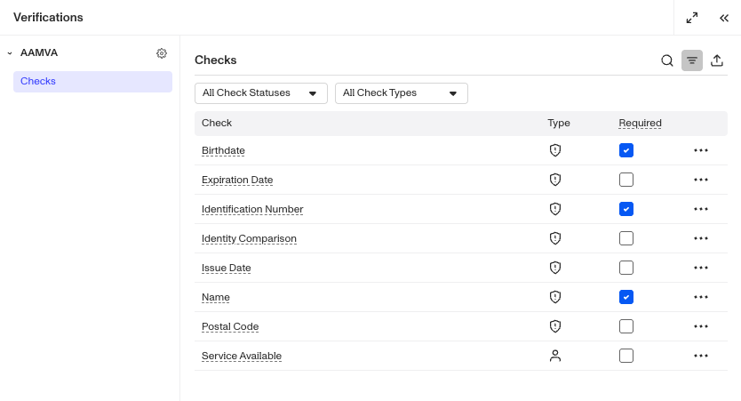

# Configuring AAMVA Verification checks

# Overview

Below, we'll guide you through choosing and configuring a [AAMVA Verification](./1wiQ7wAhmnKh6mesCGopKl.md). We'll walk through each of these steps:

1.  Review possible Verification checks
2.  Choose which Verification checks to require
3.  Edit required checks

Each step is important. The first two steps help you decide what information and checks best support your use case. The remaining steps walk through how to configure those choices.

AAMVA Verification offers a variety of configuration options, including required or un-required Verification checks, Identity Comparison checks, and verification check sub-configurations.

## Step 1: Review possible Verification checks

Navigate to **Documentation > [Verification Checks](https://app.withpersona.com/dashboard/resources/verification-checks/)** reference in the Dashboard. Find the section for AAMVA checks. The table includes all possible checks to choose from.

## Step 2: Choose which Verification checks to require

The Verification checks you choose to require will depend on your organization's specific needs. There is no one-size-fits-all configuration for these checks, but the following guidelines can help you optimize your setup:

**Consider the business goals of the Inquiry Template**. For example:

-   Do you want to prioritize avoiding false positives (people passing verification who should not), or avoiding false negatives (people failing verification who should not)? The more strict your verification needs are, the more checks you may want to require.
-   Some checks are more fraud oriented while others are more conversion oriented.

Use the [Verification check reference](https://app.withpersona.com/dashboard/resources/verification-checks/) to see which checks are more suitable for your business.

**Monitor and iterate**. Keep in mind that you can adjust Verification checks as your needs change. For example, you can start with the defaults, then change one check to see how it impacts your Inquiry pass rates. You can use [Inquiry Analytics](./6wdZdwn9m4T8eY7EfqWRmB.md) to help you decide if it was an improvement.

## Step 3: Edit required checks

Once you decide which Verification checks to require, you can [add or remove a required Verification](./5Tc5tsWfBX03AHRkr2vqv2.md).

**For AAMVA Verification Templates within an Inquiry Template:**

1.  In the Persona Dashboard, navigate to **Inquiries > Templates**. Select a template that uses AAMVA Verification.
2.  Once you are in the Flow Editor, use the Left Panel to head to Verifications.
3.  Select the AAMVA Verification template.
4.  Navigate to Checks.

## Related articles

[AAMVA Verification](./1wiQ7wAhmnKh6mesCGopKl.md)

[Government ID + AAMVA Solution](./76IuZmA7MC9tdemWcSb49M.md)

[Understanding AAMVA Verification results](./2SLguSV9wCFn8Fi7m7eoPJ.md)

[How can I use an existing inquiry template with the AAMVA verification solution?](./K8vbSyXEh92a83t222FfX.md)
