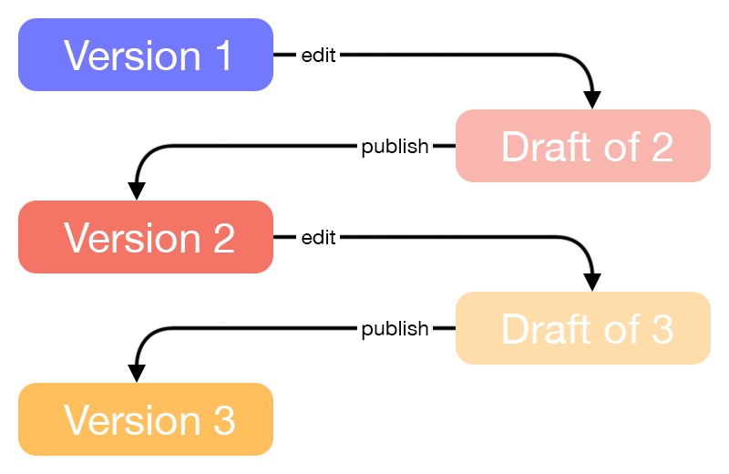

# Verification Template Versions and Change Management

# Overview

Verification Templates in Persona support version management, allowing you to draft, publish, and maintain multiple versions over time. This enables safe iteration, controlled releases of changes, and the ability to audit or revert prior configurations as needed.

| **Persona Object** | **Object ID syntax** | **Object ID versioning syntax** |
| --- | --- | --- |
| Verification Template | Begins with `vtmpl_` | Begins with `vtmplv_` |

Verification Templates can be versioned independently or as part of Inquiry Template changes depending on how they are used:

-   When a Verification Template is embedded within an Inquiry Template and modified as part of editing the Inquiry Template in Flow Editor, its changes are captured and versioned automatically under the Inquiry Template draft. In this case, versioning is managed alongside the Inquiry Template.
-   When you update a standalone Verification Template directly in the Dashboard , the changes are captured in a draft version of the Verification Template. Note: You can consider a standalone Verification Template as one that is only used within a Workflow or directly via the Create Verification API endpoint, and not within an Inquiry Template.

## Drafting and Publishing

When you update a Verification Template directly, Persona creates a **draft** version. Drafts allow you to make incremental changes and save progress before committing those changes live. You can edit a draft multiple times. Once you are satisfied with your changes, publishing the draft will create a new version of the Verification Template.

After publishing, the new version becomes the **live version** used to generate any new Verifications. Published versions are locked from further editing. To make additional changes, you must create a new draft based on any existing version.

## Live version behavior

Once published, a Verification Template version is considered **live**. Any new Verification created after publication uses the latest live version.

-   Each Verification is permanently linked to the version of the Verification Template that was live when it was generated.
-   When you publish additional versions, any new Verifications will use the latest live version, while previously generated Verifications will continue to reference the version from which they were originally created.

This ensures that existing Verifications maintain their integrity and are not affected by changes made to newer template versions.

### Reverting to a previous version

For Verification Templates embedded within an Inquiry Template

-   If you need to undo changes or roll back to a stable configuration of the Verification Template, you can revert to any prior version in the Inquiry Template's Version History. Reverting publishes the selected version as the new live version, without altering the content of the prior versions. Existing Verifications already linked to earlier versions remain unaffected.

For standalone Verification Templates

-   Reverting to previous Verification Template Versions is not supported. Many organizations choose to "roll forward" and adjust the Verification Template configurations to a desired state on a go-forward basis.
