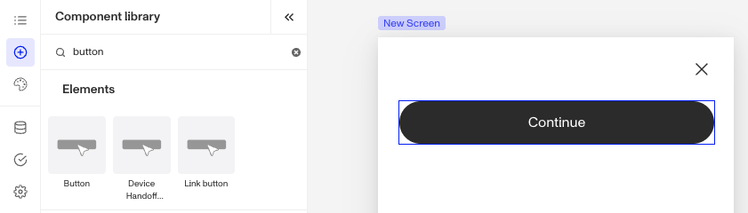

# Inquiries: Button component

# What is the Inquiry Button component?

**Button** is an Inquiry screen component that provides an interactive element. When users click it, it triggers an action. You can customize its appearance, function, and define logic that governs when it appears.

A **Button** guides users through key actions such as submitting forms, opening pages, or canceling operations. It is essential for enabling user interactions and directing workflows.

# How do you add an Inquiry Button Component?

1.  Navigate to the Dashboard, and click on **Inquiries > Templates**.
2.  Find and click on the Inquiry template you want to edit, or **Create** a new template.
3.  Hover over a screen and click the **Pencil** icon, or double-click the screen to open it in the Screen Editing View.

4.  In the Left Panel, click **Component Library** and search for ‘**Button**\`.
5.  Drag and drop the Button component into your screen, and reposition it by dragging it around.
6.  Click on the Button component, and go to **Properties** in the Right Panel.
    1.  Under **Settings,** you must set a **Button Type**. This defines what happens when users click the **Button**. You can choose from four options: Action, Cancel, Complete, Submit. You can read more about **Button Types** below.
    2.  Under **Settings,** you can change the text displayed on the **Button**. Go to **Properties** in the Right Panel. Add **text** and **translations**:
        1.  Edit the text in the **Text** box.
        2.  Add translations for the text by clicking **Edit translations.** You can **Translate All** or **Translate** individual languages, manually or automatically. If you don’t set translations, you’ll be prompted to do so upon **Publishing** the template. You can read more about **Translations** below.
7.  (Optional) In the **Styles** tab, you can edit the **Button’s** sizing, spacing, layout, color and border. You can read more about **Styles** below.
8.  (Optional) In the **Logic** tab, you can add rules that govern when the component appears, and when it does not. You can read more about **Logic** below.
9.  **Close** the step. You’ll have to **Save** and **Publish** the template to begin using it.

# Button Types

There are four Button Types: Action, Cancel, Complete, Submit. Each has a different set of settings and use.

1.  **Action type:** Triggers a specific task or interaction, when using this **Button** type you must set a **Transition Type.** This defines what happens when users click the **Button.** You can choose between two types: **Screen** and **Action Sequence**.
    
    1.  **Screen** transition allows the screen to change to a different screen when the Button is clicked.
        1.  Click the **Screen** dropdown menu to select the **transition screen**. You will see a list of available screens from your Inquiry.
    2.  **Action Sequence** transition uses an action sequence to determine the next screen.
        1.  **Action Sequences** run logic within an Inquiry to determine which screen to show users based on specific conditions. Click the **Action Sequence** dropdown menu to select the sequence. You will see a list of available actions from your inquiry.
        2.  **Action Sequence Error Screen**: If your **Action Sequence** fails for any reason, users will be routed to this screen. Click the **Action Sequence Error Screen** dropdown menu to select the error screen. You will see a list of screens from your Inquiry.
2.  **Cancel type:** Allows users to back out or dismiss an action without making changes, often returning them to the previous screen.
    
3.  **Complete type:** Indicates the successful completion of a process, such as completing a form.
    
    1.  (Optional) In addition to being able to customize the text displayed in the **Button**, you can also add text for **Auto Submit Countdown. Auto Submit Countdown Text** displays a timer indicating when an action, such as submitting a form, will occur automatically. This feature helps inform users of the remaining time and ensure they are aware of the upcoming automatic submission.
4.  **Submit type:** Sends user-provided information when using this **Button** type you must set a **Transition Type.** This defines what happens when users click the **Button.** You can choose between two types: **Screen** and **Action Sequence**.
    
    1.  **Screen** transition allows the screen to change to a different screen when the Button is clicked.
        1.  Click the **Screen** dropdown menu to select the **transition screen**. You will see a list of available screens from your Inquiry.
    2.  **Action Sequence** transition uses an action sequence to determine the next screen.
        1.  **Action Sequences** run logic within an Inquiry to determine which screen to show users based on specific conditions. Click the **Action Sequence** dropdown menu to select the sequence. You will see a list of available actions from your inquiry.
        2.  **Action Sequence Error Screen**: If your **Action Sequence** fails for any reason, users will be routed to this screen. Click the **Action Sequence Error Screen** dropdown menu to select the error screen. You will see a list of screens from your Inquiry.
    
    (Optional) Under **Settings,** you can change the button style from **Primary** to **Secondary** for different styling. This creates visual contrast on a screen and differentiates between buttons.
    
    (Optional) In addition to being able to customize the text displayed in the **Button**, you can also add text for **Auto Submit Countdown. Auto Submit Countdown Text** displays a timer indicating when an action, such as submitting a form, will occur automatically. This feature helps inform users of the remaining time and ensure they are aware of the upcoming automatic submission.
    

# Translations

Persona can automatically translate new text into other languages in the component’s **Properties** tab. You can also customize the translation for any particular language.

To configure available languages for your template, click the **Gear** icon in the Left Panel to access **Settings**, then select languages under the **General** tab.

# Styles

You can customize how your component appears to users in the Styles tab, modifying elements like sizing, spacing, text, color, and border to align with your branding and enhance usability.

## Sizing

**Button** size can be defined by adjusting its height and width. Under **Sizing**, you can change the height of the **Button** by increasing or decreasing the px value. Select **Fill Width** to make the **Button** fill the screen, this is the default selection. Or choose **Fixed Width** to set a custom size.

## Spacing

Margins can be adjusted on all four sides of the Button component (top, left, bottom, right) to control the spacing between it and other elements on the screen. For instance, increasing the top margin can create more breathing room above the Button component, while adjusting the bottom margin can ensure consistent spacing with subsequent elements, reinforcing a clean and organized layout.

Padding can be adjusted on all four sides of the Button component (top, left, bottom, right) to control the spacing between it and the edge of the screen. Increasing padding creates more space inside the Button, ensuring its content doesn’t feel cramped and aligns neatly with the overall design.

## Text

-   **Font customization**: Choose the font family and weight to match your design typography. For example, use a sleek, modern font for a tech-focused design or a serif font for a more traditional or elegant feel.
-   **Size and spacing**: Adjust font size, line height (space between lines), and letter spacing for optimal readability. Larger fonts with generous spacing can make headings more prominent, while tighter spacing. might suit a minimalist design approach.
-   **Color**: Set text color, match the color to your design palette to ensure consistency.

These styling options help ensure your Button components are visually consistent with your design while maintaining readability for users.

## Colors

Setting a background color allows you to customize the visual appearance of the **Button**, providing contrast and enhancing the overall design.

## Border

You can add a border to all four sides of the Button component (top, left, bottom, right) for custom styling. Adding a border radius creates rounded edges, which softens the Button’s appearance for a more modern look. You can also customize the border's color to match your design.

# Logic

Persona provides you with the ability to add logic to a Button component. For example, a component may only become visible to a user if certain conditions are met. There are two options for logic rules:

-   **On screen load**: Logic rules are evaluated only when the screen loads. They can reference any field configured on the template.
-   **On screen update**: Logic rules are evaluated in real time. They can only reference inputs on the current screen.

## Logic Rules

Logic rules consist of three main components:

1.  **Field**: The object that will have a condition linked to it.
2.  **Condition**: How the field is compared to the value (e.g., equals, does not equal).
3.  **Value**: The value to test against.

### Creating Logic Rules

-   **AND Statements**: Combine multiple conditions that must all be true for the rule to pass. Add these using the **"Add"** button.
-   **OR Groups**: Combine conditions where only one needs to be true for the rule to pass. Create these by clicking **"Add OR Group"**.

## How to use Logic Rules

1.  Click on the Button component, and go to **Logic** in the Right Panel.
    1.  Choose either “**On screen load**” or “**On screen update**” and click **Add.**
    2.  Choose what **Component Update to apply**. This determines what happens to the component when the logical rules are met.
    3.  Create a logical rule by filling in the three boxes following **When**, which correspond to an object, its condition, and its value being assessed, respectively. When that logical rule passes, the component update is applied.
    4.  (Optional) Add additional logical rules by clicking either **\+ Add** (if you want to add 'AND' rules, where all must be passed to continue) or **\+ Or** (if you want to add 'OR' rules, where one must be passed to continue). You can also nest a group of OR statements within an AND statement by clicking **\+ Add Group**.
    5.  (Optional) To edit the logic directly, you can open the **code editor**.

# Plans Explained

## Button component by plan

|  | Startup Program | Essential Plan | Growth Plan | Enterprise Plan |
| --- | --- | --- | --- | --- |
| Button component | Available | Available | Available | Available |
| Translations for Button component | Available | Available | Available | Available |
| Styles for Button component | Available | Available | Available | Available |
| Logic for Button component | Limited | Limited | Limited | Available |

[Learn more about pricing and plans](./6oZbzp7jb7AWGClF5vpY3K.md).

# Learn more

[Learn more about Inquiries.](../../docs/docs/inquiries.md)
