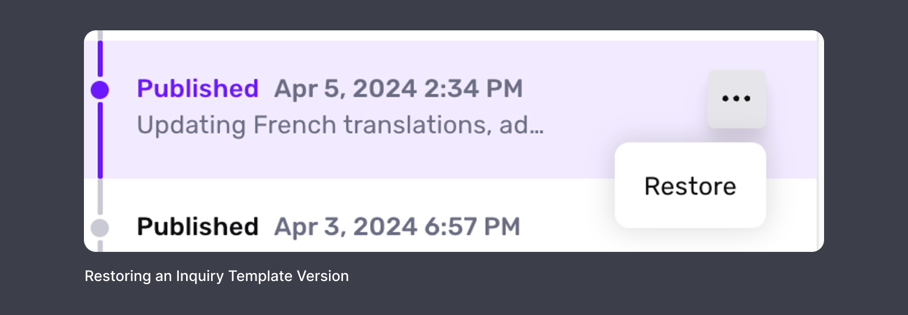
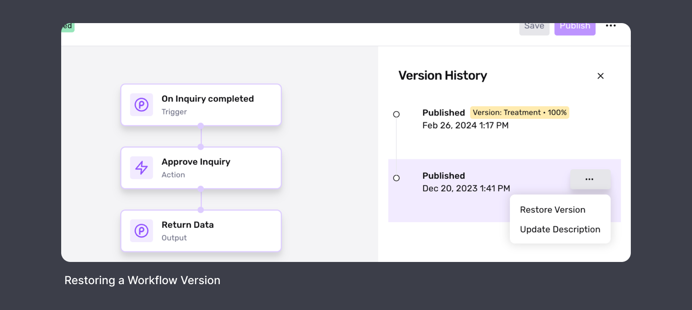

# How to revert to a previously published Inquiry Template Version or Workflow Version

⚠️ This question came from a member of the Persona Community - a compliance leader who was trying to understand how best to revert a set of changes. This question is useful for those looking to revert a published Inquiry Template or Workflow to an older published version that contained desired configurations, experiences, and/or steps for end users.

At Persona, we understand that changes to Inquiry Templates or Workflows can sometimes lead to unexpected issues. To ensure minimal disruption, we provide the ability to revert to previous stable versions of both Inquiry Templates and Workflows.

# How to use this guide

⚠️ This guide will walk you through the steps to quickly revert to an older Inquiry Template or Workflow version. By following these steps, you can self-serve this fix and reduce your product's downtime. Before you begin, ensure you have the necessary privileges to implement these changes.

1.  Go to **Dashboard > Team > Roles > Your Role > Products**.
2.  Under both Inquiries and Workflows, ensure that the **Edit** option has been enabled.

# Reverting an Inquiry Template

1.  **Select the Inquiry Template**: Choose the one you’d like to modify.
2.  **Access Versions**: Click the **Versions** button on the top bar. This will open a history tab on the right side of the screen displaying each published version. 
3.  **Preview Older Version**: Click on the desired version to load it in view-only mode.
4.  **Initiate Restoration**: In the history tab, click the **More Options** button next to the selected version, then click **Restore**.
5.  **Publish the Restored Version**: You will now see the Inquiry Template in view-only mode with a **Publish** button at the top bar. Click **Publish**.
6.  **Confirm**: A popup will appear, asking if you would like to "Create new draft from restored version?". Optionally, provide a reason for the change in the input box, and click **Save**.

# Reverting a Workflow

1.  **Enter Workflow Edit Mode**: Select the **Edit** button for the Workflow you want to change.
2.  **View Version History**: Click the **More Options** button on the top bar and select **Version History**.
3.  **Preview Older Version**: Select the version you want to revert to, which loads in view-only mode.
4.  **Restore the Version**: In the history tab, click the **More Options** button next to the selected version and then click **Restore Version**.
5.  **Publish the Restored Version**: You will again be in view-only mode with a **Publish** button at the top bar. Click **Publish**.
6.  **Review and Confirm Changes**: A popup will display the changes you are about to make. Click **Confirm Changes**.
7.  **Activate in Environments**: Another popup will ask you to select which environments (i.e., Production and/or Sandbox) to activate the Workflow in. Choose the desired environments, optionally provide a description, and click **Publish**.

📌 This answer was last updated on July 28, 2024 by Justin Sayarath, a product manager at Persona. FAQs, unlike other articles, are written to provide Persona Community members more specific answers to common questions. While we periodically review responses and answers, please note when this FAQ was last updated as information may have changed since then.

## Related articles

[Creating Workflows](./20Zvcq50493eMUdt7aDhRY.md)

[Workflows overview](./6i3aAp6lBK3FCf08HJgPjh.md)

[Organization-level Workflows](./4rjJO3TZUWqgcL8DgQkSPq.md)
