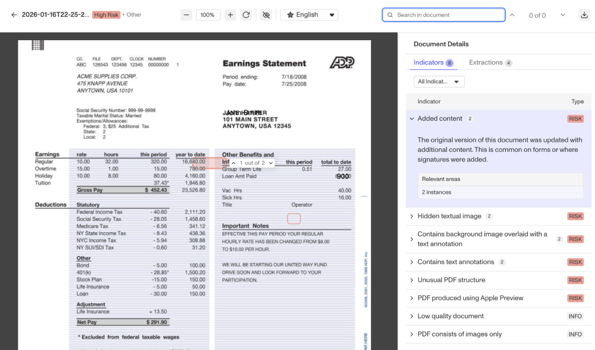
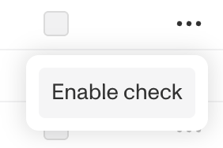

# Document AI Enhanced

For organizations that are particularly sensitive to fraud, Document AI Enhanced offers the most advanced suite of fraud detection capabilities.

## How it works

In addition to performing the classifications, extractions and checks that exist in the core product, Document AI Enhanced analyzes hundreds of visual, non-visual, and contextual fraud indicators, including digital edits and tampering, screenshot use, synthetic and generative AI documents, content inconsistencies, and more.

Upon completion of its fraud analysis, Document AI Enhanced assigns each document a composite risk score (High, Medium, Low, Minimal), and summarizes its output in the document viewer.

## The document viewer

The document viewer is a visual surface that highlights both risk and trust indicators with visual overlays to help fraud reviewers quickly assess the fraud risk and make an accurate decision. 

## How to enable enhanced fraud checks

1.  Navigate to the Dashboard, and click on **Inquiries > Templates** (or **Verifications > Templates**).
2.  Find and select an Inquiry template with Document AI, or **Create** a new template.
3.  In the left panel, click **Verifications**. 
4.  In the left navigation, click **Document Groups**, and select the document group you wish to configure. _(Learn more about document groups [in this article](./2tUC2D9VeLsyPtgBo5KYzX.md).)_
5.  In the document group configuration panel, click on Checks.
6.  In the Checks configuration table, click on the … overflow menu to enable the check. 
7.  Once the check is enabled, select the checkbox under “Required” if you want to require the check for the verification to pass.

## Access by plan

We're here to chat through your specific needs. Feel free to reach out to your Customer Success Manager or [contact the Persona support team](https://app.withpersona.com/dashboard/contact-us).

|  | Startup Program | Essential Plan | Growth Plans | Enterprise Plans |
| --- | --- | --- | --- | --- |
| Database Verification | Not Available | Not Available | Available | Available |

## Related articles

[Document AI](./2ipL09vsPcus5OXuOXdeO9.md)

[Document AI: Extraction Configurations](./7tNoY1RqC6YvEGEV1VhSZn.md)

[Document AI: Insights Configurations](./2Y9GwZE2JRwND63LUDbQBs.md)

[Document AI: Document Fields Configurations](./5l5OxysTOoxtbizpSe3nyP.md)
