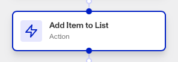

# Workflows: Add Item To List step

# What is the Add Item To List step?

**Add Item To List** is a Workflow Action step that adds an item to a Persona list, which helps you maintain lists of data such as email addresses, IP addresses, or government ID numbers that can be used for matching against future inquiries or transactions.

Lists are particularly useful for enhancing security, compliance, and operational efficiency. Some examples of this include:

-   **Fraud Prevention**: Maintain a list of known fraudulent email addresses, IP addresses, or identities to automatically flag or block suspicious activities.
-   **Compliance Checks**: Create lists of sanctioned individuals or entities to ensure compliance with legal and regulatory requirements by checking against these lists during verification processes.
-   **VIP Customer Management**: Manage a list of VIP customers to provide them with prioritized service or special handling during interactions.
-   **Access Control**: Use lists to manage access to certain features or services by maintaining a whitelist or blacklist of users or entities.
-   **Marketing and Engagement**: Segment customers into lists based on specific criteria, such as geographic location or purchase history, to tailor marketing campaigns or engagement strategies.

The Add Item To List step allows you to automatically add relevant information to a list, keeping it relevant and useful. For example, you may flag a new email address as fraudulent, then use the Add Item To List step to add it to your known fraudulent emails list.

# How do you add an Add Item To List step?

1.  Navigate to the Dashboard, and click on **Workflows** > **All Workflows**.
2.  Find and click on the workflow you want to edit, or **Create** a new workflow.
3.  Click on **+** when hovering over a circle to add an **Action**.

4.  Use the **Find Action** select box to click on **List** > **Add Item To List**.
5.  Choose the **List** you want to add items to.
6.  Choose the **Item Fields** you want to add to the List, and the value to be added.

7.  (Optional) In ‘Advanced Configuration’, click the **Continue on error** box if you want the workflow to continue running even if this step raises an error.
8.  **Close** the step. You’ll have to **Save** and **Publish** the workflow to begin using it.

# Plans Explained

## Add Item To List step by plan

|  | Startup Program | Essential Plan | Growth Plan | Enterprise Plan |
| --- | --- | --- | --- | --- |
| Add Item To List step | Not Available | Available | Available | Available |

[Learn more about pricing and plans](./6oZbzp7jb7AWGClF5vpY3K.md).

# Learn more

[Learn more about Lists.](../../docs/v2022-09-01/docs/lists.md)
