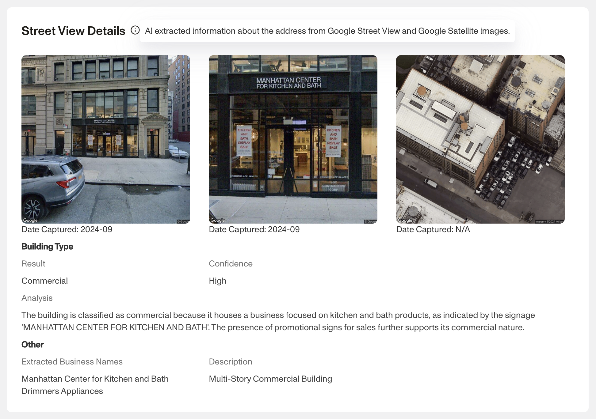

# Address Lookup Report

📍 📍 Additional features are available upon request. Contact your account team to enable international addresses, Street View + Satellite insights, or virtual address detection.

## Overview

The Address Lookup returns detailed metadata for a given address and includes two map views. It is useful when you want quick, trustworthy details about a business's address from within the Dashboard without searching external sites (e.g., Google). Common uses include validating that an address is a real residence or business and flagging PO Boxes or private mailboxes.

## Coverage At A Glance

| Feature / Capability | United States | International |
| --- | --- | --- |
| **Core Address Lookup (non-AI)** | ✔ Generally available | ✔ Available with limited fields |
| **USPS-sourced outputs** (DPV, RDI, CMRA, LACSLink, carrier route, ZIP type) | ✔ Available | ✖ Not applicable |
| **Latitude / Longitude** | ✔ Available | ✔ Available (varies by provider) |
| **Precision** | ✔ ZIP-level | ✔ Lower precision possible |
| **Street View + Satellite Insights** (formerly AI Insights) | ✔ Where Google imagery exists | ✔ Where Google imagery exists (beta) |
| **Virtual Address Detection** | ✔ US-only | ✖ Not supported |

## When To Use This Report

-   Enrich an address during KYC or KYB reviews
-   Distinguish residential vs commercial delivery points
-   Detect PO Boxes and private mail receiving agencies
-   Get latitude and longitude plus precision for geospatial checks
-   Add quick visual context with Street View and Satellite (when enabled)

## Report Features

### Search Inputs

-   Full US address (required)
    -   **Note:** US addresses are supported by default. International support is available with limited fields.

### Report Outputs

There are multiple returned fields for the Address Lookup Report. Below, we've listed all of the fields and their definitions so that you can better understand how to use and interpret the information.

**Note:** USPS-sourced outputs are US-only. International addresses return non-USPS fields such as formatted address, coordinates, and time zone.

---

## Address Details

### `Resolved/Corrected address`

The fully-formatted and corrected version of the address passed in.

### `Record type`

Represents the type of record this address matched against. Only given if a DPV match is made.

### `Zip type`

Indicates the type of the ZIP code for the address that was matched:

-   **Unique:** Single delivery point (large orgs or government)
-   **Military:** APO/FPO
-   **PO Box:** Assigned to post office boxes
-   **Standard:** All other ZIP codes

### `County FIPS`

The 5-digit county FIPS code (state + county code).

### `County name`

The name of the county in which the address is located.

### `Building default indicator`

Indicates whether the address is the “default” address for a building (e.g., main lobby).

### `Latitude`

Exact latitude of the address.

### `Longitude`

Exact longitude of the address.

### `Precision`

Indicates the precision of the latitude and longitude values:

-   Zip9 (most accurate)
-   Zip8
-   Zip7
-   Zip6
-   Zip5
-   Unknown

### `Congressional district`

The congressional district (01–53 or “AL” for at-large districts).

---

## Delivery Details

### `Residential Delivery Indicator`

Indicates whether the address is residential, commercial, or unknown.  
_Note: USPS marks PO Boxes as residential._

Values include:

-   Residential
-   Commercial
-   Blank (unknown)

### `Carrier route`

A one-letter prefix and three-digit route designator (e.g., C007).  
_Routes C770–C779 pertain to PO Box Street Addresses._

Prefixes:

-   C – City route
-   R – Rural
-   H – Highway contract
-   B – Post office box section
-   G – General delivery

### `DPV match code`

Indicates whether USPS delivers to the address:

-   Confirmed
-   Not confirmed

### `DPV footnotes`

Additional details related to DPV validation.

### `DPV CMRA`

Indicates whether the address is a Commercial Mail Receiving Agency (e.g., UPS Store, Mailboxes Etc.).

### `DPV vacant`

Indicates the address was previously active but is now marked vacant.

### `Active`

Indicates whether the address is active in USPS systems.  
_Note: USPS updates may lag by months._

### `Footnotes`

Indicates which changes were made to the input address.

---

## Time Zone Details

### `Time zone`

Examples include Alaska, Atlantic, Central, Eastern, Mountain, Pacific, Samoa, UTC+9–UTC+12.

### `UTC offset`

Indicates the number of hours offset from UTC/GMT.

### `Observes daylight savings time`

Whether the location observes daylight savings time.

---

## Mailing Details

### `LACSLink Code`

The reason code indicating how the address appears in LACSLink.

### `LACSLink indicator`

Indicates whether a LACSLink match exists.

### `Suitelink match`

Indicates whether SuiteLink provided secondary (suite/apartment) information.

---

## Street View + Satellite Insights

This AI-powered module uses Google Street View and Satellite imagery to delivery insights about the location. 

Within this module, you can see:

-   **Building type:** Commercial, residential, or other
-   **Extracted business name:** From Street View imagery
-   **Description:** A generated summary of the building

---

## Virtual Address Detection

This module highlights whether an U.S. based address may be a virtual mailbox, PO Box, or CMRA.

Signals include:

-   **Known Provider Match**
-   **PO Box / CMRA Indicator**
-   **Ignored Secondary Match**
-   **Keyword Match in Search Results**
-   **Business Match**
-   **Multiple Businesses Detected**

---

### Notifications

Set up a webhook listening for:  
`report/address-lookup.ready`

---

## Configuration Options

There is no configuration option available for this report type.

\- USPS active status may lag and should not be the sole basis for decisions. - Some outputs are blank for invalid or partial addresses. - International coverage and image-based insights are in beta and subject to change.

## Plans Explained

|  | Startup Program | Essential Plan | Growth and Enterprise Plans |
| --- | --- | --- | --- |
| Address Lookup Report | Not Available | Available | Available |

[Learn more about pricing and plans](./6oZbzp7jb7AWGClF5vpY3K.md)

## _Disclaimer_

_Persona is not a consumer reporting agency and the services (and the data provided as part of its services) do not constitute a ‘consumer report’ for the purposes of the Federal Fair Credit Reporting Act (FCRA). The data and reports we provide to you may not be used, in whole or in part, to: make any consumer debt collection decision, establish a consumer’s eligibility for credit, insurance, employment, government benefits, or housing, or for any other purpose authorized under the FCRA. If you use any of any of our services, you agree not to use them, or the data, for any purpose authorized under the FCRA or in relation to taking an adverse action relating to a consumer application._
