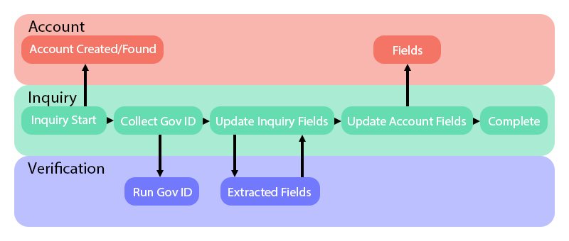
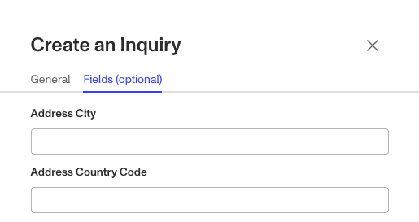

# Using Inquiry Prefill

# What is inquiry prefill?[](#what-is-inquiry-prefill)

Inquiry prefill allows you to pre-populate inquiry fields with information you already have about a user. Prefill values are static inputs to an individual inquiry run and are provided when the inquiry is created.

# How does inquiry prefill work?[](#how-does-inquiry-prefill-work)

An inquiry has a number of fields that can be populated with inputs from either the end user or via extractions from a verification in the inquiry flow. These fields all start as blank and may or may not be filled in by the end of the inquiry.



When you use inquiry prefill, you set initial values for some or all of the inquiry fields. The initial values may be updated by the end user as they go through the inquiry flow, in which case the field will be updated with the edited value. The initial values are saved for reference regardless of whether they are updated, and may be used for verification checks later in the inquiry flow.


# How do prefilled values appear to the end user?[](#how-do-prefilled-values-appear-to-the-end-user)

End users can see and edit prefilled values if the prefilled fields are included in a screen component that they see during the inquiry flow.

In the example above, `John Smith` is prefilled for first name and last name and then populated into those fields. If the user is shown a screen that asks them to input their first and last name, they will see the fields with the prefilled values and be able to edit them. But if they are only asked to provide their government ID, and are never prompted to type in their information, they will never see the first and last name fields. Their first and last name will be extracted from their government ID and the first and last name fields will be updated with the extracted values, with the end user never seeing the initial prefilled values.

# How can I add prefilled values to an inquiry?[](#how-can-i-add-prefilled-values-to-an-inquiry)

There are two ways to add prefilled values to an inquiry: via the Create Inquiry widget, or via the Persona API.

## Prefill values in the Create Inquiry widget[](#prefill-values-in-the-create-inquiry-widget)

If you are manually creating a one-off inquiry, you can prefill values directly in the Create Inquiry widget.

1.  Navigate to Inquiries > All Inquiries from the left-hand dashboard menu
2.  Click on “+Create Inquiry” in the upper right-hand corner
3.  Select the “Fields (optional)” tab in the Create Inquiry widget
4.  Add prefilled values to any of the inquiry fields; if you don’t see the field you want to prefill, check to be sure it’s included on at least one screen in the inquiry template
5.  Create the inquiry and send it to the recipient



## Prefill values via the Persona API[](#prefill-values-via-the-persona-api)

If you’re creating inquiries via Persona’s API, you can specify the prefill values in the data section as in the following example curl:

```
curl --request POST \
 --url https://api.withpersona.com/api/v1/inquiries \
 --header 'Persona-Version: 2023-01-05' \
 --header 'accept: application/json' \
 --header 'content-type: application/json' \
 --data '{"data": {"attributes": {"fields": {"name-middle": "John","name-last": "Smith"}}}}
```

You can run API calls from our [API reference](../../docs/reference/create-an-inquiry.md).

# What are some common use cases for inquiry prefill?[](#what-are-some-common-use-cases-for-inquiry-prefill)

Inquiry prefill supports a number of use cases, including:

-   **Logic routing**: You can use prefill metadata about an end user or business entity that will be used by the branching logic of a flow to change how that run is handled. An example field might be `risk factor`, that can raise or lower friction or scrutiny within the flow.
-   **KYB**: On a KYC Inquiry that is part of a KYB workflow, you can prefill which business the end user is related to and their relation to the business, helping you to stay organized.
-   **End user experience**: You may prefill the expected end user PII, saving the end user from having to fill out those fields during the inquiry.
-   **Anti-fraud**: You may prefill the expected end user PII, and lean on the Inquiry Comparison check in the government ID verification to determine whether the end user provided conflicting PII.

If you plan to use a new field, like `risk factor`, you’ll need to configure it for the inquiry template before you can prefill it. And if you want that new field to update to the account, the account will need to be configured to have that same field too.

# Inquiry prefill FAQ[](#inquiry-prefill-faq)

## Can I use information collected in one step of an inquiry flow to populate fields that appear later in the same flow?[](#can-i-use-information-collected-in-one-step-of-an-inquiry-flow-to-populate-fields-that-appear-later-in-the-same-flow)

If you have collected values for certain fields at one step in an inquiry flow, you can configure your inquiry template to re-surface those values to the user at a later step in the same flow. For example, if you are extracting the user’s first and last name from their government ID, you may want to display the extracted values to the user and ask them to confirm that the information is correct. For more information, see [Building a confirmation screen](./39GokrnIg3FmKd95AoFBEL.md).

## Can I configure an inquiry template to dynamically prefill data directly from existing Persona accounts?[](#can-i-configure-an-inquiry-template-to-dynamically-prefill-data-directly-from-existing-persona-accounts)

No, prefill values must be provided to a specific inquiry as it is created. To prefill values at scale across many inquiries, we recommended creating the inquiries via [Persona’s API](../../docs/reference/create-an-inquiry.md).

## Can I prevent an end user from editing a prefilled value?[](#can-i-prevent-an-end-user-from-editing-a-prefilled-value)

Any prefilled value that is displayed to the end user during an inquiry flow will be editable by the end user. If you do not want a prefilled value to be editable by the end user, you will need to ensure that the inquiry template doesn’t include a screen component that uses that field.

If your inquiry flow includes an action step to update the end user’s account, you can [configure the action step](./aBe34oNwaa0YskUd5U5HZ.md) to exclude any editable fields from the update. Edited information will still be saved as part of the inquiry, but edits will not be carried over to the user’s account profile. For more information on updating account fields, see [Accounts Overview](./2gE7mjjLCIGJPnK6mTyjU9.md).

## Related articles

[Create an Inquiry link for an end user](./2NPmFrWIXXdx9I5X5Mvk3F.md)
