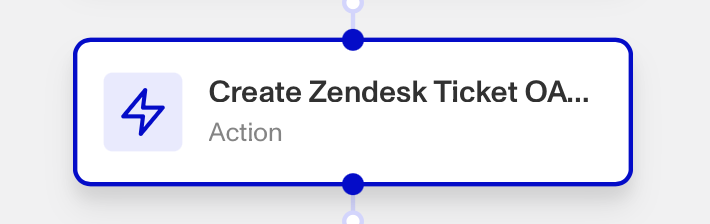

# Workflows: Pattern of Zendesk steps

# What is the pattern of Zendesk action steps?

Zendesk can be integrated into your workflow, offering several Zendesk Workflow Action steps that allow you to **Create** and **Update** Zendesk tickets, and **Add** and **Remove Tags** to Zendesk tickets, all automatically within your workflow.

Zendesk is a customer service platform that empowers organizations to improve customer engagement and better understand their customers. Zendesk is available as a [Marketplace integration](./6YaRAGHHcXb6MQ0c6CGvbJ.md).

Persona’s Zendesk integration can be useful for streamlining and simplifying customer support, automating ticket management, improving your customer support team’s access to up-to-date customer information, and more.

Once the integration is set up, you can trigger the following Zendesk actions inside your Workflows. _Note: If there are multiple options for these actions, choose the one with "OAuth" in the name._

-   Create Zendesk Ticket
-   Update Zendesk Ticket
-   Add Tags to Zendesk Ticket
-   Remove Tags from Zendesk Ticket

# How do you add a Zendesk action step?

## Navigating to your Workflow

1.  Navigate to the Dashboard, and click on **Workflows** > **All Workflows**.
2.  Find and click on the workflow you want to edit, or **Create** a new workflow.
3.  Click on **+** when hovering over a circle to add an **Action**.

4.  Use the **Find Action** select box to click on **Marketplace** > **Zendesk**. Choose which **Zendesk** action step to add: **Create**, **Update**, **Add Tags**, or **Remove Tags**.

## Adding a Create Zendesk Ticket step

1.  In **Find Action**, click on **Marketplace** > **Zendesk** > **Create Zendesk Ticket OAuth**.
2.  Choose the **Zendesk Instance** the step should interact with.
3.  Choose the ticket **Subject**, either manually or from elsewhere in your workflow with ‘**+**’. The subject should be specific and succinct, and include searchable keywords where possible.
4.  Add a **Comment Body** to be attached to the new ticket, either manually or from elsewhere in your workflow with ‘**+**’. The Comment Body should explain the all context and details necessary for someone to resolve the ticket.
5.  (Optional) In ‘Advanced Configuration’, you can do the following:
    1.  Click the **Make the Comment Public** box if you want anyone within your organization to see the ticket’s comment.
    2.  Select the ticket **Status**, such as ‘New’ or ‘Open’.
    3.  Add relevant **Tags** to the ticket. Tags should be specific and standardized across your organisation.
    4.  Add the **Requester Name** and **Email**, where the Requester is the user who’s actions prompted the creation of this Zendesk ticket in your workflow.
    5.  Click the **Continue on error** box if you want the workflow to continue running even if this step raises an error.
6.  **Close** the step. You’ll have to **Save** and **Publish** the workflow to begin using it.

## Adding an Update Zendesk Ticket step

1.  In **Find Action**, click on **Marketplace** > **Zendesk** > **Update Zendesk Ticket OAuth**.
2.  Choose the **Zendesk Instance** the step should interact with.
3.  Choose the **Ticket ID** associated with the ticket to be updated, either manually or from elsewhere in your workflow with ‘**+**’.
4.  Add a **Comment Body** to be attached to the new ticket, either manually or from elsewhere in your workflow with ‘**+**’. The Comment Body should explain the all context and details necessary for someone to resolve the ticket.
5.  (Optional) In ‘Advanced Configuration’, you can do the following:
    1.  Click the **Make the Comment Public** box if you want anyone within your organization to see the ticket’s comment.
    2.  Select the ticket **Status**, such as ‘Pending’ or ‘Solved’.
    3.  Add relevant **Tags** to the ticket. Tags should be specific and standardized across your organisation.
    4.  Click the **Continue on error** box if you want the workflow to continue running even if this step raises an error.
6.  **Close** the step. You’ll have to **Save** and **Publish** the workflow to begin using it.

## Adding an Add Tags to Zendesk Ticket step

1.  In **Find Action**, click on **Marketplace** > **Zendesk** > **Add Tags to Zendesk Ticket**.
2.  Choose the **Zendesk Instance** the step should interact with.
3.  Choose the **Ticket ID** associated with the ticket to be tagged, either manually or from elsewhere in your workflow with ‘**+**’.
4.  Add relevant **Tags** to the ticket. Tags should be specific and standardized across your organisation.
5.  **Close** the step. You’ll have to **Save** and **Publish** the workflow to begin using it.

## Adding a Remove Tags to Zendesk Ticket step

1.  In **Find Action**, click on **Marketplace** > **Zendesk** > **Remove Tags to Zendesk Ticket**.
2.  Choose the **Zendesk Instance** the step should interact with.
3.  Choose the **Ticket ID** associated with the ticket to have tags removed from, either manually or from elsewhere in your workflow with ‘**+**’.
4.  Select any **Tags** you want removed from the ticket.
5.  **Close** the step. You’ll have to **Save** and **Publish** the workflow to begin using it.

# Plans Explained

## Zendesk action steps by plan

|  | Startup Program | Essential Plan | Growth Plan | Enterprise Plan |
| --- | --- | --- | --- | --- |
| Zendesk action steps | Not Available | Not Available | Available | Available |

[Learn more about pricing and plans](./6oZbzp7jb7AWGClF5vpY3K.md).

# Learn more

[Learn more about Zendesk integration here.](./2xlpV3Ala4msnSSrjcA4v5.md)
