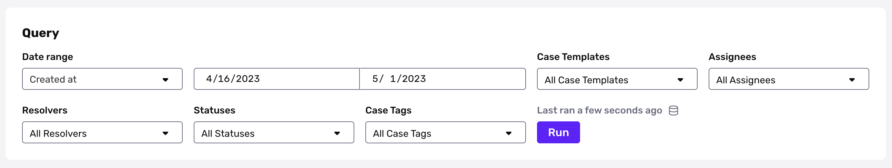
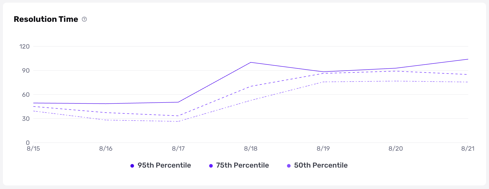
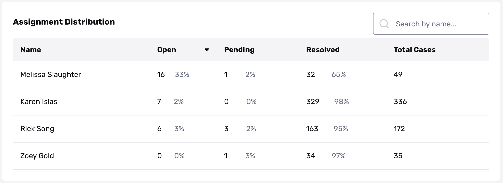
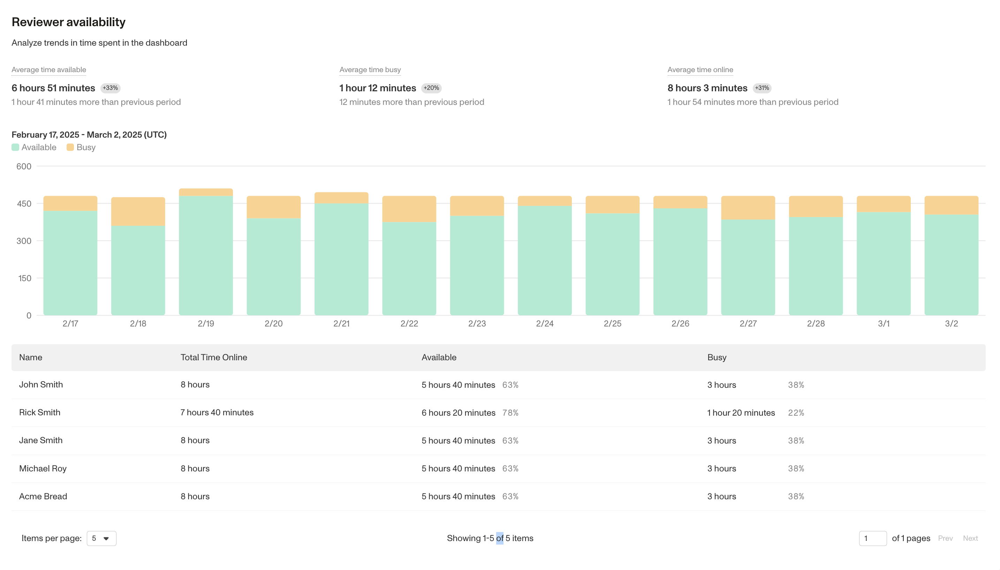

# Cases Analytics

## Overview

Cases Analytics gives you visibility into your review team's productivity metrics, and lets you discover actionable insights to help you assess performance, reallocate workload, and gain operational efficiency.

Cases Analytics can answer questions like:

-   Are reviewers meeting SLAs and responding to manual review on time?
-   How many cases are left unresolved or remain in pending status for a significant period of time?
-   Are certain review agents more efficient than others?
-   What is the average total time that all queried reviewers were online during the review period?

### Permissions

If your org has access to Cases, all admins within your org will have access to Cases Analytics. You can further adjust permissions for Cases Analytics using user roles permissions.

### Navigating to Cases Analytics

To view Cases Analytics, navigate to **Cases** > **Analytics** in the Dashboard.

The analytics are divided into tabs:

-   **Productivity**: your team's overall productivity metrics
-   **Resolution**: your Case resolution trends

## Get to know the Cases Analytics dashboard

### Filters

Filters at the top of the Cases Analytics page let you select the time period you want to see data for, then filter by Case template, assignee / reviewer, and resolution type. Click **Run** to update the metrics on the page.

### Totals

Under Total Cases, you'll find a breakdown of all Cases by Case status, so you can easily track how many total Cases are open, pending, and resolved.

The dates displayed on the x-axis are automatically adjusted based on the selected query date range (daily, weekly, or bi-weekly).

### Resolution time

The Resolution Time graph shows the 95th, 75th, and 50th percentiles for the time it takes all Cases within your filter criteria to go from opened to resolved.

You can see whether your team or specific individuals are meeting SLAs, by setting your filter criteria to specific team(s) or individuals.

For example, in the chart below, on August 17th, 95% of Cases were resolved in under 56 hours.

Hover over the chart to see details of the exact resolution time at the 95th, 75th, and 50th percentile. Resolution times are displayed in hours.

### Assignment distribution

You can review the efficiency of each individual reviewer through the Assignment Distribution view.

### Availability status metrics

You can review team availability metrics by analyzing the average or total time reviewers spent online or in either the available or busy status. Learn more about [Availability Statuses here](./4qTPmfbkQ6CIcbEJVagRVp/%20%22Availability%20Status%20in%20Cases%22.md).

Availability status metrics include the following:

**Reviewer Average Time**

-   **Average Time Available** – The average duration that all queried reviewers were in an available status during the review period.
-   **Average Time Busy** – The average duration that all queried reviewers spent in a busy status during the review period.
-   **Average Time Online** – The average total time that all queried reviewers were online (available + busy) during the review period.

**Reviewer Total Time**

-   **Total Time Online** – The aggregated average time spent in either available or busy status within the selected date range per user.
-   **Total Time Available** – The aggregated average time a reviewer was in an available status within the selected date range per user.
-   **Total Time Busy** – The aggregated average time a reviewer spent in a busy status within the selected date range per user.

\*Note on Total Time Calculations: User availability data always trails real time by approximately 6 hours.

Each time a user changes their status, we log a timestamp. To calculate the duration per user, we:

-   Compare the most recent status change to the current status change to determine the start and end timestamps.
-   Aggregate these durations to compute the total time a user spends per day (in UTC)\*.
-   Run a SQL query upon page load to retrieve all durations for the selected period.

_Since users, teams, and organizations may be distributed across time zones, we use UTC for consistency. Additionally, users may remain in a status for multiple days. To ensure accurate per-day calculations and efficient queries, we align timestamps to midnight UTC._

Your analytics is a source of truth for the performance of your specifics solutions, but should not be treated as such for your billing. Your contract will determine how your bill is calculated and your invoice should be treated as the source of truth.

For example, verification analytics will count unique inquiries containing a verification, but not the number of individual verifications in the inquiry, whereas billing counts the total number of verifications. If you have an inquiry with 2 Gov ID verifications, this can cause a disparity in the count between the analytics numbers and billing.
