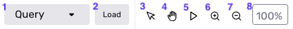
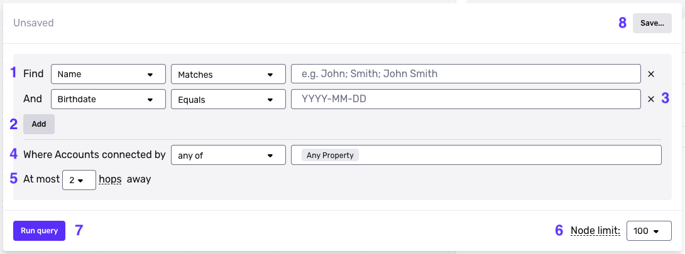
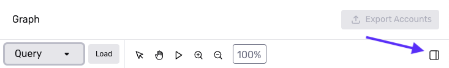
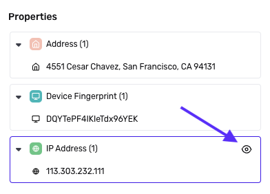
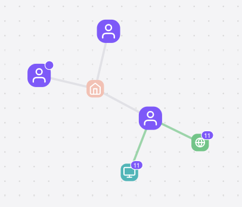

# Graph Explorer interface

## Overview

Learn the key features of the Graph Explorer interface:

-   The main components of the Explorer
-   Actions you can take in the Explorer

## Main components of Graph Explorer

### Toolbar

The toolbar has the following components:

#### Run a Query

1: **Query**: Toggles the Query editor open or closed.

2: **Load**: Lets you load a saved Query Template.

#### View results

3: **Select**: Enables Select mode. In Select mode, you can select nodes and drag nodes to rearrange them on the canvas.

4: **Pan**: Enables Pan mode. In Pan mode, you can click and drag to move in any direction on the canvas.

5: **Re-layout**: Triggers a re-layout of nodes on the canvas. If you have rearranged nodes on the canvas, this resets them to the original layout.

6: **Zoom in**: Increases the zoom level of the canvas.

7: **Zoom out**: Decreases the zoom level of the canvas.

8: **Zoom**: Shows the zoom level of the canvas. This is a text input that lets you change the zoom level. Just edit and press Enter.

### Query editor

The Query editor is divided into two main sections:

-   In the upper section, you specify the properties of Accounts to search for. In Graph, we call these Accounts the _starting nodes_.
-   In the lower section, you specify which “connected” Accounts to also surface. In Graph, we call these Accounts the _connected nodes_.

#### Specify the starting nodes

1: **Property clause**: Select an Account property you want to search by, and provide the value of that property.

2: **Add**: You can add one or more property clauses to your search query.

3: **Remove**: Remove a property clause by clicking the “X” icon.

#### Specify connected nodes

4: **Properties**: Specify at least one property that defines a “connected” Account. If an Account has the same value for the property as a starting node, it will be considered “connected.”

5: **Maximum hops**: Choose the maximum number of edges apart in the network a “connected” Account can be from a starting node.

#### Configure, run, and save a Query

6: **Node limit**: Configure the number of nodes returned in initial results.

7: **Run query**: Run the query. Results will be displayed in the canvas.

8: **Save**: You can save the current query as a Query Template.

### Results overview

The Results overview shows summary statistics and other information about Accounts surfaced by a Query. To open the Results overview, click the rectangular “sidebar” icon at the top right of the Graph Explorer:

### Canvas

The canvas is the main area of Graph Explorer where Query results appear.

### Nodes

Query results appear as clusters of connected _nodes_. Each node represents either an Account in Persona, or a property of that Account. A line between an Account node and a property node means that the Account has that property.

### Node hover card

When you hover over a node, a hover card appears. The hover card shows details about the node, and actions you can take on the node.

## Actions in Graph Explorer

### Navigate

#### Pan

You can pan in any direction on the canvas. There are multiple ways to do this:

-   Enable Pan mode using the Pan mode icon in the Toolbar. Then click and drag in any direction on the canvas.
-   To temporarily switch into Pan mode, hold down the Space Bar. While holding down the Space Bar, click and drag in any direction on the canvas.
-   No matter what mode you’re in, you can always pan by dragging left, right, or diagonal with two fingers on a trackpad.

#### Zoom in / Zoom out

You can zoom in or out on the canvas. There are multiple ways to do this:

-   Click the Zoom in / Zoom out icons in the Toolbar.
-   Set a specific zoom percentage by editing the Zoom percentage text input. (See the Toolbar section for details.)
-   Hold `cmd` and scroll down / up on your computer mouse to zoom in / zoom out.

### View results

#### Select nodes

To select a node, first enable Select mode. Then click any node.

You can select multiple nodes at once. To do this, you can either:

-   Click and drag over several nodes, or
-   Click on each node while you hold down the `Shift` key.

#### Rearrange nodes

To rearrange a node, first enable Select mode. Then click and drag any node.

You can move multiple nodes at once. Select multiple nodes, then click and drag the entire selection.

#### Hide nodes

You can hide nodes that have a specific property value.

Open the Results overview. In the Properties section, hover over the property you want. Click the “eye” icon to hide nodes with that property.

### Explore results

#### View node details

Hover over any node to open the node hover card, which contains details about the node. Different information and actions are displayed, depending on the type of node.

#### Show Connections

If a purple badge appears in the corner of a node, it means the node can be expanded to show additional related Accounts.

To expand a node, hover over it to open its details modal. At the bottom of the modal, click the “Show Connections” icon.

Example: In the results above, three nodes can be expanded: one Account node, one device fingerprint node, and one IP address node.

### Share results

#### Export Accounts

You can select one or more Account nodes, and export them as a CSV file.

To export a single Account, hover over it to open its details modal. At the bottom of the modal, click the “Export” icon.

To export multiple Accounts, select multiple Account nodes. Then click the “Export” icon that appears beneath the selection.

To export all Accounts in the results, click **Export Accounts** at the top right corner of the Explorer interface.

### Take action on results

#### Tag Accounts

You can select one or more Account nodes, and add a Tag to these Accounts.

To Tag a single Account, hover over it to open its details modal. At the bottom of the modal, click the “Tag” icon, and select your desired Tag.

To Tag multiple Accounts, select multiple Account nodes. Then click the “Tag” icon that appears beneath the selection, and select your desired Tag.

#### Add Property to List

You can add a property to a List. For example, you can add a specific device fingerprint or IP address to a List.

To do this, hover over the property to open its details modal. At the bottom of the modal, click the “Add to List” icon, then select your desired List.
