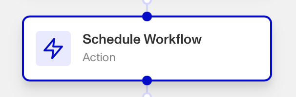
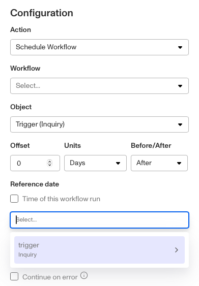

# Workflows: Schedule Workflow step

# What is the Schedule Workflow step?

**Schedule Workflow** is a Workflow Action step that initiates a Workflow based on a predefined schedule.

Rather than triggering a Workflow when a particular event or API call occurs, the Schedule Workflow step lets you trigger a Workflow based on a regular schedule.

This is useful for automating routine checks that need to occur at regular intervals, or executing specific actions at a scheduled time.

For example, you can schedule reverification inquiries when an ID is about to expire) by linking a two Workflows; a scheduled workflow that creates a reverification inquiry for the end user, and a second workflow (using the Schedule Workflow step) that sets the time schedule of when that first workflow will begin.

You can learn more about this process [with this tutorial.](./5Mae1yx6yhNfolJjuMaoZB.md)

# How do you add a Schedule Workflow step?

1.  Navigate to the Dashboard, and click on **Workflows** > **All Workflows**.
2.  Find and click on the workflow you want to edit, or **Create** a new workflow.
3.  Click on **+** when hovering over a circle to add an **Action**.

4.  Use the **Find Action** select box to click on **Other** > **Schedule Workflow**.
5.  Select the **Workflow** you want to trigger with this step.
6.  Select the Persona **Object** that should trigger this step, such as an Inquiry or Account.
7.  Set the trigger schedule. Either:
    1.  Tick the **Time of this workflow run** box to schedule the Workflow a certain amount of time after this step is triggered.
    2.  Untick the **Time of this workflow run** box, click on the empty dialog box below it, hit backspace once, and select a **date** field (such as an expiration date) to schedule the Workflow a certain amount of time after that field’s **date** is reached.

8.  Now, set the **Offset, Units, and Before**/**After** based on when you want the scheduled Workflow to run after the trigger is activated (either the step runs, or a date is reached).
    1.  For example, you may schedule a Workflow to run one week after this step is triggered.
    2.  For example, you may schedule a Workflow to run one day before an expiration time is reached.
9.  (Optional) In ‘Advanced Configuration’, click the **Continue on error** box if you want the workflow to continue running even if this step raises an error.
10.  **Close** the step. You’ll have to **Save** and **Publish** the workflow to begin using it.

# Plans Explained

## Schedule Workflow step by plan

|  | Startup Program | Essential Plan | Growth Plan | Enterprise Plan |
| --- | --- | --- | --- | --- |
| Schedule Workflow step | Not Available | Not Available | Available | Available |

[Learn more about pricing and plans](./6oZbzp7jb7AWGClF5vpY3K.md).
