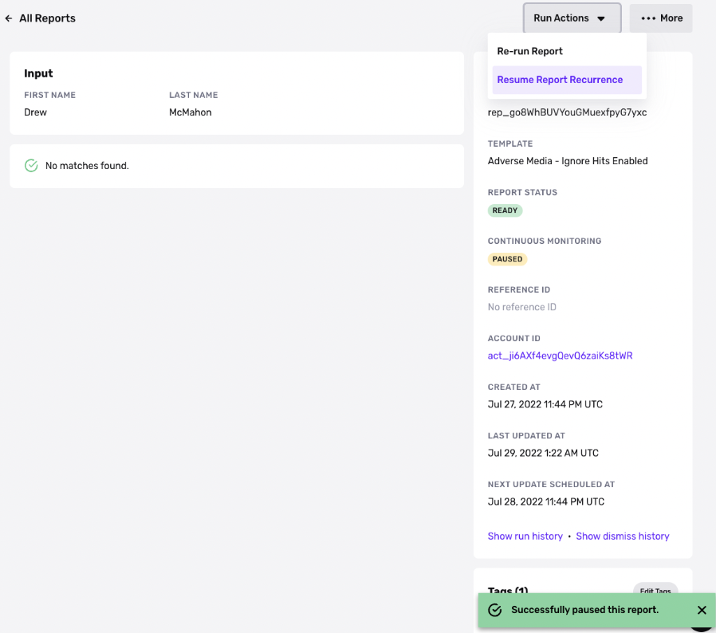

# Continuous monitoring for Reports

_Continuous monitoring is available on the Growth plan. If you'd like to set up your Reports to run on a recurring cadence, please contact your Customer Success Manager or [contact the Persona support team](https://app.withpersona.com/dashboard/contact-us)._

✍🏻 This feature only applies to recurrable reports:

-   Watchlist (person & business)
-   Adverse Media (person & business)
-   PEP
-   Crypto Address Watchlist
-   Business Nonprofit

## Overview

Continuous monitoring lets you run Reports run on a recurring schedule. For example, you can run a Watchlist Report against your [Accounts](./2gE7mjjLCIGJPnK6mTyjU9.md) each month or once a year. This can help you detect if an Account that was previously not on a Watchlist was later added to a Watchlist.

Continuous monitoring can help you implement [perpetual KYC](../../landing/blog/perpetual-kyc-ongoing-customer-due-diligence.md). Perpetual KYC (pKYC) introduces ongoing [customer due diligence](../../landing/blog/know-your-customer-kyc-vs-customer-due-diligence-cdd-whats-the-difference.md): reverifying customers on a continuous basis and putting strategies in place to flag worrisome interactions. By consistently monitoring the relationship, you can be more confident each transaction comes from the same verified person.

## Features

### Recurrence interval

You can choose a recurrence interval ranging from 1 day to 365 days.

The Report that is running with continuous monitoring takes the same inputs as before.

### Pause and resume

In order to pause or resume continuous monitoring on a Report, the Report has to be scheduled to recur with an upcoming run.

To pause or resume a recurring Report, click into the Report in question and select “Pause/Resume Report Recurrence”. Please note that this option will only show up if your Report type is set to run continuously.

Notice that the status “Continuous Monitoring” will update to `paused` or `continuous monitoring` based on your selection.

### Dismiss hits

When a Report running with continuous monitoring has a hit, all future runs stop. You can dismiss false positive hits to resume the continuous monitoring.

Learn more here: [Dismiss Report Hits](./2aIx2l7MNTh62ZhKcIqD7o.md)

## API

Continuous monitoring on Reports can be managed via API. A few resources include:

-   [Report Action: Pause Continuous Monitoring](../../docs/reference/report-action-pause-continuous-monitoring.md)
-   [Report Action: Resume Continuous Monitoring](../../docs/reference/report-action-resume-continuous-monitoring.md)
-   [Report Action: Dismiss Matches](../../docs/reference/dismiss-matches.md)
