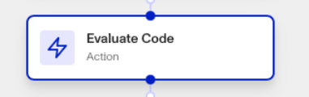
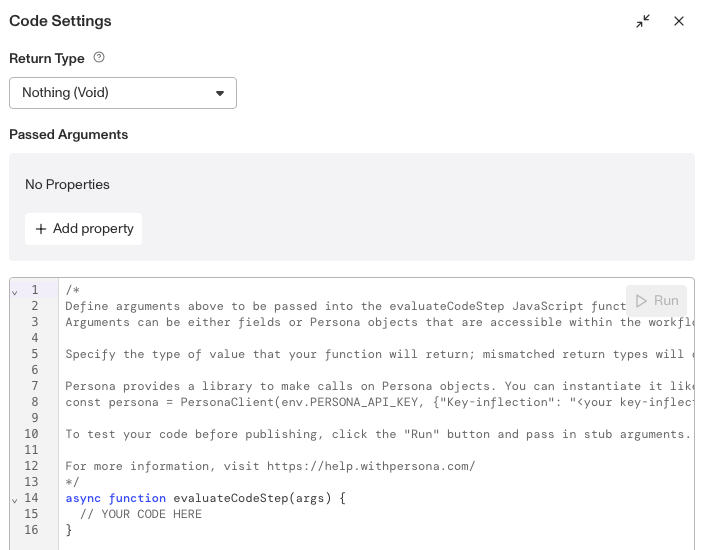

# Workflows: Evaluate Code Step

# What is the Evaluate Code step?

**Evaluate Code** is a Workflow Action step that runs a customizable JavaScript function automatically within your workflow. You can pass it fields or Persona Objects accessible within the workflow as arguments. The Evaluate Code step’s results can then be used within your workflow.

The Evaluate Code step is extremely versatile, since it allows you to run custom code anywhere in your workflow. It can be used for implementing custom logic that isn’t covered by the Persona action step library, for integrating external data sources, calling on Persona objects, and automating more complex processes.

You can test your code with the **Run** button in the Evaluate Code’s Code settings, passing it placeholder `stub` arguments.

⚠️ The **Return Type** must be set to match the type of information returned by the Evaluate Code step’s JavaScript function, otherwise the step will return an error. The Return Type can be set to Boolean, Number, Object, String, or Nothing (void).

# How do you add an Evaluate Code step?

1.  Navigate to the Dashboard, and click on **Workflows > All Workflows**.
2.  Find and click on the workflow you want to edit, or **Create** a new workflow.
3.  Click on **+** when hovering over a circle to add an **Action**.

4.  Use the **Find Action** select box to click on **Calculate > Evaluate Code**.
5.  Click the **Code** block to open the Code Settings window. Within this window:
    1.  Add your JavaScript code to the code window, where it says `// YOUR CODE HERE`.
    2.  Set the **Return Type** to match the desired output of your Evaluate Code step.
    3.  (Optional) Click **Add Properties** to add parameters for your Evaluate Code function. These parameters can be Fields or Persona Objects.
    4.  (Optional) If you want to test your code, click **Run**. You’ll be prompted to add placeholder `stub` or `mock` arguments to run your function with.
6.  (Optional) In "Advanced Configuration", choose a **Retry Interval** in seconds for the Evaluate Code step to reattempt running its function after it errors. You can add multiple Retry intervals that will be assessed in parallel.
7.  (Optional) In "Advanced Configuration", click the **Continue on error** box if you want the workflow to continue running even if this step raises an error.
8.  **Close** the step. You’ll have to **Save** and **Publish** the workflow to begin using it.

# Plans Explained

## Evaluate Code step by plan

|  | Startup Program | Essential Plan | Growth Plan | Enterprise Plan |
| --- | --- | --- | --- | --- |
| Evaluate Code step | Not Available | Not Available | Limited | Available |

[Learn more about pricing and plans](./6oZbzp7jb7AWGClF5vpY3K.md).
