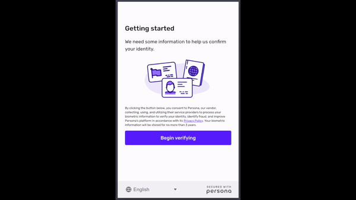
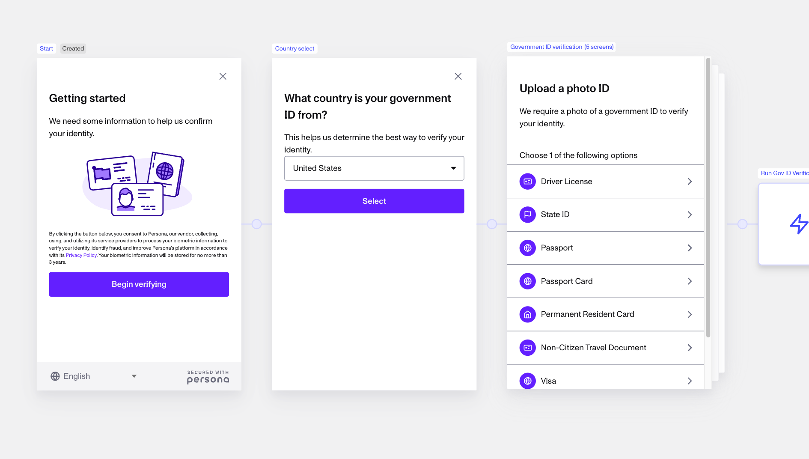
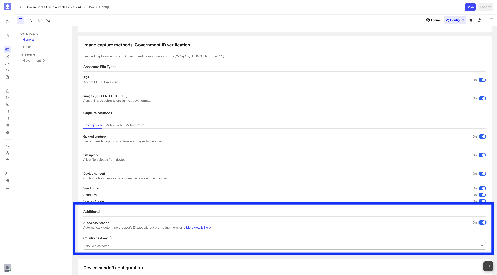

# Autoclassification

# What is Autoclassification?

Autoclassification enables users to submit a picture of their ID when verifying their Government ID, without having to explicitly select a country or ID type. This can save a user time and speed up the verification process for use cases where identity verification should feel as simple as possible (i.e. re-verification). As an alternative, a flow can be adjusted to require users to select both the country and the ID type, before submitting their Government ID.

By default, Autoclassification is currently supported as part of all integration methods, including hosted, embedded flow (aka web SDK), and mobile SDK via Inquiries.

## Who should use Autoclassification?

Autoclassification is most relevant to businesses that:

-   have users from varying countries and/or with varying ID types. Autoclassification makes it easier for your users to submit whatever they have. They won't have to scroll through long lists of countries and ID types.
-   are especially focused on conversion and end-users completing the flow.
-   have an identity verification use case where the experience must have as few screens as possible.

## How does Autoclassification works

With Autoclassification, Persona can identify country and ID type based on a submitted image without needing user input. The flow can then prompt the user as necessary for any correction or follow-up based on the identified ID type.

For collection of Government ID Verification inputs via Inquiries, Autoclassification follows the flow outlined below.

# Where do you find or configure Autoclassification?

By default, any Inquiry templates with a Government ID that are added via the [Solution](../getting-started/solutions/%20%22Solutions%20Overview%22.md) Library, Inquiry Template Library, or [Modules](./tdHGWIcHzLEnvUHe05nH1/%20%22Modules%20Overview%22.md) within Flow Editor will have Autoclassification enabled.

### Understanding whether Autoclassification is disabled or enabled

For many Inquiry templates, one simple way to check if Autoclassification is disabled is to take a look at the template in Flow Editor.

_If there is a Country Select screen immediately preceding a Government ID Verification within your template, then Autoclassification is most likely disabled and the Flow indicates that users going through an Inquiry experience from this template will have to select country and ID type to submit their Government ID Verification._

### Configuring Autoclassification

To configure Autoclassification (i.e. set to enable or disable):

1.  Navigate to **Inquiries > Templates**
2.  Select the Inquiry Template (must have a Government ID Verification Template within it) for which you’d like to configure Autoclassification
3.  Click `Configure` in the top right of the Flow Editor
4.  Scroll to **Image Capture methods: Government ID verification > Autoclassification**
    1.  If toggling Autoclassification to enabled, a specified value for the `Country field key` configuration is not needed for the majority of use cases. For rarer use cases where the ID provided by end users must be from a specific country, this key should be set to the field that will specify the country the ID should be from. selected\_country\_code is often used (because it is also the same value used most commonly when opting out of Autoclassification to have users manually select a country and ID type via a Country Select screen). Upon failed autoclassification and a user's manual selection of country and id type, this country field is populated by the user's selection if the field key is set.

_You can configure Autoclassification from the Flow Editor, for any Inquiry Template that contains a Government ID Verification. The configuration is accessible under Configure (when editing an Inquiry Template in Flow Editor)._

# What can you do with Autoclassification?

## Benefits of Autoclassification

Autoclassification can benefit both the end user completing an identity verification flow, and the organization performing identity verification.

**For businesses**:

-   **Better UX**: Rather than relying on users to select their country or ID, Persona recognizes the ID based on the submitted image. For IDs that are not able to be classified, Persona will fall back to an ID-select flow.
-   **Higher conversion rates**: Autoclassification minimize screens and processing time reducing the chance for drop-off.
-   **Reduced human error**: Leveraging Autoclassification can eliminate common human error-related mistakes when a user is going through Government ID Verification, such as hasty selection of the wrong country or ID type.

**For users**:

-   **Streamlined and faster verification**: Rather than having to think about their ID type, customers can simply take a photo of their ID.

## Considerations for Autoclassification

While Autoclassification offers many benefits, there are a few considerations to keep in mind:

**Fallback experience**: In cases where an ID cannot be automatically classified or is not in the list of acceptable ID types (as configured on the Government ID Verification), users are prompted to select the ID type from a drop-down list. This can be an important consideration for businesses attempting to optimize for a balance between fraud mitigation and conversion.

**Government ID image inputs**: The Autoclassification configuration inherently relies on the quality of the image(s) captured and collected. For example, if the image is poor or obscured, it can result in more fallback experiences presented to users.

-   There are many factors that can lead to challenges with image quality including your business' integration method with Persona (Server API vs. collection via Inquiries), user's device, user's network connection, and lighting to name a few.
-   Some factors may be mitigated depending on your business needs through other configurations like device handoff, acceptable ID types, MRZ or barcode collection required, and front & back of ID collection required, or other features.

If your users frequently struggle to capture high-quality images of their IDs, consider turning off Autoclassification for more step-by-step guidance and required explicit selection of country and ID type.

# Plans Explained

## Government ID Autoclassification access by plan

|  | Startup Program | Essential Plan | Growth Plan | Enterprise Plan |
| --- | --- | --- | --- | --- |
| Government ID Autoclassification Configuration | Available | Available | Available | Available |

[Learn about pricing and plans](../../landing/pricing.md)

## Related articles

[Government ID Verification](./5vXD7S7pQCq8Q9Z4RztxLw.md)
