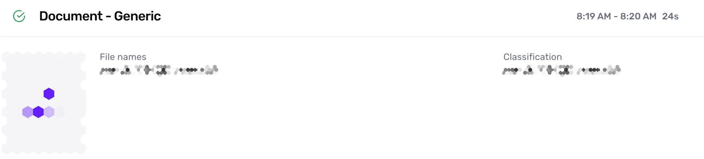
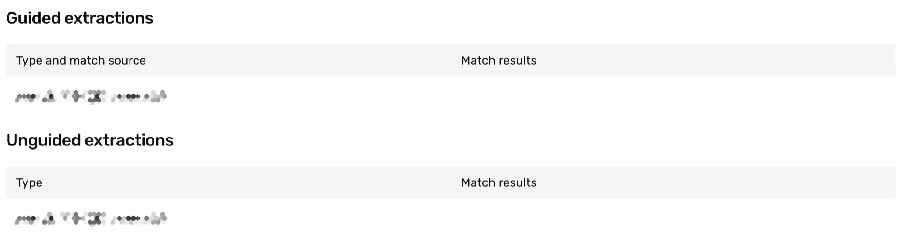
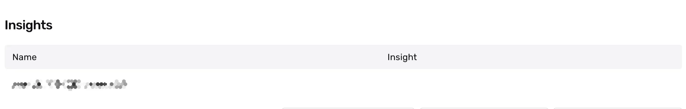
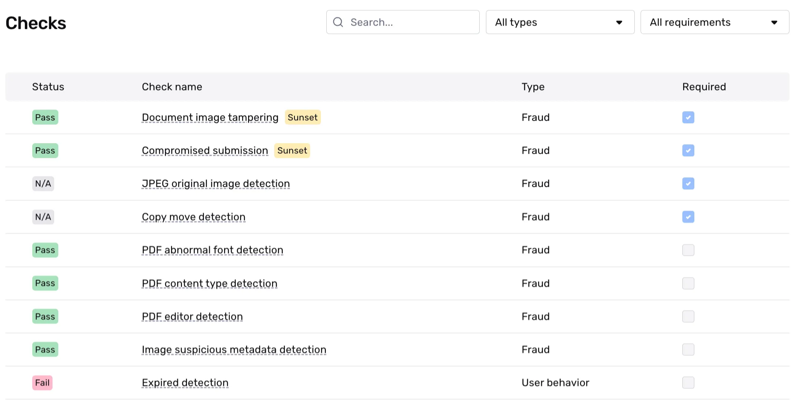

# Understanding Document Verification results

## Overview

Document AI helps you collect and analyze non-government ID documents—including SSN cards, W2s, IRS notices, and utility bills—from individuals or companies. For more details, see the [Document AI overview](./2ipL09vsPcus5OXuOXdeO9.md).

This page examines an example of a Document Verification run and guides you through the results. You'll learn how to interpret Verification checks and understand why they **passed** or **failed**.

ℹ️ Note: A Verification run represents a single attempt to verify specific information. Within an Inquiry, users may get multiple Verification results due to user error, network issues, or other configureable factors in Persona. For this reason, we recommend reviewing, listening, or retrieving the status of the parent Inquiry or Transaction rather than individual Verifications. This approach allows you to use Inquiry Templates or Workflows to better evaluate approval conditions, declines, and cases needing additional review.

## Example Document Verification run

As an example, we'll look at a Document Verification that checks whether the submitted document is acceptable. We'll walk through the example Verification below, section by section.

 Note: Input fields, extractions and insights in these screenshots are intentionally blurred for privacy, but represent the actual data submitted during verification.

## Overall Verification run result

When viewing an Document Verification run, you’ll first see the overall Verification result. In this example, the Document Verification **passed**, noted by the green checkmark.

This top-level status is commonly in a “**passed**” or “**failed**” state. The information below explains why it “**passed**” and shows the Verification Template configurations that led to that “**passed**” status.

Persona lets you configure your solution and templates to use both Inquiry and Verification statuses. This helps you quickly determine if an identity meets your Verification requirements. For cases that need review—such as higher-risk, failed, or declined identities—you can drill down into specific details based on what you need to investigate further.

Here’s how to understand Verification results and their status:

### A note on Inquiry status vs. Verification status

A common best practice for solutions within Persona is to rely on statuses. For example, when integrating via Inquiries (Hosted, Embedded, or Mobile SDK), businesses typically listen for the status of an Inquiry to decide whether a user should proceed within a user experience or not—if **passed**, otherwise it may require additional review. That additional review allows you to automatically or manually review the different verification attempts by conditioning on or reviewing the statuses of those verifications. You can also go one level deeper and review the statuses of the verification checks within a Verification to further understand the exact reasons for Verification failures.

These different statuses, let you quickly determine if an identity meets your Verification threshold and which ones don't. It gives you the ability to automate the attempts you feel most confident about, while leaving a pathway open for the longer tail, more complicated situations. For those complicated situations that need review—such as higher-risk, failed, or declined identities—you can drill down into specific details based on what you need to investigate further.

### File

Within the File section you'll find a thumbnail of the document. Clicking the thumbnail, will open the Document Viewer allowing you to further examine the collected document in detail.

"File name" refers to the name of the file uploaded by the user, and "Classification" indicates either a "persona document type" or a "custom document type." Learn more about [Classifications and Document Types here](./4yXLA2Hk27xfNbyrMazcfW.md). 

### Extracted Information

During Document Verification, the system extracts values and attributes from the uploaded images and displays them in the results. The image below shows this extracted information from the submitted document. 

Extractions come in two types: guided and unguided. In guided extractions, you can compare the extracted value against a known value. When configuring an extraction within a Document step, the default setting only extracts the value. However, you can modify it to compare against a known value, such as an Inquiry field. You can learn more at [Configure Document Verification](./0LPHPwIBZKQI8G7t24zKd.md).

### Insights

 Persona’s new AI Insights feature speeds up the review process by providing detailed data analysis of complex documents. For example, it can identify corporation types (such as Sole Proprietor, C Corp, or Partnership) and count the number of UBOs. With bank statements, it can calculate the ratio of debit to credit transactions.

## Verification checks

### What are Verification checks?

Verification checks evaluate specific aspects of the submitted information. Each Verification type has its own set of Verification checks that run instantly during the Verification run. A check can result in one of three statuses: "**passed**,” "**failed,**" or "**not applicable (N/A).”** The following section explains these statuses in detail.

In this example, a JPEG original image detection check would be "**N/A”** because a the original uploaded document was not in a JPEG format (it was likely in a PDF format) and the check only applies or is run on JPEG file types. 

### What does each Verification Check mean?

Every Verification Type has it's own Verification Checks, as each type verifies different pieces of information. For a complete look at the definition of Verification Checks per Verification Type, active customers can view a complete list of Verification Checks and associated failure reasons by going to **Documentation > [Verification Checks](https://app.withpersona.com/dashboard/resources/verification-checks)** in your Persona Dashboard.

### Which document group was applied?

To understand why certain checks were run or required, you first need to know which Rule Set was applied. This is determined by the document's **Classification**. The name of the applied Rule Set is typically displayed near the top of the Verification checks section, allowing you to trace the results back to your template configuration.

### What do Verification check results look like?

Let's zoom in on all the checks.

Here's what each column means at a high level:

-   **Status**: This is a high-level result of the check. Possible values are:
    -   `Passed`: The check passed in the Verification attempt and meets the check’s configuration.
    -   `Failed`: The check failed in the Verification attempt and does not meet the check’s configuration.
    -   `N/A`: Not applicable. The check was not evaluated in the Verification attempt. This may happen because this check’s configuration depends on a piece of information that was not collected as part of the Inquiry and the check can not be performed.
-   **Check Name**: The name of the Verification check.
-   **Type**: If a Verification check falls into the `Fraud` or `User behavior` category.
    -   `Fraud`: Checks in this category are designed to help catch fraudulent submissions. If a check in this category fails, there may be a higher chance the submission is fraudulent.
    -   `User behavior`: Checks in this category are designed to flag instances when a user submits information that does not meet the quality bar Persona requires. If a check in this category fails, it does not necessarily indicate a higher chance that the submission is fraudulent. Note: You may see this as `user action required` in the API response.
-   **Required**: The Verification checks required to pass in order for the Document Verification to successfully complete.

### How do I know if a Verification check is required?

In this example, we see that four Verification checks were [required](./7IAy61dAMRDQ1Q77ugwpcA.md) (indicated by blue checkmark in the Required column). All of the checks **passed.** While reviewing non-required Verification checks is common practice, consider updating your Verification Template to require any check whose failure would be unacceptable. This ensures future Verification runs will properly evaluate these critical checks.  _**Disclaimer**_ _Persona provides tools and signals to help companies address identity challenges. It is up to each business to define its risk tolerance and compliance requirements, configure thresholds and rules appropriately, and determine outcomes. Checks and Insights surface indicators of potential risk and tampering; they are not definitive proof of fraud. Consult your legal and compliance advisors as needed._

## Related articles

[Document AI](./2ipL09vsPcus5OXuOXdeO9.md)

[Documents Verification: Configuring Classifications and Documents Types](./4yXLA2Hk27xfNbyrMazcfW.md)

[Document Verification: Configuring Documents AI overview](./0LPHPwIBZKQI8G7t24zKd.md)
