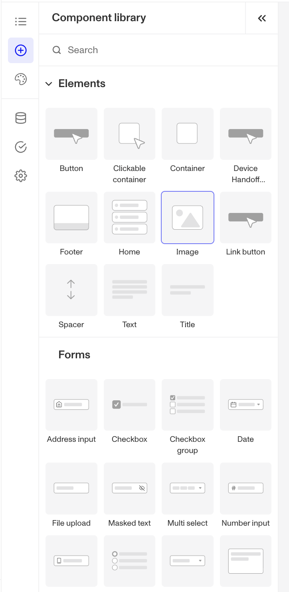
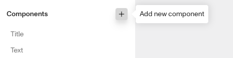
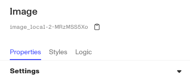

# How do I update the logo on my Inquiry template?

❓ This question came from a member of the Persona community - a project admin who wanted to add their company logo to an Inquiry.

# How to add or update your company logo

You can add or update your company logo to an Inquiry by modifying the Inquiry template:

1.  Open the Dashboard.
2.  Click on **Inquiries** > **Templates**. Click on the Template you want to add or update the logo for.
3.  Click on the Inquiry screen you want to edit, then click the **Edit** button that appears below it.

4.  Open the Component library left panel.

5.  2.  Click **Image**, and drag it over your Inquiry screen to drop it in.
6.  Click on the new **Image box**. In the right Image dashboard, click **Properties**.

6.1. **Replace** the Asset with your company logo.

6.2. Click on **Styles** to resize or realign your logo.

6.3. Move your logo’s placement by dragging the image box around. It will automatically snap to a grid.

7.  In the top right corner, click Save and Publish to save your changes to the Inquiry template.

# How to remove Persona's logo

Only Enterprise customers can remove or replace the “Secured with Persona” logo that appears on Inquiry screens. To become an Enterprise customer, you can reach out to Support by following these steps:

1.  Open the Dashboard.
2.  Click on **Documentation** > **Help Center**.
3.  In the left sidebar, click **Submit a request** under 'Get help now'.
