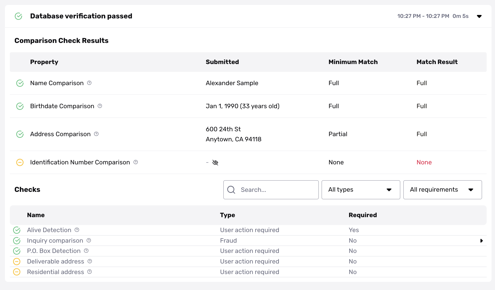

# Database Verification: Setting match requirements (Non-US & International)

## Overview

In a [Database Verification](./7dcdaIsMttmPUZ2ZelRbZD.md), you can specify what it means for a user's information to "match" against a known database, using rules we call _match requirements_. For example, you can allow for typos in a first name. 

For background on match requirements, see [this guide](./6BFKQvaUZOtRSsXUJp2xu9.md).

Match requirements for international Database Verifications—which cover regions outside the United States—have some differences from those that cover the United States.

Below, we'll explain:

-   **Match requirement settings—for international databases**: Match requirements are per-field, and can be "full", "partial", or "none." Learn what each requirement means.
-   **Possible match results—for international databases**: Match results can be "full", "partial", "missing", or "none." Learn what each result means.
-   **Example match results**: Learn how to interpret example match results from an international Database Verification in the Persona Dashboard.

## Match requirement settings—for international databases

Here's what to know about match requirements for international databases:

-   **Match requirements are defined per-field**: You can configure a different match requirement for each piece of information about a user. For example, you can require their name to match more closely to a known database, than their address.
-   **Each field you can configure maps to a single Verification check**: For example, if you want to verify a user's name, require the Name Comparison check and configure a match requirement for the check. You can see the full list of Verification checks in the [Persona Dashboard](https://app.withpersona.com/dashboard/resources/verification-checks/).
-   **For each field, you can specify the required match level.** A required match level can be one of the following:
    -   **Full**: The information must match exactly.
    -   **Partial**: The information must match, with room for slight differences. 
        -   You might hear a partial match referred to as a "fuzzy match".
    -   **None**: The information does not need to match. This setting be useful if you want to collect a field only for informational purposes, and don't need it to match against a known database.

## Possible match results—for international databases

The possible match results for international Database Verifications are the same as for the United States.

A match result tells you whether a piece of information about a user (such as first name, last name, or birthdate) matched information in a known database, according to the match requirements.

A match result can be one of the following:

-   **Full**: A full match, as defined by the match requirements.
-   **Partial**: A partial match, as defined by the match requirements.
-   **None**: No record matched, as defined by the match requirements.
-   **Missing**: Persona was unable to find information about this field from a known database.

## Example match results

Here's an example of what a completed international Database Verification looks like in the Persona Dashboard.

### Verification check sections

The Verification checks are divided into two sections.

-   **Comparison Check Results**: Verification checks that use a match requirement. Each of these checks has a match result.
-   **Checks**: other Verification checks.

### Match results

This example shows the following match results.

#### Result: Full

The Name Comparison check, Birthdate Comparison check, and Address Comparison check all had a Full match result.

A Full match result meets the required match level for each check, so these checks all passed.

Note that in this example, the Address Comparison check can pass even if a match is only Partial. The other two checks require a Full match.

#### Result: None

The Identification Number Comparison check had a None match result. However, the required match level was also None, so this check is essentially not required.

### Overall result

Overall, the Database Verification passed, because all of the required Verification checks passed.

The required Verification checks in this example are:

-   Name Comparison - Full match
-   Birthdate Comparison - Full match
-   Address Comparison - Partial match (at minimum)
-   Alive Detection

## Related articles

[Database Verification](./7dcdaIsMttmPUZ2ZelRbZD.md)

[Configuring Database Verification checks](./7x6bbb4azsh7XDTZoNk2xc.md)

[Database Verification: Setting match requirements (United States)](./6BFKQvaUZOtRSsXUJp2xu9.md)
