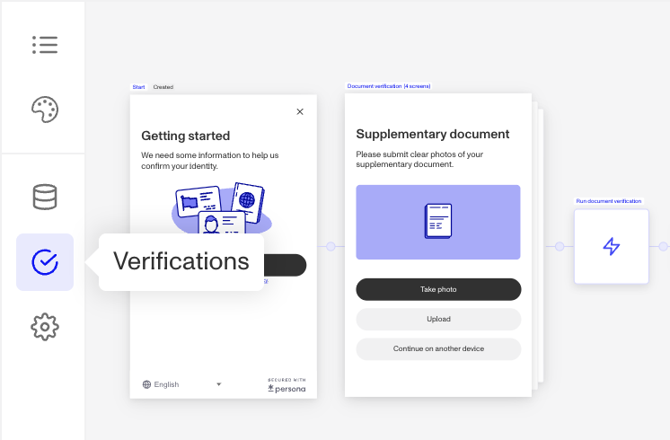
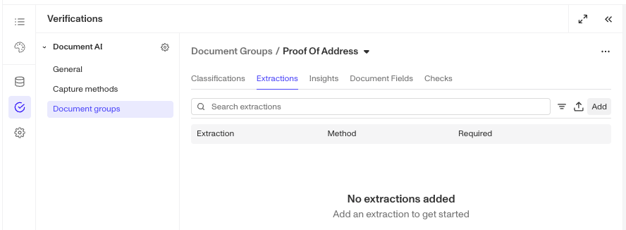
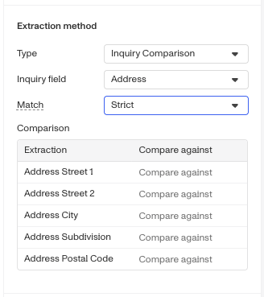

# Document AI: Extraction Configurations

# Overview

Extraction Configurations on Document Verification Templates define how Document AI identifies and extracts textual information from documents. Extracted data can be automatically compared against Inquiry fields when a Document Verification is run within an Inquiry. For example, if the name of an individual is known and stored on an Inquiry field, then you can configure a Document Verification Template's extraction configurations to compare extracted name(s) from a Document against those Inquiry fields while a user is going through an Inquiry.

These configurations enable you to standardize extraction logic, apply automated comparison checks, and enrich verification results with structured data for further analysis across Persona products like Workflows, Cases, and API responses.

## Configuring Extractions

1.  Navigate to the Dashboard, and click on **Inquiries > Templates** (or **Verifications > Templates**).
2.  Find and select an Inquiry template with Document AI, or **Create** a new template.
3.  In the left panel, click **Verifications**.

4.  In the left navigation, click **Document Groups**, and select the document group you wish to configure. _(Learn more about document groups [in this article](./2tUC2D9VeLsyPtgBo5KYzX.md).)_
5.  In the document group configuration panel, click on Extractions.

3.  To add a new extraction, click the **Add** button.
4.  In the right panel, fill out the following fields:
    1.  **Label** (required): A concise and descriptive label or name for the extraction that can provide context to the AI about what you wish to extract. Note that extraction labels should focus on the properties of the text itself, rather than on any visual characteristics such as formatting or imagery.
    2.  **Key** (required): Auto-generated from the label. Used in API responses and across Persona products.
    3.  **Required extraction**: When selected, the verification will fail if this extraction cannot be found in the document.
5.  Under **Extraction method**, choose an **Extractor type**:
    1.  **Inquiry Comparison**: Use this method to extract data from a document and compares it against Inquiry field values. See the Configure Inquiry comparison section below for details on how to set up comparison fields.
    2.  **AI**: Use this method to extract text directly from the document using Document AI, based on the extraction label.
        1.  Optional prompt: Provide context or formatting guidance to refine Document AI extraction results.
6.  Under **Advanced**, choose if you want to “Save to Document Field.”
7.  Click **Save** on the top right to save all changes to your template.

## Configure Inquiry comparison

If you selected **Inquiry Comparison** as your extraction method, you will need to configure how extracted extract data will be compared against Inquiry field values.

1.  **Inquiry field**: Choose the Inquiry field you want the extracted data to be compared against.
    1.  **Composite Inquiry Fields**: Use these to compare extracted data to specific Inquiry fields that may be a hash data type or have multiple components. This is also useful if you'd like to have custom mappings of what fields to compare. Examples:
        1.  **Address**: Map Document extracted data to the desired address fields on the associated Inquiry template (such as Street 1, Street 2, City, Subdivision, Postal Code) that you'd like to holistically compare document extracted values to.
        2.  **Name**: Map Document extracted data to the desired fields on the associated Inquiry template (such as First Name, Last Name) that you'd like to holistically compare document extracted values to..
    2.  **Single Inquiry Fields**: Use these to compare extracted data to one specific Inquiry field. This is useful is useful if you'd like to have strict 1-to-1 comparisons or for documents that may have less complex data. Examples:
        1.  **Name First**: Compare the extracted first name from the document to the Inquiry’s first name field.
        2.  **Name Middle**: Compare the extracted middle name to the Inquiry’s middle name field, when applicable.
        3.  **Name Last**: Compare the extracted last name to the Inquiry’s last name field.
2.  **Match requirement**: Define how closely the extracted data must match the Inquiry field value.
    1.  **Loose**: Uses AI-based text matching to account for common formatting or spelling variations. (e.g., “St” vs “Street”).
    2.  **Strict**: Requires higher precision in matching specific field components.
3.  **Address/Name extraction details** (if applicable):

When you select a Composite Inquiry Field, an additional section will appear where you can specify which components of the field should be extracted and compared.

### Why Extraction Configurations are important

Extraction Configurations enable you to automate how Document AI identifies and interprets document data. By configuring extractions, you can ensure that key details, like names, dates, and addresses, are consistently captured and later validated against trusted sources using the rest of the Persona platform or the Inquiry field comparison.

They’re especially useful when you need to:

-   Automate comparisons between submitted documents and Inquiry fields.
-   Capture and standardize text values for use across Workflows, Cases, and APIs.
-   Enrich your Verification data with structured, machine-readable fields

## Access by plan

We're here to chat through your specific needs. Feel free to reach out to your Customer Success Manager or [contact the Persona support team](https://app.withpersona.com/dashboard/contact-us).

|  | **Startup Program** | **Essential Plan** | **Growth Plan** | **Enterprise Plan** |
| --- | --- | --- | --- | --- |
| Extraction Configuration | Not Available | Limited | Available | Available |

## Related articles

[Document AI: Document Fields Configurations](./5l5OxysTOoxtbizpSe3nyP.md)
