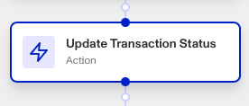

# Workflows: Update Transaction Status step

# What is the Update Transaction Status step?

**Update Transaction Status** is a Workflow Action step that updates a transaction’s status.

Transactions represent significant interactions or events (e.g. user onboarding, loan application journey, etc). While an Account in Persona represents a user or entity, a Transaction captures some event associated with that user/entity.

Transactions are integrated via Workflows and tie automations across Persona objects and constructs. Transactions and Workflows connect all parts of the platform together and back to your own systems over time.

## Possible Transaction statuses

When creating a new Transaction Type, the default Transaction statuses are:

-   **Created**: The transaction has been created and is in its initial state.
-   **Approved**: The transaction has been approved, allowing you to proceed with the user.
-   **Declined**: The transaction has been declined, indicating unsuccessful verification or other reasons for decline.
-   **Needs Review**: The transaction is awaiting manual review, often due to a report hit or other conditions requiring further inspection.

### Custom statuses

Given that a Transaction Type allows a business to model any type of interaction or event with a user within Persona, you can also add custom statuses. These custom statuses, once added, are also available as part of the Update Transaction Status workflow step.

# How do you add an Update Transaction Status step?

1.  Navigate to the Dashboard, and click on **Workflows** > **All Workflows**.
2.  Find and click on the workflow you want to edit, or **Create** a new workflow.
3.  Click on **+** when hovering over a circle to add an **Action**.

4.  Use the **Find Action** select box to click on **Transaction** > **Update Transaction Status**.
5.  Click the **Transaction** box to choose the target transaction.
6.  Click the **Status** box to set the new status.
7.  (Optional) In ‘Advanced Configuration’, click the **Continue on error** box if you want the workflow to continue running even if this step raises an error.
8.  **Close** the step. You’ll have to **Save** and **Publish** the workflow to begin using it.

# Plans Explained

## Update Transaction Status step by plan

|  | Startup Program | Essential Plan | Growth Plan | Enterprise Plan |
| --- | --- | --- | --- | --- |
| Update Transaction Status step | Not Available | Limited | Available | Available |

[Learn more about pricing and plans.](./6oZbzp7jb7AWGClF5vpY3K.md).

# Learn more

Learn more about Transactions [here](../../docs/docs/transactions.md).
