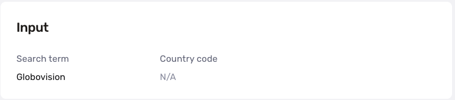
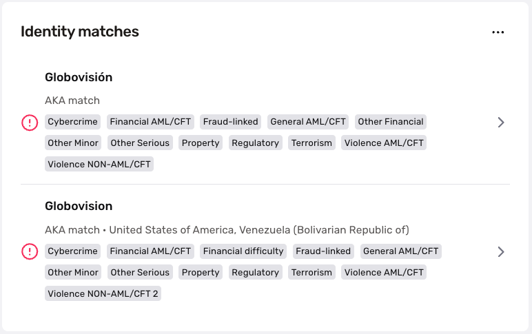
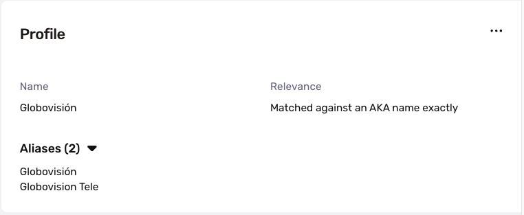
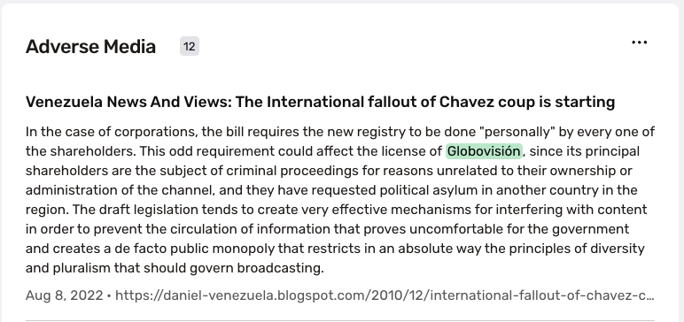
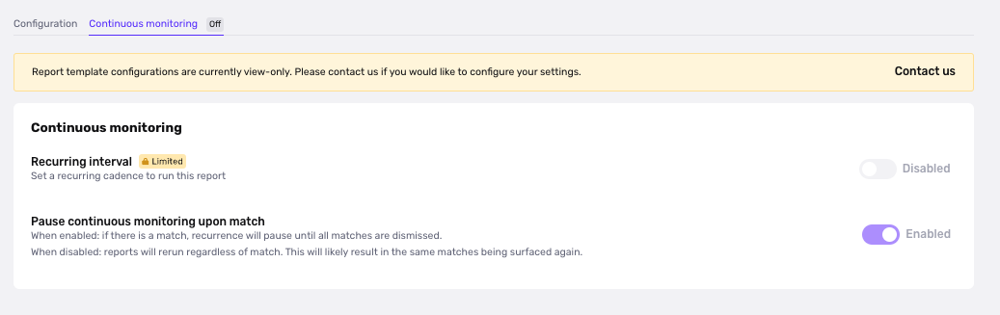

# Business Adverse Media Report

## Overview

The Business Adverse Media Report screens entities across a global database of 300+ million news articles, from both traditional news outlets and less-structured sources, to identify any unfavorable information.

## Use Case

The Business Adverse Media Report can be critical in performing due diligence on a potential customer or vendor. The results of this report tell you if an entity may have been involved with unethical or criminal activities like money laundering, financial fraud, organized crime, etc. An entity associated with such activities can jeopardize the reputation of its associates and lead to negative repercussions.

The Business Adverse Media Report is considered a "pre-cursor" to the [Business Watchlist Report](./4y3oaeL7pc2f5DHKT50smE.md), as adverse media is likely to surface far sooner than a flag on the Sanction and Warning lists. There is often a significant time delay between an entity’s involvement in nefarious behavior and being added to a Sanctions or Warnings list.

## Search inputs

There are two search inputs for the Business Adverse Media Report:

1.  **Business or Entity Name (required)**
2.  **Country of Business or Entity (optional)**

### Report Outputs

If there are possible matches to the search inputs, the Business Adverse Media Report results appear in the Identity matches section with the search term that surfaced a match. You can access and review the media articles and content by clicking on each matched item.

When you click on a matched item, you’ll be taken to a page with additional details.

**Input**

Defines the search term and country code used in the Adverse Media Report query.

**Profile**

Explains the relevance and aliases of the match.

`Relevance`

The results in the Adverse Media Report are sorted based on if the search term:

-   Matched the name exactly
-   Matched the name with a synonym
-   Matched an AKA name with a synonym
-   Matched against an AKA name exactly
-   Matched for a complex reason, such as acronym
-   Matched closely to the name
-   Matched the name phonetically

`Aliases`

Possible alternate names that the business can also be known as, taking into account slight variations in spellings as well as the name in different languages.

**Countries**

Lists all countries in which adverse media is observed.

**Categories**

We categorize the types of unfavorable media associated with a business with the below types:

-   Financial AML/CFT
-   Fraud-linked
-   General AML/CFT
-   Narcotics AML/CFT
-   Property Crime
-   Terrorism
-   Violence AML/CFT
-   Cybercrime
-   Financial Difficulty
-   Other Financial
-   Other Minor
-   Other Serious
-   Regulatory
-   Violence NON-AML/CFT

**Adverse Media**

Links to source articles are found here, along with the headline and preview of the article’s text.

## Configuration options

Configuration options for Business Adverse Media Report are view-only. By default, templates are set up in our recommended setting:

-   Categories: Media articles are organized into different categories based on the type of unfavorable media associated with a business or entity. Categories are rolled into three main compliance groups and can exist in multiple compliance groups.
-   Article-level filtering: To narrow down the query, you can apply the following filters: **Maximum article age**, **Only show article with dates**, **Allowed article countries**
-   Name match requirements: To learn more, refer to [this guide](./1FOJzuI3uMFmcDuR5zkged.md)

Please [contact the Persona support team](https://app.withpersona.com/dashboard/contact-us) to make changes to your report configurations.

## Notifications

The best way to be notified immediately of a match on the Business Adverse Media Report is to set up a webhook listening for the event types: `report/business-adverse-media.matched` fires whenever a match is found; `report/business-adverse-media.ready` fires whenever the report runs, regardless of match status.

## Continuous Monitoring

The Business Adverse Media Report can be set to recur at a regular cadence that meets your compliance requirements. [Continuous monitoring](./7LRMBbxLshF7sCcLhfhwF4.md) allows you to stay alert if there is new unfavorable content published on a business or entity that you work with.

To view your continuous monitoring settings, tab into the "Continuous monitoring" tab. If you’d like to update your continuous monitoring settings, please [contact Persona support](https://app.withpersona.com/dashboard/contact-us) for assistance.

## Plans Explained

|  | Startup Program | Essential Plan | Growth Plan | Enterprise Plan |
| --- | --- | --- | --- | --- |
| Business Adverse Media Report | Not Available | Available as add-on | Available | Available |

## _Disclaimer_

_Persona is not a consumer reporting agency and the services (and the data provided as part of its services) do not constitute a ‘consumer report’ for the purposes of the Federal Fair Credit Reporting Act (FCRA). The data and reports we provide to you may not be used, in whole or in part, to: make any consumer debt collection decision, establish a consumer’s eligibility for credit, insurance, employment, government benefits, or housing, or for any other purpose authorized under the FCRA. If you use any of any of our services, you agree not to use them, or the data, for any purpose authorized under the FCRA or in relation to taking an adverse action relating to a consumer application._
