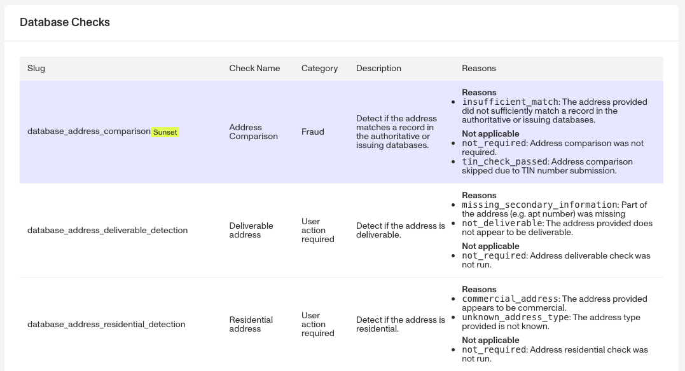
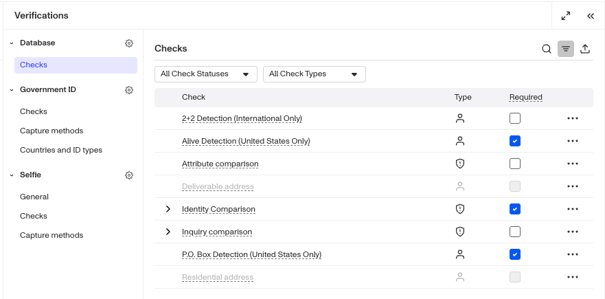
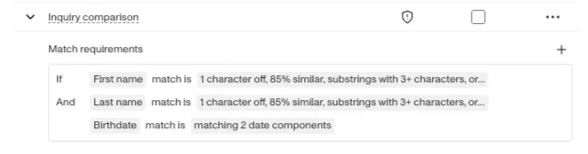
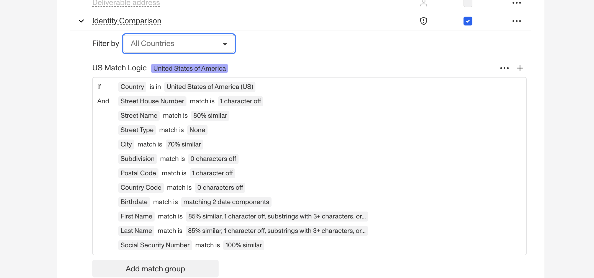
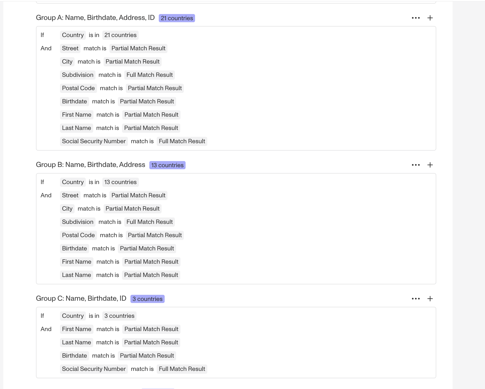

# Configuring Database Verification checks

## Overview

Below, we’ll guide you through choosing and configuring a [Database Verification](./7dcdaIsMttmPUZ2ZelRbZD.md). We’ll walk through each of these steps:

1.  Review possible Verification checks
2.  Choose which Verification checks to require
3.  Edit required checks
4.  Configure match requirements

Each step is important. The first two steps help you decide what information and checks best support your use case. The remaining steps walk through how to configure those choices.

Database Verification offers a variety of configuration options, including required or un-required Verification checks, acceptable countries, Identity Comparison checks with match groups that define acceptable match levels per attribute (for example, partial matches or exact matches), and verification check sub-configurations.

## Step 1: Review possible Verification checks

Navigate to **Documentation > [Verification Checks](https://app.withpersona.com/dashboard/resources/verification-checks/)** reference in the Dashboard. Find the section for Database checks. The table includes all possible checks to choose from.

## Step 2: Choose which Verification checks to require

The Verification checks you choose to require will depend on your organization's specific needs. There is no one-size-fits-all configuration for these checks, but the following guidelines can help you optimize your setup:

**Consider the business goals of the Inquiry Template**. For example:

-   Do you want to prioritize avoiding false positives (people passing verification who should not), or avoiding false negatives (people failing verification who should not)? The more strict your verification needs are, the more checks you may want to require.
-   Some checks are more fraud oriented while others are more conversion oriented.

Use the [Verification check reference](https://app.withpersona.com/dashboard/resources/verification-checks/) to see which checks are more suitable for your business.

**Monitor and iterate**. Keep in mind that you can adjust Verification checks as your needs change. For example, you can start with the defaults, then change one check to see how it impacts your Inquiry pass rates. You can use [Inquiry Analytics](./6wdZdwn9m4T8eY7EfqWRmB.md) to help you decide if it was an improvement.

## Step 3: Edit required checks

Once you decide which Verification checks to require, you can [add or remove a required Verification](./5Tc5tsWfBX03AHRkr2vqv2.md).

**For Database Verification Templates within an Inquiry Template:**

1.  In the Persona Dashboard, navigate to **Inquiries > Templates**. Select a template that uses Database Verification.
2.  Once you are in the Flow Editor, use the Left Panel to head to Verifications.
3.  Select the Database Verification template.
4.  Navigate to Checks.

5.  Some checks have additional options. Click the arrow to expand the check and modify its requirements.

## Step 4: Configure Identity Comparison check match requirements

Before configuring match requirements, make sure the required fields used for comparison are collected earlier in your Inquiry Template flow (if using Inquiries) or available in your workflow (if using Workflows). If a field is not collected, it cannot be evaluated by comparison checks. To learn more, see [Database Verification](./7dcdaIsMttmPUZ2ZelRbZD.md).

Match requirements apply to Identity Comparison Verification check. Match requirements define what qualifies as a “match” between the information an end user provides and a record in a known database. They are defined per-field and determine how strictly each field is evaluated.

For example, match requirements can control:

-   Whether minor typos are allowed
-   Whether common nicknames are considered valid
-   How strictly dates and numeric fields must match

### Regional differences in match requirements

Match requirement behavior varies depending on whether the Verification is configured for the United States or for non-US use cases.

**US configurations**

For US-based configurations, Persona offers a robust, field-specific matching logic by default. In most cases, the default match requirements are sufficient and do not require customization. To learn more, see [Database Verification: Setting match requirements (United States)](./6BFKQvaUZOtRSsXUJp2xu9.md).

**Non-US configurations**

For non-US configurations, Persona provides two out-of-the-box match requirement options with strong defaults:

-   **Full match:** The information must match exactly. Any difference, including a single-character, will result in no match.
-   **Partial match:** Allows limited tolerance for differences depending on the field. May account for common nicknames or minor typos.

**Note:** Requiring stricter match requirements (such as full match) generally reduces Database Verification pass rates.

To learn more, see [Database Verification: Setting match requirements (Non-US & International)](./7pCo7xatfZfIdljub260dm.md).

## Related articles

[Database Verification](./7dcdaIsMttmPUZ2ZelRbZD.md)

[Database Verification: Setting match requirements (United States)](./6BFKQvaUZOtRSsXUJp2xu9.md)

[Database Verification: Setting match requirements (Non-US & International)](./7pCo7xatfZfIdljub260dm.md)
