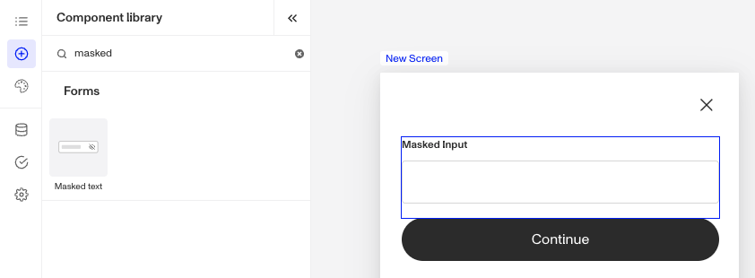
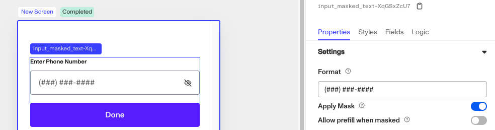

# Inquiries: Masked Text component

# What is the Inquiry Masked Text component?

**Masked Text** is an Inquiry screen component that allows a user to enter text in a specific format while ensuring data privacy and consistency.

A **Masked Text** component is ideal for collecting sensitive user information, such as Social Security numbers or other private identification numbers.

# How do you add an Inquiry Masked Text component?

1.  Navigate to the Dashboard, and click on **Inquiries > Templates**.
2.  Find and click on the Inquiry template you want to edit, or **Create** a new template.
3.  Hover over a screen and click the **Pencil** icon, or double-click the screen to open it in the Screen Editing View.

4.  In the Left Panel, click **Component Library** and search for '**Masked Text**'.
5.  Drag and drop the Masked Text component into your screen, and reposition it by dragging it around.
6.  Click on the Masked Text component, and go to **Properties** in the Right Panel.
    1.  Under **Settings**, you can set the **Format** for entered text. You can read more about **Format** below.
    2.  (Optional) Under **Settings**, you can enable **Apply Mask** with a toggle button. This controls whether a mask is applied to entered text. When enabled, previously submitted values will not be used to prefill this input.
    3.  (Optional) Under **Settings**, you can enable **Allow Prefill When Masked** with a toggle button. This allows previously submitted values to be used to prefill this input, even when masking is applied.
    4.  (Optional) Add customized **validations.** Learn more about **Validations** below.
    5.  (Optional) Add a customized **label**, **placeholder**, and **translations**:
        1.  Edit the text in the **Label** box. The **Label** is a text element displayed above the Masked Text component to describe its purpose, such as “Enter Phone Number” to guide users.
        2.  Edit the text in the **Placeholder** box. The **Placeholder** displays temporary text inside the Masked Text component, such as “###-##-####” offering an example of the expected format.
        3.  Add translations for the text by clicking **Edit translations.** You can **Translate All** or **Translate** individual languages, manually or automatically. If you don’t set translations, you’ll be prompted to do so upon **Publishing** the template.
7.  In the **[Fields](./5rT2Llik2kUvJTXKapZb8c.md)** tab, you can set up and customize the behavior of the Masked Text Component.
    1.  **Required**: Choose whether the field is mandatory (**Yes**), optional (**No**), or based on conditions (**Conditional**). If you choose **Conditional**, you will need to set a Logic rule.
    2.  **Format:** Changes to this setting will change the settings in Step 6. These fields are the same.
    3.  **Apply Mask:** Changes to this setting will change the settings in Step 6. These fields are the same.
    4.  **Allow Prefill When Masked:** Changes to this setting will change the settings in Step 6. These fields are the same.
8.  (Optional) In the **Logic** tab, you can add rules that govern when the component appears and when it does not.
9.  **Close** the step. You’ll have to **Save** and **Publish** the template to begin using it.

# Format

You can customize the format of the Masked Text component.

1.  `#` for any number.
2.  `@` for any letter.
3.  `*` for any number or letter.
4.  Any literal character (e.g. a format of `qwe` means the first three characters must be “qwe”).

Here is an example **Format** for a phone number, with the Mask applied.

# Validations

Validation rules can be set on a Masked Text component to ensure that the entered data follows the correct format. This prevents errors such as invalid inputs and ensures consistency in structured data collection.

The **Error message** can be edited to provide the user with more information on why the Masked Text input is not valid. Translations for the error message can be added by clicking **Edit translations.** You can **Translate All** or **Translate** individual languages, manually or automatically. If you don’t set translations, you’ll be prompted to do so upon **Publishing** the template.

## Validation Rules

Validation rules consist of three main components:

1.  **Field**: The object that will have a condition linked to it.
2.  **Condition**: How the field is compared to the value (e.g., equals, does not equal).
3.  **Value**: The value to test against.

### Creating Validation Rules

-   **AND Statements**: Combine multiple conditions that must all be true for the rule to pass. Add these using the **"Add"** button.
-   **OR Groups**: Combine conditions where only one needs to be true for the rule to pass. Create these by clicking **"Add OR Group"**.

## How to use Validation Rules

1.  Click on the Masked Text component, and go to **Logic** in the Right Panel.
    1.  Create a validation rule by filling in the three boxes following **When**, which correspond to an object, its condition, and its value being assessed, respectively. When that validation rule passes, the component update is applied.
    2.  (Optional) Add additional validation rules by clicking either **\+ Add** (if you want to add 'AND' rules, where all must be passed to continue) or **\+ Or** (if you want to add 'OR' rules, where one must be passed to continue). You can also nest a group of OR statements within an AND statement by clicking **\+ Add Group**.
    3.  (Optional) To edit the validation directly, you can open the **code editor**.

# Translations

Persona can automatically translate new text into other languages in the component’s **Properties** tab. You can also customize the translation for any particular language.

To configure available languages for your template, click the **Gear** icon in the Left Panel to access **Settings**, then select languages under the **General** tab.

# Logic

Persona provides you with the ability to add logic to a Masked Text component. For example, a component may only become visible to a user if certain conditions are met. On the **Logic** tab, there are two options for logic rules:

-   **On screen load**: Logic rules are evaluated only when the screen loads. They can reference any field configured on the template.
-   **On screen update**: Logic rules are evaluated in real time. They can only reference inputs on the current screen.

For form components a field can be labeled as required under specific conditions.

-   **Require field**: Logic rules are evaluated in real time referencing inputs on the current screen. They can only reference inputs on the current screen.

## Logic Rules

Logic rules consist of three main components:

1.  **Field**: The object that will have a condition linked to it.
2.  **Condition**: How the field is compared to the value (e.g., equals, does not equal).
3.  **Value**: The value to test against.

### Creating Logic Rules

-   **AND Statements**: Combine multiple conditions that must all be true for the rule to pass.
-   **OR Groups**: Combine conditions where only one needs to be true for the rule to pass.

## How to use Logic Rules

1.  Click on the Masked Text component, and go to **Logic** in the Right Panel.
2.  Choose either “**On screen load**” or “**On screen update**” and click **Add.**
3.  Choose what **Component Update to apply** when conditions are met.
4.  Create a logical rule by filling in the three boxes following **When**.
5.  (Optional) Add additional logical rules using **\+ Add** (AND rules) or **\+ Or** (OR rules).
6.  (Optional) Open the **code editor** to edit the logic directly.

# Plans Explained

## Masked Text component by plan

|  | Startup Program | Essential Plan | Growth Plan | Enterprise Plan |
| --- | --- | --- | --- | --- |
| Masked Text component | Available | Available | Available | Available |
| Validations for Masked Tex component | Available | Available | Available | Available |
| Translations for Masked Text component | Available | Available | Available | Available |
| Logic for Masked Text component | Not Available | Not Available | Available as part of Inquiries Enhanced | Available as part of Inquiries Enhanced |

[Learn more about pricing and plans](./6oZbzp7jb7AWGClF5vpY3K.md).

# Learn more

[Learn more about Inquiries.](../../docs/docs/inquiries.md)
