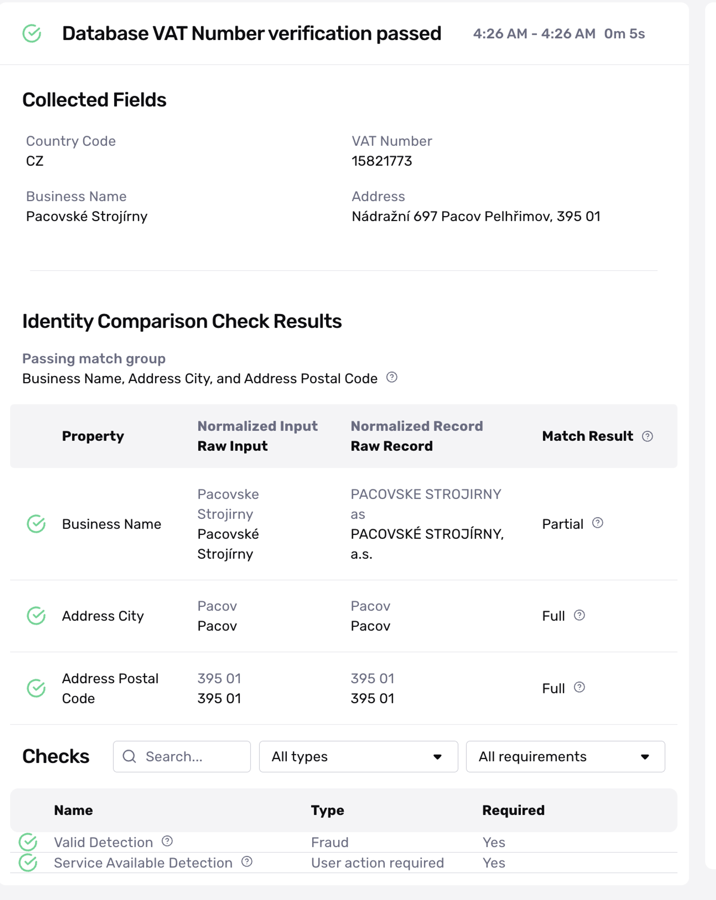

# VAT Verification (European Union & United Kingdom)

# Overview

VAT verification confirms a provided VAT and country code matches official registries in the EU (VAT Information Exchange System) or the UK. The EU VAT Verification covers VAT numbers in the EU and the UK.

This article explains:

-   Common use cases for EU VAT verification
-   How it works
-   Caveats

## Common use cases for EU VAT verification

VAT numbers are assigned in the EU and UK to businesses or sole-props that participate in the VAT (Value Added Tax) system. As part of DAC7, marketplaces are required to collect and verify EU VAT numbers.

Note that VAT numbers can be different from Business Registration Numbers and Personal/Business Tax IDs (TINs). To verify Business Registration Numbers, Persona recommends using the [Business Registry Verification](./3pkLBWKg5wIQJru7PATxBc.md)

## How it works

The business provides

-   VAT number
-   Country code
-   Business name (optional)
-   Business address (optional)

 The verification then returns back a Passed or Failed depending on if results match what is provided in VIES or the UK registry. If requested, match groups for comparison can be set up if customers want to perform matching logic against an inputted business name + address against the business name + address returned from VIES

## Caveats

Each member state will have regularly scheduled downtime (i.e. Germany will have 2.5 hours of downtime a day), so Persona recommends configuring retry logic via Workflows.

Additionally, each government may update Tax IDs on their own schedule.

## Related articles

[Verifying Businesses: How Persona can help verify businesses](./3OGe9IwySJmDvXL2DOfV7N.md)
