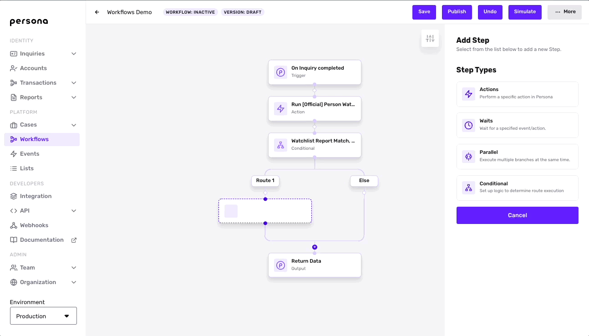
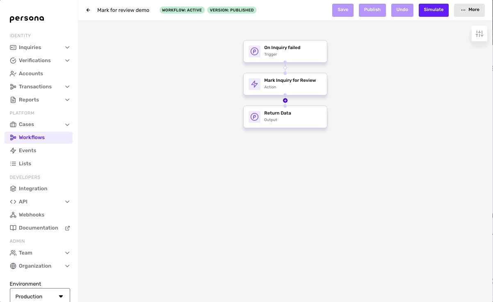
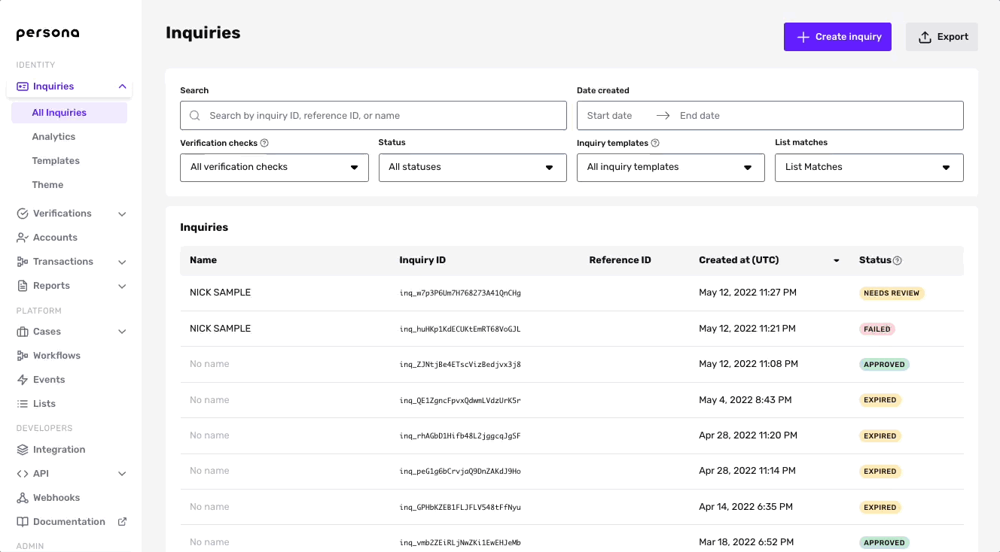
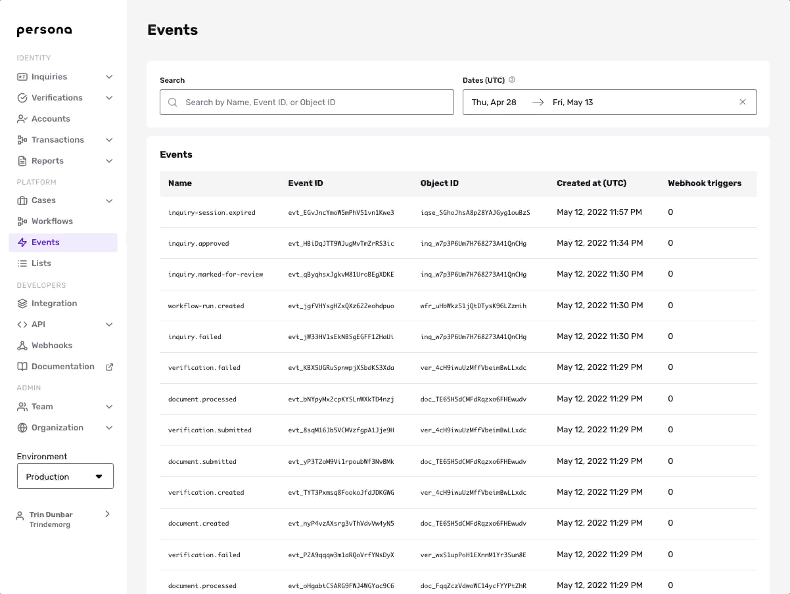

# Setting up an Inquiry review process using Workflows

## Overview

Because there are often edge cases, you will likely want to manually review some of your Inquiries. You can set up an Inquiry review process entirely on Persona. You can use a Workflow to automatically flag any Inquiry that meets your criteria for manual review.

Below, learn:

-   How to use a Workflow to mark an Inquiry for review.
-   Two methods to manually review an Inquiry:
    -   Create a Case using a Workflow
    -   Review without a Case
-   Related Webhook events you can subscribe to.

## Mark an Inquiry for review

Within a Workflow, mark an Inquiry for review by adding the Action step called **Mark Inquiry for Review.**

### What happens to an Inquiry when it's marked for review?

When an Inquiry is marked for review, the status of the Inquiry object changes to `inquiry.marked-for-review`.

## Create a Case

[Cases](./1EJCOF8bL5KRx4pQESw7VB.md) offers a single hub to manage all of your manual reviews. To aid your manual review, you can design a custom UI that pulls togethers relevant information from different parts of Persona, including Accounts, Verification checks, Reports, document uploads, and more. 

To create a Case from within a Workflow:

1.  First, create a [Case template](./5WFMyVPjzgXQNljqg2xf4h.md) to address your specific use case.
2.  Then add the **Create Case** Action step in your Workflow, and choose the Case template you want to apply.

### Extensions

You can add these additional steps to the Workflow to streamline your operations:

-   Wait for the Case to resolve, using a Wait step.
-   Automatically update the Inquiry status based on the Case `state`, using a Conditional step:
    -   If the Case is approved, set the Inquiry status to approved.
    -   If the Case is declined, set the Inquiry status to declined.

To learn more about how to use Workflows and Cases together, see [Using Workflows and Cases to run Reports and review Report Matches](./042goubhldtkoKAA6AmiZ.md).

## Manually review an Inquiry without a Case

To find Inquiries that have been marked for review in the Dashboard:

1.  Go to **Inquiries** > **All Inquiries**.
2.  Under the Status drop-down menu, check **Needs Review**. 
3.  Select an Inquiry you want to review.
4.  Click **Review** in the upper corner.
5.  Select Approved or Declined, and optionally add an comment.
6.  Submit the form.

## Listen for the `inquiry.marked-for-review` Webhook event

[Webhooks](../../docs/docs/webhooks.md) notify your service about events that happen on Persona. Use the `inquiry.marked-for-review` event to get notified when a Inquiry is marked for review.

You can view this event in the Dashboard. Go to the [Events](../../docs/docs/events.md) page and select an event you'd like to view. This will take you to the event details page, which includes the event ID and the event body.

