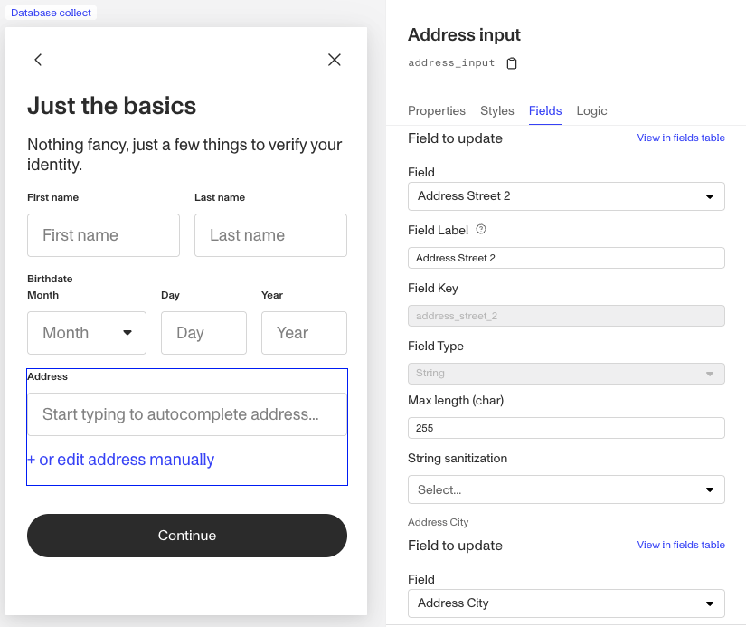
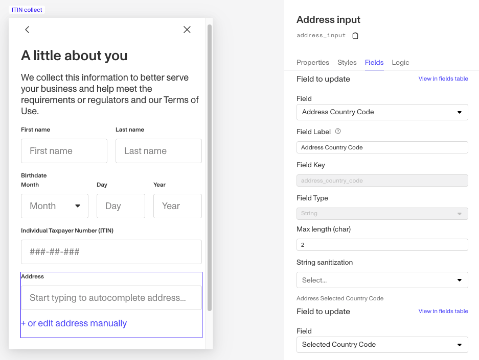

# Why does the address input component only accept US addresses?

📌 This question came from a member of the Persona community — a product manager improving their user onboarding experience. This is useful for anyone looking to understand the address input component within Inquiries.

# Question

**Why does the address input component only accept US addresses?**

# Answer

The [Address Input component](./4g00EKwkY9HGPv7Dr2KlX9.md) within Inquiries can actually accept addresses from all over the world.

If you're testing the component in a sandbox Inquiry, preview mode, or simulate mode and it seems to only accept US addresses (or addresses from a specific country), you may be running into a common misunderstanding related to field configuration. Let’s dive deeper.

## Address Input component’s Fields configuration

### The user experience of the Address Input component

When a user fills out the address, they start typing, a prefill option appears, and the fields fan out into separate input boxes: Address Street 1, Address Street 2, City, Postal Code, and Subdivision/State.

### The relationship between the component and Inquiry Fields

When you add an Address Input component to a screen in an Inquiry Template, each part of the address maps to an Inquiry Field.

When editing a screen with an Address Input component selected, navigate to the **Fields** tab to see how the fields are mapped. For example, **Address Street 2** might map to a field key like `address_street_2`, while **City** maps to `address_city`.

Here's an example of the mapping: 

Things can get tricky if you collect multiple addresses within a single Inquiry Template (e.g., a personal address and a business address). In those cases, you must create separate fields for each address. Otherwise, users could unintentionally overwrite earlier entries because the same field keys would be reused. But Persona enables you to do this and manage, on a granular level, where you store the inputted values using Inquiry fields.

For a deeper look at managing fields, check out the [Inquiries Field Editor](./5rT2Llik2kUvJTXKapZb8c.md).

### How country selection works for Address Input

You may notice that the **country** field doesn't appear when previewing an Inquiry or when a user completes one — only fields like Address Street 1, Address Street 2, City, Postal Code, and Subdivision/State are shown.

However, when you're editing or configuring a screen with an Address Input component, **country** _is_ shown and mapped to a specific field in the Inquiry Template's schema.

In the example below, the country field is mapped to `address_country_code`: 

This mapping matters: the Address Input component relies on the value of the associated country field to function properly.

In many default templates, the Address Input component maps country to `selected_country_code` or `address_country_code`. Often, a preceding screen contains a [Country Select component](./1m63dKFyhIC03NpraApqZY.md) that fills this field when the user selects a country. In some cases, the field may have a default value like `US`, which explains why the Address Input seems limited to US addresses.

## How to fix or further understand the behavior

1.  **Test selecting a different country**:
    
    If a Country Select component (or another component updating the country field) exists on a preceding screen, select a different country during testing. This should allow the Address Input component to accept non-US addresses.
    
2.  **Check your Inquiry Template configuration**:
    
    Review the Inquiry Template and confirm that:
    
    -   A Country Select component (or similar) maps to the same associated country field as the Address Input component.
    -   Ideally, the Country Select component should appear immediately before the Address Input component.
    -   If other steps (like Verifications, Action Steps, etc.) occur between the country selection and the address input, make sure nothing else is overwriting the country field unexpectedly.

📌 This answer was last updated on Dec 10, 2025 by Ryan Cole, a content manager at Persona. FAQs are written to provide Persona Community members specific answers to common questions. While we periodically review responses, please note the last updated date as information may have changed since then.
