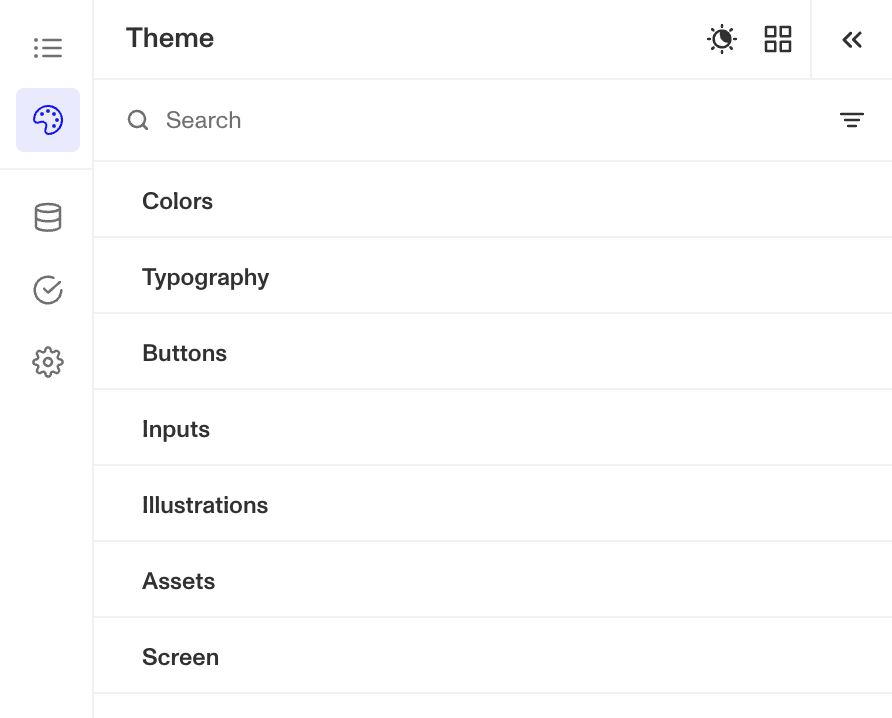
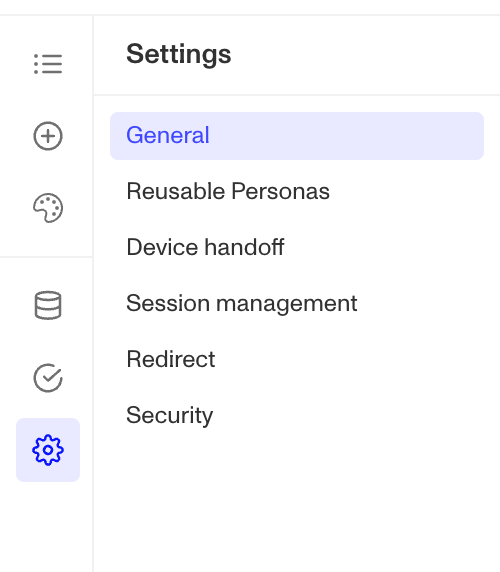
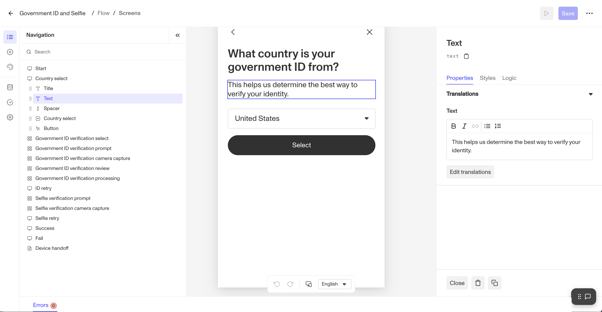
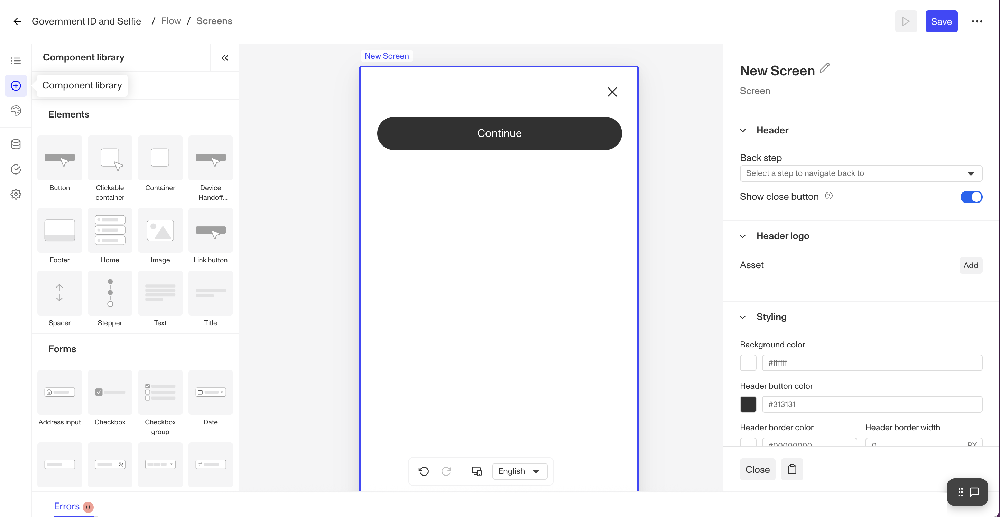
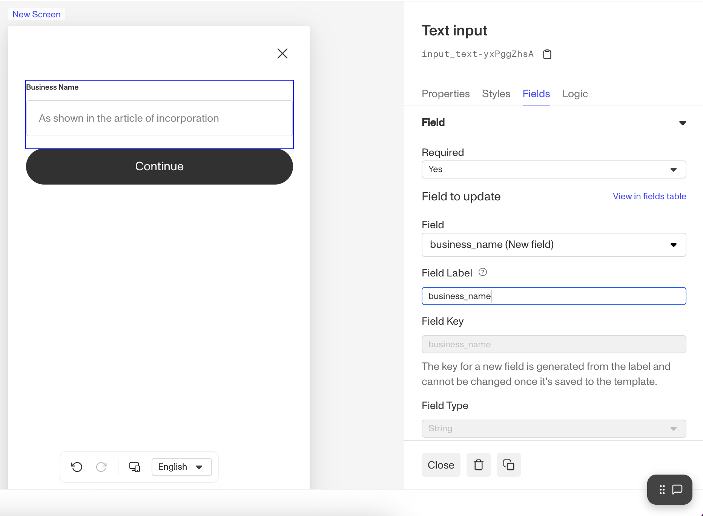
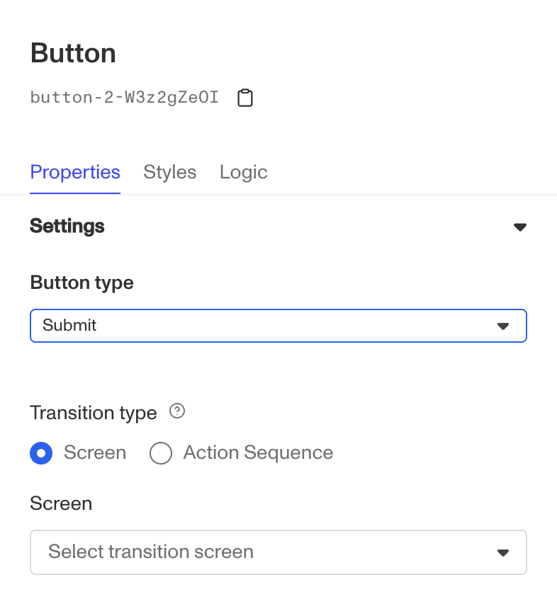
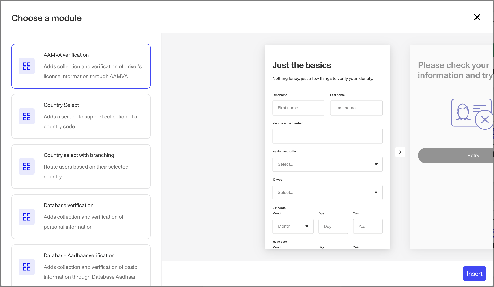
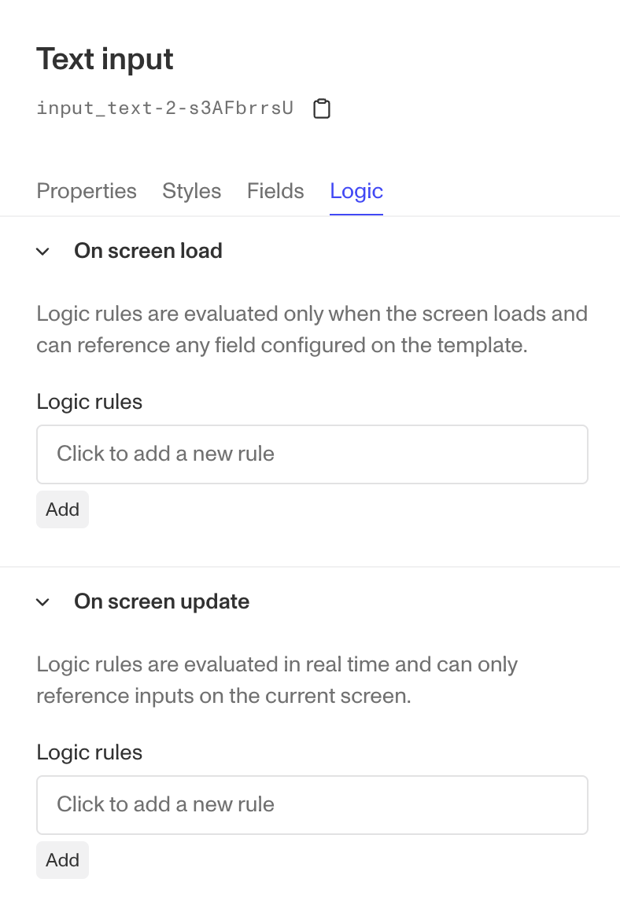
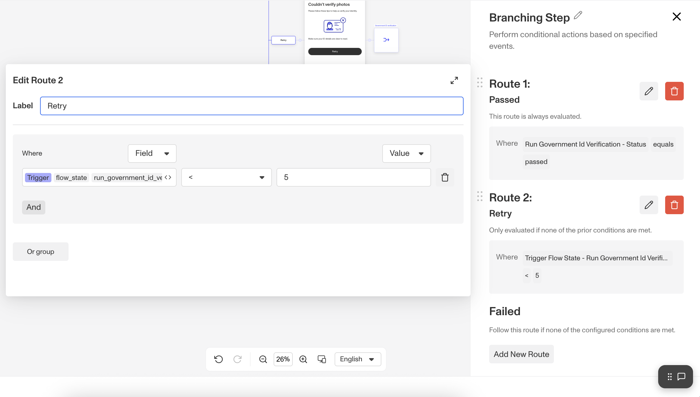

# Configuring your Inquiry Template

## Getting started

Under "Inquiries" > "Templates" in the Persona Dashboard, you'll find the [Templates](https://app.withpersona.com/dashboard/inquiry-templates) view. Here, you'll see a list of all the Inquiry Templates in your organization.

When you click into a Template, you are opening a template in the Flow Editor. The Flow Editor is a visual no-code interface where you can view, edit, and preview your Template. Refer to [Getting started with your Dynamic Flow Template](./3oD3G7MYVMVOvWZWXRvXtR.md) to learn about the overall structure of the flow editor.

Note: [Enhanced features](./7MxcjmVedDlKwbp42qoGT5.md) are available to organizations on paid plans. These features include the ability to add custom visuals, custom styling, and any number of steps to your flows. Please reach out to your customer success manager or [contact the Persona support to learn more](https://app.withpersona.com/dashboard/contact-us).

## Theme - style your inquiry flow

When you click on the **Theme** sub-section in the left panel, you'll open up the theme editor.  Theme is a collection of configurations related to styling of UI elements in the flow that can be customized to match your brand. Here, you can change colors, typography, buttons, inputs, illustrations, assets (header logo), and screen. In addition, you can configure a dark mode.

If you have a theme set set up for your organization (under Inquiries → Themes), you can also load an existing theme set and make further changes for a particular inquiry template.

To learn how to configure a theme step-by-step, see [Tutorial: Configure a Theme with Flow Editor](./6SIHupp847yaEuVMucKAff.md).

## Fields - configure fields to store data submitted through the inquiry flow

The Fields section lists all fields created for your inquiry flow. Most fields are automatically generated by input components in screens (such as when you add a date component, which needs a field to store the user's input) or by verifications (like government ID verification, which creates fields to store various ID extractions). You can also manually create custom fields to store any values you want. 

## Verifications - configure Verifications in the inquiry flow

Verification configurations provide extensive customization options. You can fine-tune any Verification in your flow based on your business needs and fraud risk level to determine which checks must pass for successful verification ([Checks](./5Tc5tsWfBX03AHRkr2vqv2.md)). The overall success or failure of a verification will depend on its verification check configuration. Persona checks can be **Required**, **Not Required**, or **Disabled**.

-   All non-**Disabled** checks will run on every verification.
-   A verification attempt can only pass if all of its required checks pass.
-   If the verification attempt fails, the user will be prompted to retry until they exhaust all of their attempts (see below on configuring retries in the Screens section below).

Beyond checks, you can also adjust other important options. For example:

-   If your organization is fraud-sensitive, you might disable file uploads on Government ID and require users to take a live capture ([Capture methods](./7JQ78WDWLj5L63qXEu7AqJ.md)).
-   If conversion rates are a priority, you could automatically classify IDs without requiring users to specify Government ID country and type ([Auto-classification](./7kOzAY6feIPnzI3s5XbXVL.md)).
-   You can also restrict which countries and government ID types your business accepts.

Government ID verification is just one example - each verification type has its own configurable options. This section displays all available configurations for each verification type in your inquiry flow.

To learn how to configure each verification type more in detail, refer to the [Verification section of Help Center](../verifications.md). 

## Settings - remaining configuration options

-   The **General** section includes the template name, IDs, and language support option that determines which languages are available in the language selector.
-   You can choose whether [Reusable Personas](./4DXUhrP7e1sLBj2SKIDsMX.md) can be created or used in the Inquiry Flow through the **Reusable Personas** section.
-   **Device handoff** allows the user to continue the flow on other devices. You can enable device handoff for each verification template in Capture Methods in Verifications, but this section includes other related settings that pertain to the entire inquiry flow.
-   The **Session management** section allows you to configure the time intervals after which an Inquiry expires and the flow can no longer be accessed.
    -   To ensure users aren’t allowed access to their inquiries indefinitely, but to avoid friction for users who might not complete their inquiries right away, you can [configure your Expiration intervals settings](./5TKUNJRjtKqtwU02Z5Ka1X.md). If you’re sending links via email (or other asynchronous method), you should configure a longer expiration time.
-   **Redirect** allows you to configure the handoff from the Persona flow back to your application
-   The **Security** section allows you to configure Allowed Domains, which are domains permitted to embed this Inquiry Flow (via Embedded Flow) or to serve as redirect destinations after a Hosted Flow completes, as well as the ability to block client-side Inquiry creation.

## Screens

When you double click on a screen or click the pencil icon, you transition from the Flow Tree View to the Screen Editing View. Here, you can view all the possible screens of the flow and customize specific components of each screen through the Right Panel.

You can insert, edit, and rearrange screen components. There are two categories of components: Elements & Forms.

-   **Forms** take an input from a user who is going through an inquiry, whether it is a text input, an address input, or a selection in the dropdown. A form component gets saved to a field, usually of a type that matches the nature of input (e.g. date input component is saved to a date type field).
-   **Elements** are all other non-form components, such as a title, a text, a spacer, an image, a footer, or a button.

You can mix and match different components to create a screen that you want to show to your end user.

Note:

-   Some configurations cannot currently be made through the Flow Editor ([Inquiry flow screens](./2WWzr0d6rEOIlyXjtHSCgC.md)). To request specific changes, you can reach out to your account team or [contact our support team](https://app.withpersona.com/dashboard/contact-us).
-   Customization of the combined screens step is limited.

There are so many ways one can configure the inquiry template, so we can’t cover them all. However, we will talk about the most common ways one can configure the template.

### Adjusting wording and component-level styling

Once you're in the Screen Editor, clicking on any **Component** (any item within the screen) will open the Right Panel where you can edit both text and styling. Remember that any styles applied directly to a component affect **only** that specific component and won't change your overall theme.

You can also edit any translations you have by pressing the “Edit translations” button, and see a list of all of your enabled languages in the Left Panel (Settings → General → Language Supported). By default, all languages that Persona offers are enabled. 

### Collecting information you need from the user

Between any two screens, or between a screen and an action, you’ll see a purple circle that turns into a ➕ when you hover over it. Clicking on it will bring open a submenu that gives you the option to add a new screen, module, action sequence, branching, or connector.

This new screen starts off as a blank canvas, but by accessing the **Component Library** in the Left Panel, you can drag-and-drop components onto the screen and configure. Screens generally follow this format:

-   Title component
-   Spacer
-   Other components (text, input, etc.)
-   “Continue” button

 When adding any input components, set a descriptive `Field Key` for these components, because the `Field Key` will be the identifier for the value in the API response. A good field key will accurately describe the information that’s being asked for, like `name_first` or `address_country_code`

-   To set a `Field Key` for a new field, edit the Field Label immediately after adding the component.
-   To set a `Field Key` for an existing field, change the selection to an existing one using the Field dropdown.
    -   If there is already a value in the existing field, the form component will be pre-populated with the value when shown to the user.

### Using a Button

In the Component Library, there are a few different types of buttons - (generic) button, device handoff button, and a link button.

-   A link button routes a user to a certain URL when clicked. Think of it as a hyperlink but in a button form.
-   A device handoff button appears as part of combined screens steps (e.g., Government ID or Selfie Verification), but you can also use this pre-configured button to give users the option to hand off to another device on other screens (e.g. at the Retry screen).
-   A (generic) button component has a few types - Action, Cancel, Complete, Submit.
    -   Cancel - Opens a cancel confirmation dialog asking "Are you sure you want to cancel?" and terminates the inquiry session if confirmed
    -   Complete - Ends the inquiry flow successfully
    -   Action - Transitions without form processing. Need to designate the transition step.
    -   Submit - Most common button type. Validates and submits form data. It basically continues to the designated transition step.

### Using Inquiry Modules

A module in the Flow Editor is a pre-configured group of steps designed for specific purposes, making it easier for builders to create flows. If you're unsure how to put together a set of screens for a commonly used scenario, browse the modules list to find what you need. By combining templates from the Template Library with modules, you can quickly assemble a base flow and then refine it as needed. 

### Using Logic to hide or show a component

You can set logic rules to show or hide a component at On-screen load or at On-screen update. This is useful when you have a certain component that is applicable only when a certain set of conditions are met

-   e.g. If a user selects "Other" in a dropdown menu, show an input field where they can provide additional details
-   e.g. If a user selects a country where a VAT number is required, display a field requesting this information

### Adjusting the number of retries if desired

For Inquiry Templates that include a Verification, you can configure the number of retries you want to allow before an inquiry fails. Click on the Branching Step that appears after a verification to open up its logic.

You’ll see that on the “Retry” path, the conditional looks something like `trigger.flow_state.run_<verification>_attempts < 5` by default (`flow_state` is a variable that’s internal to the inquiry). You can change the limit on verification attempts by clicking on and editing the expression in the panel. Change the value from `5`, the default, to another value.

You might decrease the number of tries to a lower number if you’re seeing high fraud activity and want to limit the number of attempts your users have to pass. 

## Preview, Save, and Publish

### Preview

You can preview a Template at any time by clicking on the **Preview** button (with the ▶️ icon) in the top right of the page. Switch to a Sandbox environment by using the environment switcher in the top left of the page. This opens up a hosted flow Inquiry that simulates what your end users see, without running live Verifications.

For more, see: [How to preview an Inquiry](./4Bc5EGnIOwAiXZaijGISsx.md).

### Save

When you save changes to a published Template, a draft version of the Template will be created. You can save any number of additional changes to this draft.

### Publish

When you're ready to put the changes saved in your draft into production, click the **Publish** button at the top right of the page. Any users going through your flow from this point onward will see the new version of your flow.

## Learn more

-   [Inquiry flow overview](./6CiQpUM6lROr10QmRXAqrP.md) dives into each of the components of an Inquiry flow: screens, steps, modules, and connectors.
