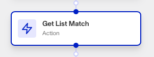
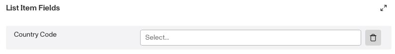

# Workflows: Get List Match step

# What is the Get List Match step?

**Get List Match** is a Workflow Action step that checks whether a piece of information matches any item on a predefined Persona list. The Get List Match step returns a boolean value: if the specific piece information being checked is found on the list, it returns **True**; otherwise, it returns **False**. This result can then be used in subsequent a Conditional step to trigger subsequent actions or decisions within the workflow based on the presence or absence of a match.

Lists are particularly useful for enhancing security, compliance, and operational efficiency. Some examples of this include:

-   **Fraud Prevention**: Maintain a list of known fraudulent email addresses, IP addresses, or identities to automatically flag or block suspicious activities.
-   **Compliance Checks**: Create lists of sanctioned individuals or entities to ensure compliance with legal and regulatory requirements by checking against these lists during verification processes.
-   **VIP Customer Management**: Manage a list of VIP customers to provide them with prioritized service or special handling during interactions.
-   **Access Control**: Use lists to manage access to certain features or services by maintaining a whitelist or blacklist of users or entities.
-   **Marketing and Engagement**: Segment customers into lists based on specific criteria, such as geographic location or purchase history, to tailor marketing campaigns or engagement strategies.

The Get List Match step allows you to automatically check certain information against a list. This action is typically used within workflows to automate decision-making processes based on whether there is a match. For example, if an inquiry contains an email address that matches an email address on a list of known fraudulent addresses, the workflow can use the Get List Match step to determine that, then automatically flag the inquiry for review or take other predefined actions.

# How do you add a Get List Match step?

1.  Navigate to the Dashboard, and click on **Workflows** > **All Workflows**.
2.  Find and click on the workflow you want to edit, or **Create** a new workflow.
3.  Click on **+** when hovering over a circle to add an **Action**.

4.  Use the **Find Action** select box to click on **List** > **Get List Match**.
5.  Choose the **List** you want to check.
6.  Choose the **Item Fields** you want to check against the List, and the value to be checked.

7.  (Optional) In ‘Advanced Configuration’, click the **Continue on error** box if you want the workflow to continue running even if this step raises an error.
8.  **Close** the step. You’ll have to **Save** and **Publish** the workflow to begin using it.

# Plans Explained

## Get List Match step by plan

|  | Startup Program | Essential Plan | Growth Plan | Enterprise Plan |
| --- | --- | --- | --- | --- |
| Get List Match step | Not Available | Available | Available | Available |

[Learn more about pricing and plans.](./6oZbzp7jb7AWGClF5vpY3K.md)

# Learn more

[Learn more about Lists.](../../docs/v2022-09-01/docs/lists.md)
