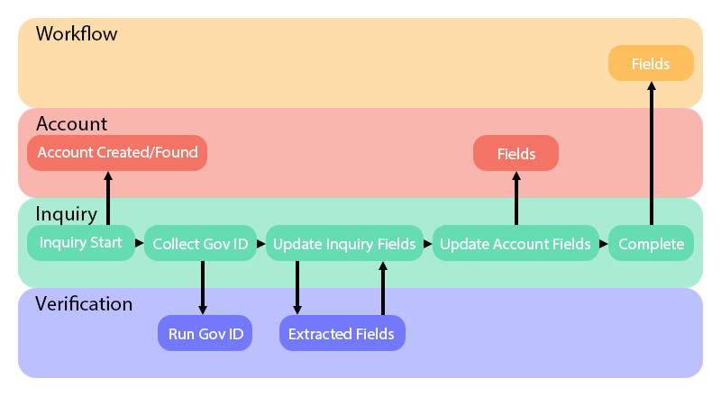
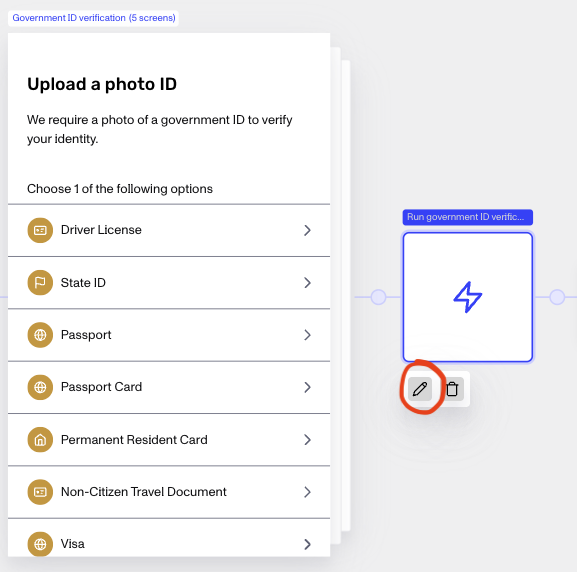
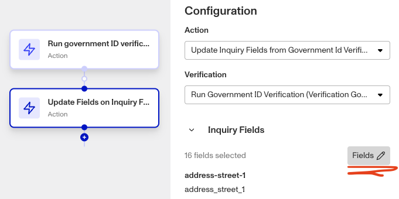
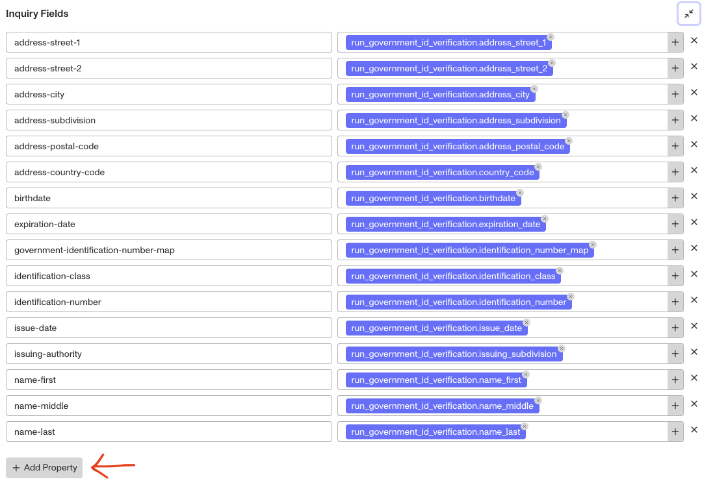

# How can I use an existing inquiry template with the AAMVA verification solution?

❓ This question came from an Essentials customer who wanted to utilize their already-existing inquiry template into the newly added AAMVA solution. The full AAMVA solution includes a pre-built inquiry template, workflow with AAMVA verification, a Case temple for review.

# Question

I've just added the AAMVA verification as an add-on solution. How do I “plug” my existing inquiry template into the solution?

# Answer

The full [AAMVA solution](./76IuZmA7MC9tdemWcSb49M.md) added to your account includes a pre-built inquiry template, but you can instead use an already existing inquiry template as long as it includes Government ID verification enabled for US users with driver’s licenses and state IDs. You’ll just need to modify your existing inquiry template to update some addition fields needed by the AAMVA verification that runs in the workflow.

## Updating Fields

The workflow of the AAMVA solution requires some fields from the collected driver’s license that are normally not passed from the verification to the inquiry and then to the workflow. Those three fields are:

-   `issuing_authority` (string)
-   `issue_date` (date)
-   `expiration_date` (date)

The following set of instructions will show you how you can ensure those fields are added to your existing inquiry template and link that template into the AAMVA workflow solution.

1.  Go to your **[Persona Dashboard](https://app.withpersona.com/dashboard?utm_source=helpcenter&utm_medium=referral&utm_audience=a&utm_term=11xc0c4sJ2yVgEcjxCA62u&utm_content=faq_how_can_i_change_my_plan&utm_campaign=acq_gen_ds_dashboard) > Inquiries > Templates**, and select the inquiry template you want to use to run Government ID verification prior to AAMVA.
2.  From the inquiry template, go to **Configure > Fields**. You’ll want to ensure that ALL the below fields exist. If one is missing not, add them.
    1.  `issuing_authority` (string)
    2.  `issue_date` (date)
    3.  `expiration_date` (date)
    4.  `address_postal_code` (string)
    5.  `birthdate` (date)
    6.  `identification_class` (string)
    7.  `identification_number` (string)
    8.  `name_first` (string)
    9.  `name_last` (string)
3.  From the inquiry template flow view, edit the action step ‘Run government ID verification’ that appears after the ‘Government ID verification’ combined screen.

4.  Click into the action step called ‘Update Fields on Inquiry’. To the right of the screen you will see a configuration menu. Toggle open ‘Verification Fields’ and click on the ‘Fields’ button.

5.  To add a field, scroll to the bottom of the Inquiry Field popup and click the ‘Add Properties’ Button. For any fields that needed to be added in Step 2, add the properties to ensure that the verification fields from the Government ID are written to the inquiry fields.

6.  Save and publish.
7.  Go to your Workflow and [add your inquiry template token as a trigger criteria](./20Zvcq50493eMUdt7aDhRY.md#trigger-criteria).

## Related articles

[AAMVA Verification](./1wiQ7wAhmnKh6mesCGopKl.md)
