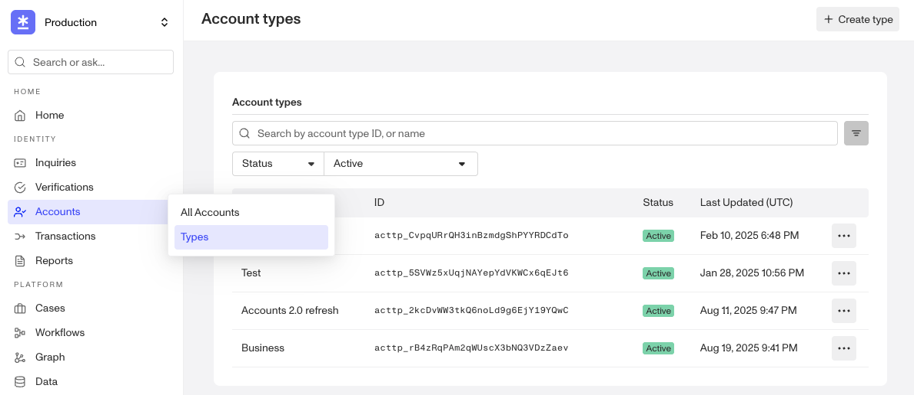
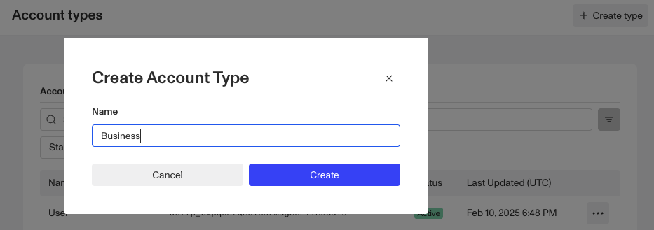

# Creating custom Account Types and Fields

# **Creating Account Types And Fields**

# Overview

Businesses need identity data infrastructure that can represent the multiple entities they support, along with each entity’s associated information. These entities may include people - such as drivers with their driver’s licenses, or shoppers with their phone numbers - or non-human entities, such as stores with their street addresses or companies with their tax identification numbers.

An organization can create custom Account Types in Persona and equip them with custom fields to craft a source of truth for every entity type, reflecting the complexity of their business.

### What is an Account Type?

An **Account Type** is a Account template that configures the included fields, any custom statuses to represent the different stages of an account’s lifecycle, and the relations representing real-world connections between different entities. By default, all organizations have a “User” Account type in their Dashboards. You can rename this type and revise fields and statuses. However, you cannot delete the default account type since at least one account type is required.

You can create new account types to represent various entities with their own set of fields, relations, and statuses. Account Types are scoped per organization (i.e. across all environments).

### What can organizations do with Custom Account Types?

-   Represent businesses or groups, in addition to individuals
-   Store KYB data more effectively and enable easier business account lookups
-   Store custom **fields** and information that are specific to each account type
-   Configure **statuses** to represent different stages of a lifecycle that are specific to each account type
-   Define **relations** to establish named connections between different entities
-   Create accounts **actions** to automate a series of actions for an account of each account type

# Create an Account Type

1.  In the Dashboard, click **Accounts** > **Types** in the navigation bar.

 2. In the upper right corner, click **Create type** to create a new Custom Account Type. 3. Enter a name for the Account Type that you’re creating and click **Create** to open the New Account Type configuration panel. 

NOTE: For ways to create an account of a certain account type, please refer to this article [here](./5O2wfeWGy3cR7jS0rdcd1R.md).

## Adding fields to an Account Type

To customize the kind of info your organization can collect and store for this entity, add fields to the Account Type within our Field Editor.

1.  Click on the Account Type.
2.  You will see 3 tabs - Fields, Actions, and Statuses.
3.  Select the Fields tab. In the upper right corner of Field Editor, click the **\+ Add Field** button. This will open a configuration panel on the right side of the screen.
4.  Fill out the details for each field. Then set the necessary configurations
5.  Once you close the configuration panel, be sure to Save

You can also configure a field to be an [identifier](./6Iz6sufWpRG5uVSEwoOPJT.md) or create a [relation](./1aMbe1XEyhiAHgFz1oOjDj.md) through Field Editor. Please refer to [Accounts Field Editor](./1wcCKHsRP621g13l4iTc85.md) for more details.

## Add statuses to the Account Type

To customize statuses to represent the lifecycle stages of an account, you can define statuses per account type.

1.  Click on the Account Type. You will see 3 tabs - Fields, Actions, and Statuses.
2.  Select the Statuses tab. In the upper right corner, click the **\+ Add Status** button.
3.  Provide a name, choose a color, and click Save

Please refer to [Accounts Statuses](./6W3ySuKOa8ez3CEbZYHdcj.md) for more details.

## Add actions to the Account Type

To add one-click “macros” to automate a set of actions on a given account, you can create Account Actions per account type.

1.  Click on the Account Type. You will see 3 tabs - Fields, Actions, and Statuses.
2.  Select the Actions tab. In the upper right corner, click the **\+ Create Action** button.
3.  Provide a name and configure a set of workflow steps to be triggered upon click.
4.  Save and Publish

Please refer to [Accounts Actions](./64EZm9gziZNEwZ9wX2yrU1.md) for more details.

## How to access Account-related information in Workflows

In Workflows, you may want to access and condition off of Account-related information for a given account. You can access using the following attributes

-   Type - `account.account_type`
-   Fields - `account.fields.<key>`
-   Status - `account.account_status`
-   Relations - `account.relations.<key>`
-   Identifier - `account.identifiers.<key>`
    -   Note that Reference ID can be accessed through `account.reference_id`

## Related articles

[Configuring Account views with Layout Editor](./6vTs9Xe6Z72JKNf8cy4F7w.md)
