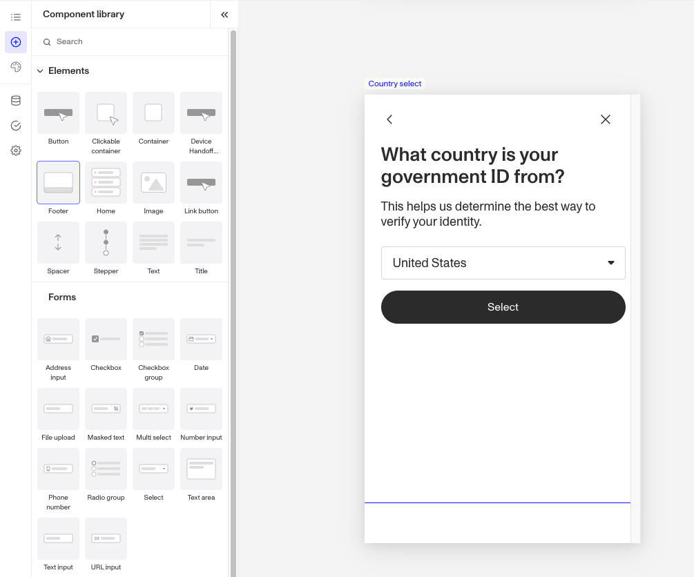

# Inquiries: Footer component

# What is the Inquiry Footer component?

**Footer** is an Inquiry screen component that adds a section block to the bottom of the screen. You can customize its appearance to suit your design needs.

The Footer component allows you to style and customize the bottom section of the screen. Content added to this block will stay at the bottom of the screen. Footers often contain company logos, important links to key pages like “Privacy Policy” or “Contact Us”, or displaying social media icons and navigation options. Footers provide a consistent, accessible space for important information.

# How do you add an Inquiry Footer component?

1.  Navigate to the Dashboard, and click on **Inquiries > Templates**.
2.  Find and click on the Inquiry template you want to edit, or **Create** a new template.
3.  Hover over a screen and click the Pencil icon, or double-click the screen to open it in the Screen Editing View.

4.  In the Left panel, click the **+** icon to open then Component Library and search for ‘**Footer**’.
5.  Drag and drop the Footer component into your screen.
6.  To customize the Footer component you can drag and drop any component. For example, if you want to add important links you can drag and drop a **Text** component into the **Footer.**
7.  (Optional) In the **Styles** tab, you can edit the **Footer’s** padding, layout, color, and border. You can read more about **Styles** below.
8.  **Close** the step. You’ll have to **Save** and **Publish** the template to begin using it.

# Styles

You can customize how your component appears to users in the Styles tab, modifying elements like spacing, layout, color, and borders.

## Spacing

Padding can be adjusted on all four sides of the Footer component (top, left, bottom, right) to control the spacing between it and the edge of the screen. Increasing padding creates more space inside the **Footer**, ensuring its content doesn’t feel cramped and aligns neatly with the overall design.

## Layout

The alignment options allow for control over the positioning of elements, offering vertical alignment choices (left, center, right) and a horizontal alignment with a reverse direction checkbox to adjust the layout direction as needed.

## Colors

Setting a background color allows you to customize the visual appearance of the **Footer**, providing contrast and enhancing the overall design.

## Border

You can add a border to all four sides of the Footer component (top, left, bottom, right) for custom styling. Adding a border radius creates rounded edges, which softens the **Footer's** appearance for a more modern look. You can also customize the border's color to match your design.

# Plans Explained

## Footer component by plan

|  | Startup Program | Essential Plan | Growth Plan | Enterprise Plan |
| --- | --- | --- | --- | --- |
| Footer component | Available | Available | Available | Available |
| Styles for Footer component | Available | Available | Available | Available |

[Learn more about pricing and plans](./6oZbzp7jb7AWGClF5vpY3K.md).

# Learn more

[Learn more about Inquiries.](../../docs/docs/inquiries.md)
