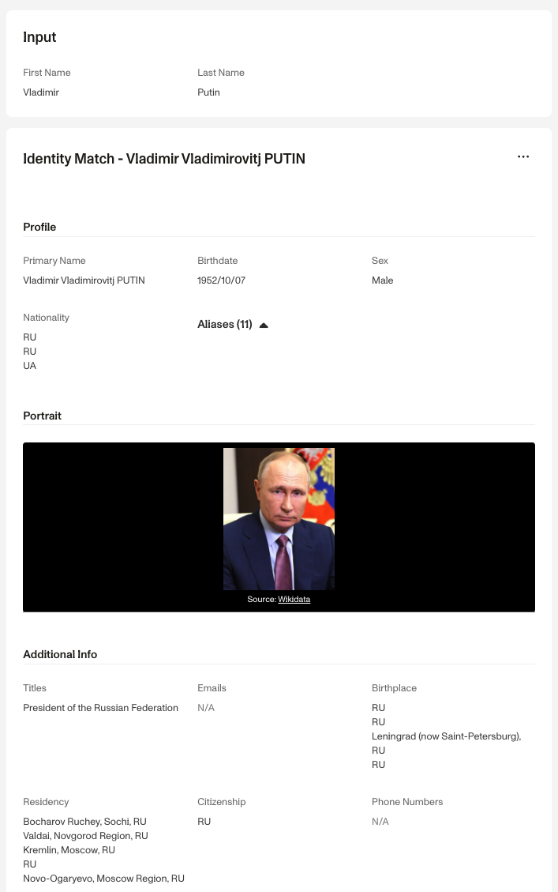
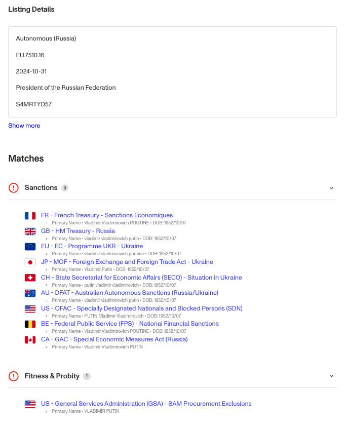

# Watchlist Report

## Overview

The Watchlist Report screens an individual across 200+ **global** Sanctions and Warning lists. It is the most commonly used Report type and is often required as part of a fully built-out Know Your Customer (KYC) and Anti-Money Laundering (AML) process, adding to and enriching information from an Inquiry that collects and verifies an individual. The full list of watchlists can be found on the dashboard within the watchlist template.

## Report Features

### Search Inputs

-   Name of individual (required)
-   Birthdate (optional)
-   Country of individual (optional)

These inputs are typically collected during a KYC inquiry. The individual’s first and last names, are set as the main search terms, while birthdate and country inputs can be derived from a government ID verification or inquiry form input.

### Report Outputs

The Watchlist Report compares the provided inputs against the source lists, and returns detailed individual information if a match is found.

### Notifications

The best way to be notified immediately of a match on the Watchlist Report is to set up a webhook listening for the event types: `report/watchlist.matched` fires whenever a match is found; `report/watchlist.ready` fires whenever the report runs, regardless of match status.

## Configuration options

The Watchlist Report is configurable in the Report Template Editor. By default, all source lists are enabled along with recommended match settings. For further customization, refer to our guide on how to [Configure a Watchlist Report](./3gcpePErNfB1lPrMAcLjeI.md).

## Continuous Monitoring

Just because a person is not a "bad actor" today does not mean that they cannot be a "bad actor" 2 months down the line. Therefore, it's critical for organizations to monitor individuals continuously and to make sure there is no negative news or unfavorable information on a given person. To learn more, refer to [this guide](./7LRMBbxLshF7sCcLhfhwF4.md).

## Plans Explained

|  | Startup Program | Essential Plan | Growth and Enterprise Plans |
| --- | --- | --- | --- |
| Watchlist Report | Available to Fintech Cohort | Available | Available |

[Learn more about pricing and plans](./6oZbzp7jb7AWGClF5vpY3K.md)

## FAQs

### What other reports complement the Watchlist Report?

The [Politically Exposed Person (PEP) Report](./116MoqsoZ0B5FYkdR8Hufp.md) is often used alongside as part of the full KYC solution. Additionally, the [Adverse Media Report](./7K0LSbrfPvUsuBHGCjUhsr.md) also serves as a leading indicator relative to the Watchlist Report.

### How often are lists updated?

Our sources are updated as frequently as every 10 minutes to ensure the most current data is used.

## _Disclaimer_

_Persona is not a consumer reporting agency and the services (and the data provided as part of its services) do not constitute a ‘consumer report’ for the purposes of the Federal Fair Credit Reporting Act (FCRA). The data and reports we provide to you may not be used, in whole or in part, to: make any consumer debt collection decision, establish a consumer’s eligibility for credit, insurance, employment, government benefits, or housing, or for any other purpose authorized under the FCRA. If you use any of any of our services, you agree not to use them, or the data, for any purpose authorized under the FCRA or in relation to taking an adverse action relating to a consumer application._
