# Using filters and saved views of Verifications

## Overview

Saved Views let you create customized views of the Verifications index page, giving you access to commonly filtered lists of verifications. Whether you want to focus on verifications from a specific template, with a specific status, or created between a certain date range, you can filter and save views that align with your business processes.

## Default view

From the Dashboard, navigate to **Verifications** > **All Verifications** to open the Verifications index page. By default, the page opens on the **Default view**, where you can search, apply filters, and adjust the layout.

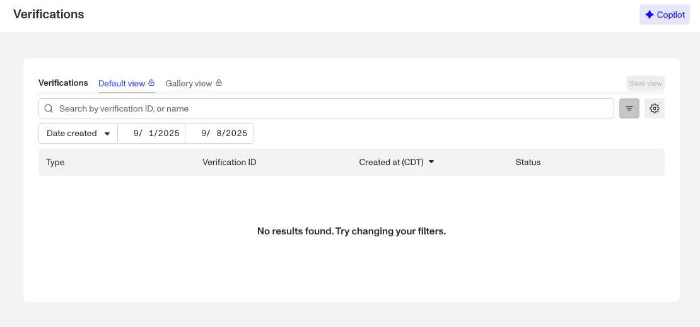

The Default view starts with only one filter available: **Date created**. You can add additional filters as needed, but if you find yourself applying the same set of filters repeatedly, consider saving that configuration as a **Saved View**.

## Gallery View

In addition to the Default view, Verifications includes a **Gallery view**. In Gallery view, you can see the images uploaded for **Government IDs** and **Selfies**, alongside key verification details.

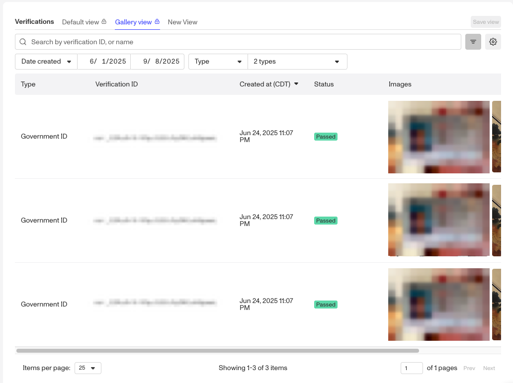

When you open Gallery view, you’ll see:

-   A **Date created** filter (same as in Default view).
-   A **Type filter**, which is set by default to **Selfie** and **Government ID**. You can adjust this filter to focus on other verification types as needed.

You can add additional filters as needed, but if you find yourself applying the same set of filters repeatedly, consider saving that configuration as a **Saved View**.

## What you can configure in a saved view

Saved views make it easy to return to your preferred filters with a single click, instead of re-creating them each time. Your Verification list view offers several configurable components:

-   **Filters** applied to each view
-   Visibility and ordering of columns displayed
-   Ability to add multiple filters

## Filtering Verifications

To filter your Verification list view and display only the items that meet your criteria:

1.  Open the **filter menu** (toggle button with three lines to the right of the search bar).

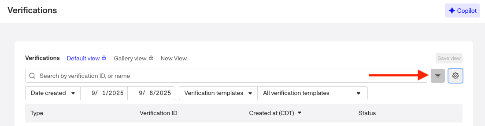

2.  Apply filters such as:
    
    1.  Date created: Narrow results to verifications created within a specific date or date range.
    
    
    
    2.  Verification checks: Filter by the outcome of verification checks (select the verification, the check, and the status).
    
    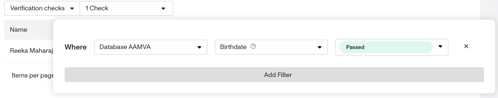
    
    3.  Status: Show only verifications with a certain status (e.g., pending, approved, or declined).
    
    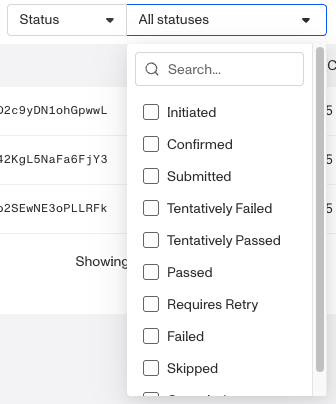
    
    4.  Inquiry templates: Limit results to verifications generated from a specific inquiry template.
    
    
    
    5.  Verification templates: Limit results to verifications generated from a specific verification template.
    
    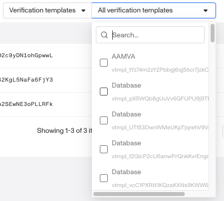
    
3.  To add more than one filter, hover next to the last filter row until the **“+” button** appears, then click it to add another filter.
    

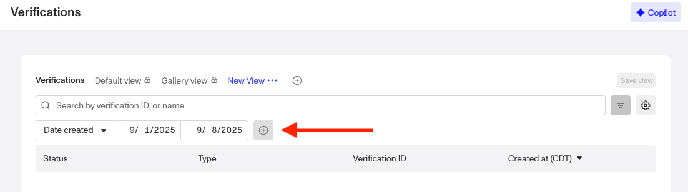

## Customizing columns

You can also customize the columns shown in the Verification index:

1.  Open the **configure columns menu** (click the gear button next to the **filter menu** button).

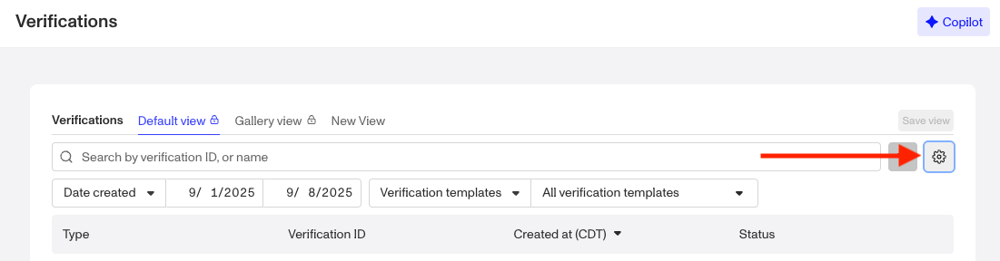

2.  Use the toggles to turn attributes shown on or off.
    
    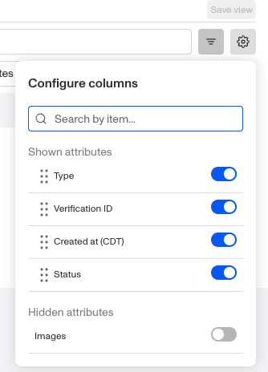
    
    1.  Attributes that are on appear under **Shown attributes.**
    2.  Attributes that are off appear under **Hidden attributes.**
3.  Drag the six dots next to an attribute name to rearrange the order in which columns appear.
    

## Creating saved views of filtered Verifications

If you’ve applied filters in the Default view and want to save them for future use, you’ll need to create a new view:

1.  Hover next to **Gallery view** until the **“+” button** appears.

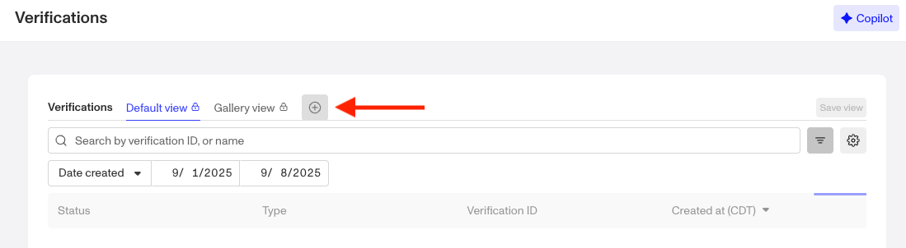

2.  Click the button to create your view.
3.  Give the view a **name**.
4.  Use the drop-down menu to **duplicate, save, or delete** the view. Access this menu later by hovering over the view name and selecting the **three-dot menu.**

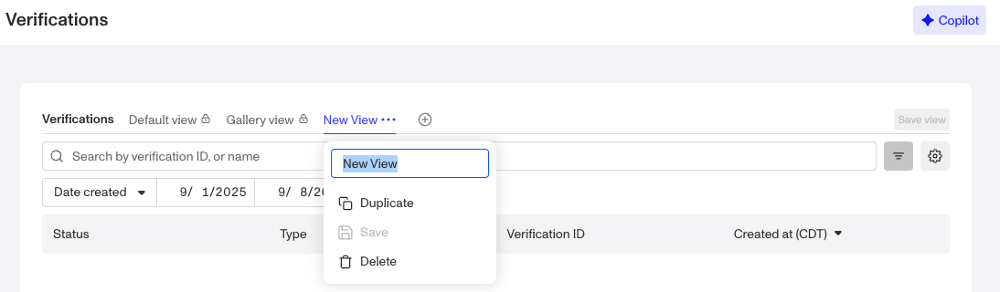

5.  Once you’ve configured your filters, click **Save view** to preserve your setup for later.

If the **Save view** button is inactive, you may not have applied filters that differ from the Default view.

## Managing saved views

To edit a saved view:

1.  Navigate to **Verifications** > **All Verifications**.
2.  Select the saved view from the existing views.

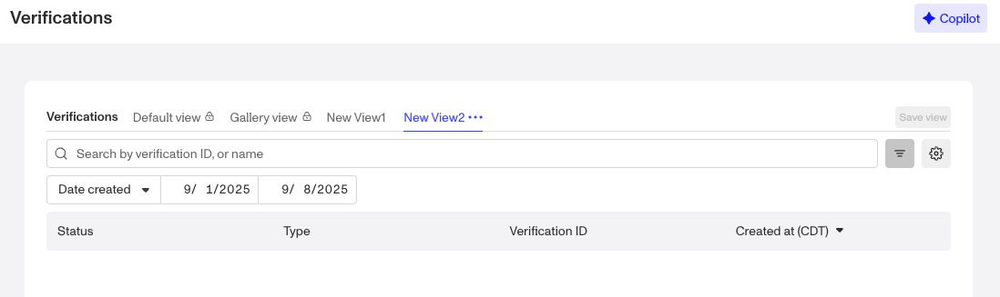

3.  Adjust filters, columns, or other settings as needed.
4.  Click **Save view** to apply your changes.

Your updates will overwrite the existing saved view, so you’ll see the new configuration the next time you open it.

## Items per page

At the bottom of the Verifications index page, you can control how many verifications are displayed at once. Use the **Items per page** dropdown to select from the available options: **10, 25, 50, 100, or 200**.

Adjusting this setting is helpful if you want to:

-   View more verifications on a single page when scanning large datasets.
-   Limit the number of verifications displayed for easier navigation.

Your selection will update the table immediately.
