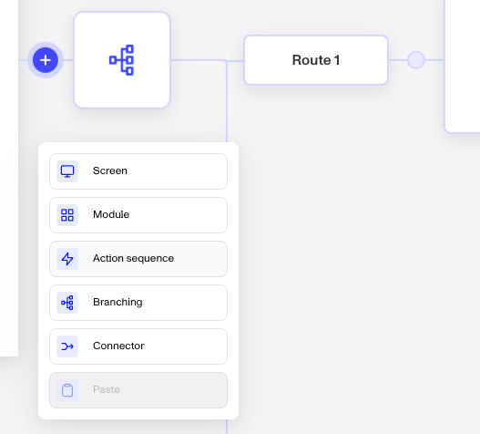
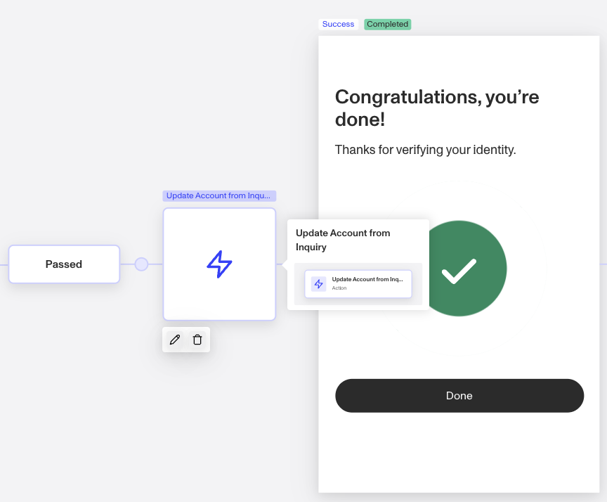
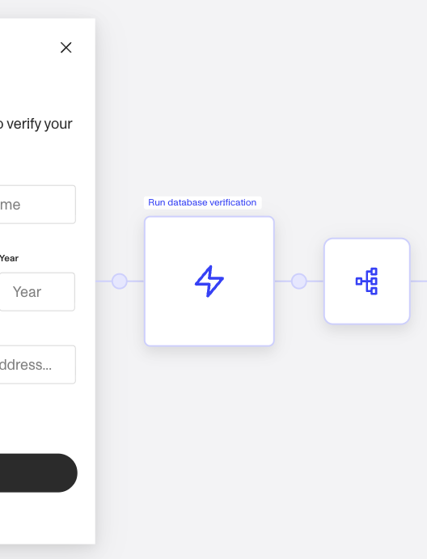

# Action Steps in Inquiries

# What is an Action Step?

The Action Step — within the Flow Editor — allows you define a sequence of actions required to conduct further business logic, write collected information to other Persona objects, or conduct actions necessary to complete immediate or future business processes within an Inquiry Flow. An Action Step's Action Sequence operates similarly to Workflows.

This Action Step happens after a Screen Step. You can investigate the Action Step further by double clicking to see the underlying Action Sequence.

Looking further into the above Action Step, you can see the underlying actions within the Action Sequence.

## Where do you add an Action Step?

1.  To access this feature, navigate to `Inquiries` —> `Templates` from the left nav and select any Inquiry template.
2.  An Action Step can be added by moving your mouse over the circular nodes between steps, turning them into a plus sign. From the step menu, select Action Sequence.

_To add a new Action Step, click the plus sign wherever you'd like the step to be added._

You can also edit an existing Action Step by double clicking on it or clicking the pencil icon below it to review the underlying Action Sequence.

## What can you do with Action Steps?

### Run Verifications and handle Verification results

The most common use of Action Steps is to run Verifications within an Inquiry Flow. This allows you to gain a risk signal while a user is moving through your experience and follow up with additional Verifications for further assurance or any other follow up actions using other Persona products. Depending on your business needs, you can strategically place Verifications throughout the Inquiry flow to minimize risk, deter fraud, or maximize conversions.

### Updating Account fields

An Inquiry typically represents a singular attempt at identity verification (or onboarding, reverification, or your use case), whereas an Account is a system of record for a user. An Account keeps record of all of the entity's details in Account fields and logs the detail of their various Inquiries/attempts at verifying.

# Plans Explained

## Action Step access by plans

|  | **Startup Program** | **Essential Plan** | **Growth and Enterprise Plans** |
| --- | --- | --- | --- |
| Actions Available | Limited to pre-configured solutions | Basic Inquiry Flow actions and actions available in Workflows Basic | Unlimited |
| Action Steps allowed per Inquiry Template | Limited to pre-configured solutions | ≤20 overall steps (Screen, Action, Branching, or Connector) per Inquiry Template | Unlimited |

[Learn more about pricing and plans](./6oZbzp7jb7AWGClF5vpY3K.md)

## Examples

### Action Steps on the Essential plan

Action Steps are commonly used to run Verifications within an Inquiry Flow.

Essential plan customers can run the Verification types available on that plan. For example, Database Verification utilizes a Screen Step to collect information from a user and then the Action Step runs those attributes appropriately to produce a Verification run. After the Verification, customers often have a Branching Step to show users a success, retry, or fail screen. This follows best practice to ensure end-users are informed of their attempt in real-time.

_The Action Step in the Flow Editor view._

_The Action Step has an Action Sequence that runs the Database Verification and then writes the values from the Verification run onto the Inquiry. Many customers additionally follow up with a Branching Step and another Action Step to write only the verified values from the Verification run to an Account. This is to use Accounts as a system of record for their users._

### Action Steps on the Growth plan

Growth plan customers have access to all the functionalities for Action Steps available in the Essential plan, and can additionally execute advanced Verification services available on that plan and actions available on Workflows Enhanced.

# Plans Explained

## Action Step access by plans

|  | Startup Program | Essential Plan | Growth Plan | Enterprise Plan |
| --- | --- | --- | --- | --- |
| Actions Available | Limited to pre-configured solutions | Basic Inquiry Flow actions and actions available in Workflows Basic | Unlimited | Unlimited |
| Action Steps allowed per Inquiry Template | Limited to pre-configured solutions | ≤20 overall steps (Screen, Action, Branching, or Connector) per Inquiry Template | Unlimited | Unlimited |

[Learn more about pricing and plans](./6oZbzp7jb7AWGClF5vpY3K%20%22Pricing%20Overview%22.md)

## Related articles

[Inquiry Template Steps](./1z8F1l9Q28qNxQFtKoMfY3.md)

[Branching Steps in Inquiries](./6NyDb8wHpzSCVW5fnV3iHi.md)

[Screen Steps in Inquiries](./2WWzr0d6rEOIlyXjtHSCgC.md)

[Connector Steps in Inquiries](./1aLUyDUK4ZGuupSgscqd6P.md)
